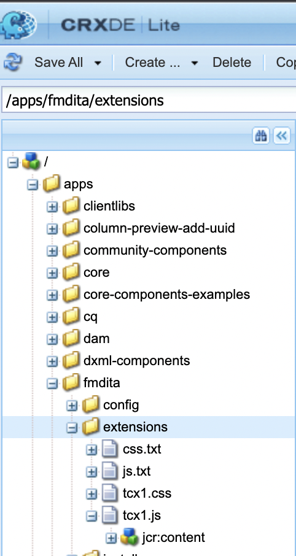
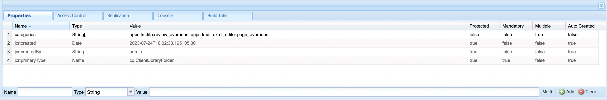

# AEM Guides拡張機能パッケージのインストールと使用

拡張機能を使用すると、AEM Guides アプリをニーズに合わせてカスタマイズできます。 この拡張機能フレームワークは、AEM Guides v4.3 以降（オンプレミス）および 2310 （クラウド）でサポートされます。

## 要件

このパッケージには、[git bash](https://github.com/git-guides/install-git) と npm が必要です

## インストール

AEM Guides フレームワークのインストールをブートストラップする最も簡単な方法は、cli を使用することです

```bash
npx @adobe/create-guides-extension
```

## カスタマイズコードの追加

1. `src/` ディレクトリに拡張する各コンポーネントのコードファイルを追加します。 いくつかのサンプル ファイルは既に追加されています。
2. `src/` ディレクトリにある `index.ts` ファイルで、次の操作を行います。
   - カスタマイズ内容を追加した `.ts` ファイルをビルドに読み込みます。
   - `window.extension` への読み込みの追加
   - カスタマイズしたコンポーネントの `id` と、対応する読み込みを `tcx extensions` に登録します
   - サンプル `/src/index.ts` を参照してください。

## カスタマイズされたコードの作成

- ルートディレクトリで `npm run build` を実行します。 ディレクトリには、次の 3 つのファイルが `dist/` ります。
   - `build.css`
   - `guides-extension.js`
   - `guides-extension.umd.cjs`


## AEMへのカスタマイズの追加

- `CRXDE` `crx/de/index.jsp#/` に移動
- `apps` フォルダーの下に、タイプ `cq:ClientLibraryFolder` の新しいノードを作成します



- ノードの `properties` で、を選択して次のプロパティ `Multi` 追加します
名前：`categories`
型：`String []`
値：`apps.fmdita.review_overrides`、`apps.fmdita.xml_editor.page_overrides`

>[!NOTE]
>
> 最後から 2 番目の UI の場合、値は `apps.fmdita.penultimate.xml_editor.page_overrides` および `apps.fmdita.review_overrides` になります




- ビルドされた js を追加するには、新しいファイル（例：上記で作成されたノードの `tcx1.js`）を作成します。 ここでは、`dist/guides-extension.umd.cjs` または `dist/guides-extension.js` からコードを追加します。 次に、`js.txt` という新しいファイルを作成します。ここでは、js ファイルの名前を追加します。この場合、名前は次のようになります。

```t
#base=.
tcx1.js
```

- 構築された css を追加するには、例えば、新しいファイルを上記で作成したノードに `tcx1.css` 作成します。 ここでは、`dist/build.css` からコードを追加します。 次に、`css.txt` という新しいファイルを作成します。ここでは、css ファイルの名前を追加します。この場合、名前は次のようになります。

```t
#base=.
tcx1.css
```

- カスタマイズ内容を含むアプリを `shift + refresh` しく読み込んでください。

## トラブルシューティング

上記のすべての手順が正しく実行されていることを確認します。
コードを tcx.js に追加した後、必ずハードリフレッシュ（shift+refresh）を実行してください。
次に、AEMを開き、右クリックして「`Inspect`」をクリックします
ソースに移動し、`[node_name].js` （例：extensions.js）ファイルを検索します。 Control / Cmd + D を実行してファイルを検索します。 `dist/guides-extension.umd.cjs` または `dist/guides-extension.js` から貼り付けた JS コードを含んだ `.js` ファイルが存在する場合、セットアップは完了です
