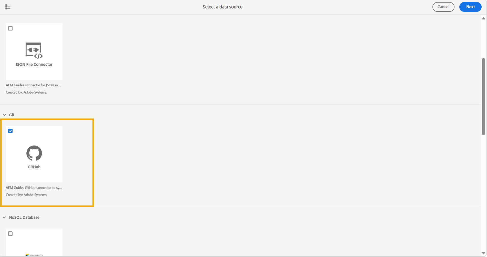
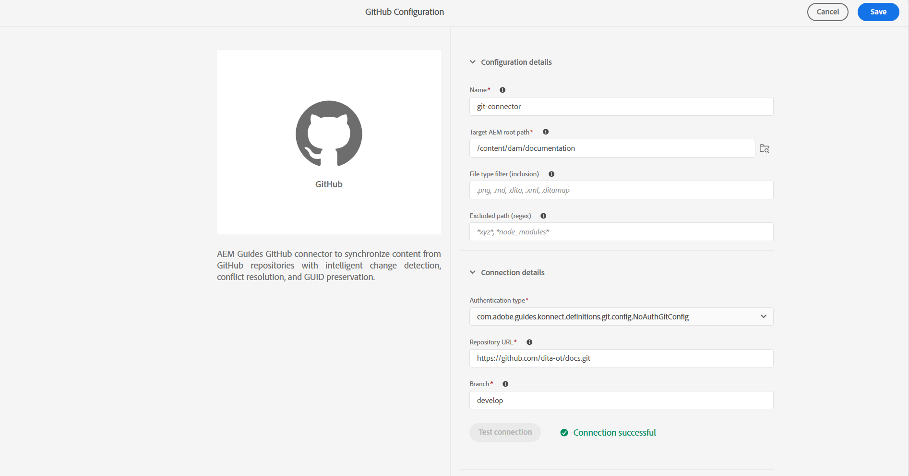

# ユーザーインターフェイスからGit コネクタを作成および設定する

>[!NOTE]
>
> この機能はデフォルトでは無効になっています。 お客様の環境で有効にするには、カスタマーサクセス部門にお問い合わせください。

Experience Manager Guidesのデータソースツールを使用して、ユーザーインターフェイスからGit コネクタを作成および設定します。 コネクタを正常に設定したら、それを使用してGit リポジトリからExperience Manager Guidesにコンテンツを読み込むことができます。

>[!NOTE]
>
> 開始する前に、Git ConnectorがCloud Manager プロジェクトにデプロイされていることを確認してください。 詳しくは、[Cloud Manager プロジェクトにGit コネクタを追加するを参照してください。](#add-git-connector-to-your-cloud-manager-project)


1. 上部の&#x200B;**Adobe Experience Manager** リンクを選択し、**ツール**&#x200B;を選択します。
1. ツールのリストから「**ガイド**」を選択します。
1. 「**データソース**」タイルを選択します。 **データソース** ページが表示されます。
1. 「**作成**」を選択します。
1. データソースコネクタのリストから、**GitHub**&#x200B;を選択します。

   {width="600"}

1. 「**次へ**」を選択します。
1. 設定と接続の詳細を入力します。

   {width="600"}

   >[!TIP]
   >
   >* カーソルを合わせる フィールドの近くので、詳細を表示できます。
   >* * フィールドは必須です。 例えば、Elasticsearch コネクタに次の詳細を入力できます。

   - **名前**: データソースの名前を入力します。
   - **Target AEMのルートパス**: Gitから読み込まれたコンテンツを保存するAEM リポジトリ内のパスを入力します。
   - **ファイルの種類フィルター（含める）**：読み込み時に含めるファイルの種類を指定します。
   - **除外パス （正規表現）**：読み込みから除外するパス パターンを指定します。
   - **認証タイプ**: ドロップダウンリストから認証タイプを選択します。 現在、**個人アクセストークン（PAT）**&#x200B;のみがサポートされている認証方法です。 コネクタの設定時にPATを入力して、認証し、Git リポジトリにアクセスします。

     [GitHub個人アクセストークンを生成する方法について説明します](https://docs.github.com/en/authentication/keeping-your-account-and-data-secure/managing-your-personal-access-tokens#creating-a-personal-access-token-classic)。

     GitHubでのPAT生成中にスコープを選択する際には、次のスコープを有効にしてください。
     - **repo**：最上位のチェックボックスを選択します。 リポジトリコンテンツ、コミットステータス、デプロイメントへのアクセス権を付与して、すべてのサブスコープが自動的に選択されます。
     - **管理者:org**: **読み取り:org**&#x200B;のみを選択します。 これは、組織とチームメンバーシップを解決するために必要です。
   * **リポジトリ URL**: コンテンツをインポートするGit リポジトリ URLを入力します。
   * **分岐**: コンテンツの読み込みに使用する分岐を入力します。

1. 接続をテストします。 「**接続をテスト**」ボタンは、必要な詳細を入力した後にのみ有効になります。 接続の詳細が正しい場合は、成功メッセージが表示されます。 それ以外の場合は、エラーメッセージが表示されます。

   {width="600"}

1. 上部の&#x200B;**保存**&#x200B;を選択して、コネクタを保存します。

   「保存」ボタンは、必要なすべての詳細が入力され、接続が成功した後にのみ有効になります。 コネクタが正常に保存された場合は、**データソース** ページで設定されたGithub コネクタを表示できます。

   {width="600"}

## Cloud Manager プロジェクトへのGit コネクタの追加

Git コネクタを使用して&#x200B;**データソース** ページから設定する前に、AEM プロジェクトに依存関係として埋め込む必要があります。 依存関係を追加するには、次の手順を実行します。

1. AEM プロジェクトの`all/pom.xml`で、`<dependencies>`の下にGit Connectorを依存関係として追加します。

   ```xml
   <dependency>
       <groupId>com.adobe.aem.addon.guides</groupId>
       <artifactId>konnect-github</artifactId>
       <version>1.0.0</version>
   </dependency>
   ```

1. 同じ`pom.xml`で、`filevault-package-maven-plugin`設定の`<embeddeds>` セクションに依存関係を追加します。

   ```xml
   <embedded>
       <groupId>com.adobe.aem.addon.guides</groupId>
       <artifactId>konnect-github</artifactId>
       <type>jar</type>
       <target>/apps/YOUR-vendor-packages/content/install</target>
   </embedded>
   ```

   `YOUR-vendor-packages`をプロジェクトのベンダーパッケージ名に置き換えます。

1. 変更をコミットしてCloud Manager Git リポジトリにプッシュし、パイプラインを実行してデプロイします。

パイプラインが完了すると、Git コネクタが環境にインストールされ、**データソース** ページから設定できるようになります。


