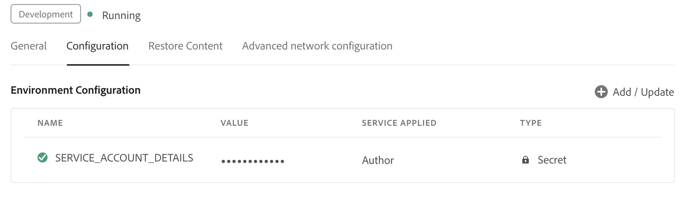

# Cloud ServiceのAgentic モードでのAI アシスタントの設定

管理者は、Experience Manager Guidesで組織のエージェンティックモードでAI アシスタントを設定できます。 設定手順は、AEM as a Cloud Service環境で統合シェル設定が有効になっているかどうか、ユーザーがSSO認証または非SSO認証を使用してログインしているかどうかによって異なります。 この記事では、各シナリオの設定プロセスについて説明します。

## 前提条件

エージェンティックモードでAI アシスタントを設定する前に、組織を&#x200B;**CX Enterprise Coworker**&#x200B;にオンボーディングする必要があります。

## 環境に応じてAI アシスタントを設定する

次の表を使用して、ユーザーに適用される設定パスを特定し、対応する手順に従います。

| 統一シェル | ログインタイプ | 設定は必須です |
|---|---|---|
| 有効になっています | SSO | 追加の設定は不要です。 すぐに利用できます |
| 有効になっています | 非SSO | 環境へのIMS設定の追加 |
| 無効 | SSO | 環境へのIMS設定の追加 |
| 無効 | 非SSO | 環境へのIMS設定の追加 |

### 統合シェルが有効になっているユーザー

**SSO ログイン**

統合シェルが有効になっていて、ユーザーがSSOを使用してログインする場合、追加の設定は必要ありません。 エージェンティックモードのAI アシスタントは、CX Enterprise Coworkerにオンボーディングすると自動的に動作します。

**非SSO ログイン**

統合シェルが有効になっていても、ユーザーがSSOなしでログインする場合は、以下の[環境にIMS設定を追加する必要があります](#add-ims-configuration-to-the-environment)。

### 統合シェルを無効にしたユーザー

統合シェルが無効になっている場合は、次の両方で[IMS設定を環境](#add-ims-configuration-to-the-environment)に追加する必要があります。

- SSO ログイン
- 非SSO ログイン

## 環境へのIMS設定の追加

IMS設定を環境に追加するには、次の手順を実行します。

1. Experience Managerを開き、設定する環境を含むプログラムを選択します。

2. 「**環境**」タブに切り替えます。

3. 設定する環境名を選択します。 これにより、**環境情報** ページに移動します。

4. 「**設定**」タブに切り替えます。

5. JSON サービスの詳細（Adobe Developer ConsoleでIMS設定を作成したときにダウンロードされた）を、`SERVICE_ACCOUNT_DETAILS`に対応する&#x200B;**値** フィールドに貼り付けます。 環境で想定されているものと同じ名前と設定を使用していることを確認してください。

>[!NOTE]
>環境のOAuth/IMS資格情報をまだ作成していない場合は、この手順を完了する前に、まずAdobe Developer Consoleで作成してください。

{width="800"}

## エージェント モードを有効にする

環境の設定が完了したら、カスタマーサクセスチームに連絡してエージェンティックモードを有効にします。

お使いの環境でエージェンティックモードが有効になっている場合は、**Workspace settings**&#x200B;に移動し、**AI アシスタント** セクションの「**一般**」タブにある&#x200B;**エージェンティック** トグルを有効にします。
