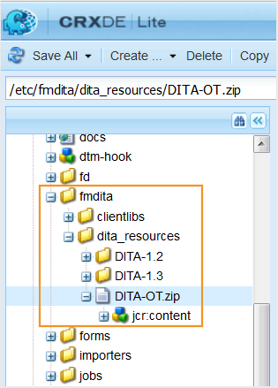

# カスタム DITA-OTとDITAの特殊化の使用 {#id181GAJ0005Z}

DITA Open Toolkit \（DITA-OT\）は、DITA マップとトピックコンテンツの処理を提供するJava ベースのオープンソースツールのセットです。 AEM Guidesを使用すると、カスタム DITA-OT プラグインを簡単に読み込んで使用できます。 読み込みが完了すると、カスタム DITA-OT プラグインを使用して任意の形式で出力を生成するようにAEM Guidesを設定できます。 出力を生成する際は、「DITA-OT」オプションを選択するだけで、AEM Guidesはカスタム DITA-OT プラグインを使用して必要な出力を生成します。

出力の公開中にAnt パラメーターを処理する場合は、AEM Guidesを使用すると簡単に処理できます。 使用するAnt パラメーターを指定し、同じAnt パラメーターを公開プロセスで処理することができます。

>[!NOTE]
>
> AEM GuidesにはDITA-OT バージョン 3.3.2が付属していますが、DITA-OT 1.7からDITA-OT 4.xまでの様々なバージョンをサポートしています。DITA-OT バージョンの包括的なリストについては、[DITA-OT バージョン ](http://www.dita-ot.org/download)を参照してください。

>[!TIP]
>
> カスタム DITA-OT プラグインの使用に関するベストプラクティスについては、ベストプラクティスガイドの「*DITA-OT プロファイル設定*&#x200B;および&#x200B;*カスタム DITA-OTを使用する」セクションを参照してください。*

## カスタム DITA-OT プラグインの使用 {#id181NH1020L7}

次のタブでは、Experience Manager Guidesの設定に基づいてカスタム DITA-OT プラグインを使用する手順を示します。Cloud Serviceまたはオンプレミスです。

>[!BEGINTABS]

>[!TAB Cloud Service]

カスタム DITA-OT プラグインをAEM リポジトリにアップロードすることで、公開にカスタム DITA-OT プラグインを使用できます。 デフォルトでは、AEM Guidesには、コンテンツの編集と公開に使用するデフォルトテンプレートの設定を含む、事前設定済みのプロファイルが用意されています。 ドキュメントの編集時に使用するカスタムテンプレートと、コンテンツを公開するためのカスタム DITA-OT プラグインを使用して、カスタムプロファイルを作成できます。

AEM Guidesで使用できるデフォルトのDITA-OT パッケージには、Apache FOP XSL-FO プロセッサーが付属しており、MathML数式のレンダリングはサポートされていません。 コンテンツでMathML数式を使用している場合は、Apache FOP用のMathML レンダリングエンジンプラグインを統合するか、別のXSL-FO プロセッサーを使用していることを確認してください。

カスタム DITA-OT プラグインをAEM リポジトリにアップロードするには、次の手順を実行します。

1. ウェルカムメールで共有されたリンクからDITA-OT.zip ファイルをダウンロードします。

1. システム上のzip ファイルの内容を抽出します。

1. DITA-OT プラグインインテグレーターメカニズムを使用して、新しいバージョンのDITA-OTをカスタム DITA-OT プラグインと統合します。

1. 同じ名前\（`DITA-OT.ZIP`\）とフォルダー構造を使用して、ZIP ファイルを再度作成します。

1. 更新したZIP ファイルをAEM リポジトリにアップロードし直します。

   ZIP ファイルをアップロードする前に、次のチェックを行ってください。

   - Mac/Linux OSでインテグレータ \（カスタムプラグインをインストールするには\）を実行して、ファイルセパレータの問題を回避します。WindowsとLinux OSには異なるファイルセパレータがあるため、Mac/Linux OSに統合されたプラグインは、WindowsとLinuxの両方のセットアップに対応しています。
   - `DITA-OT.ZIP` ファイルに、関連するすべてのプラグインとファイルを含む「DITA-OT」という名前のフォルダーが含まれていることを確認します。
   - 作成する`DITA-OT.ZIP` ファイルがmimeType: &quot;nt:file&quot; \（これは、AEMにアップロードする際の主要なZIP ファイルの種類に相当します\）であることを確認します。 WebDAV ツールまたはコードのデプロイメントを使用して、このZIP ファイルをAEMの目的のパスにアップロードします。 \（このZIP ファイルはAEM コンテンツパッケージではなく、単なるアーカイブファイルであるため、AEMのパッケージマネージャーを使用しないでください。\）

   >[!NOTE]
   >
   > デフォルトのDITA-OT パッケージを上書きしないことをお勧めします。 プラグイン /var/dxml/dita\_resources/dita-ot フォルダーを含むカスタム DITA-OT パッケージをアップロードする必要があります。 Cloud Manager パイプラインを使用して実行することもできます。詳しくは、AEM as a Cloud Serviceへのデプロイ [AEM ドキュメントの](https://experienceleague.adobe.com/docs/experience-manager-cloud-service/implementing/deploying/overview.html?lang=ja)を参照してください。

1. デフォルトプロファイルを編集するか、新しいプロファイルを作成するか、デフォルトプロファイルから設定を複製して新しいプロファイルを作成するかを選択できます。

   >[!NOTE]
   >
   > デフォルトのプロファイルは更新できますが、削除することはできません。 ただし、作成した新しいプロファイルはすべて編集および削除できます。

1. カスタム DITA-OT プラグインを使用するには、次のプロパティを設定します。

   | プロパティ名 | 説明 |
   |-------------|-----------|
   | **プロファイルのプロパティ** | |
   | プロファイル名 | このプロファイルに一意の名前を指定してください。 |
   | 出力を再利用 | *\（Optional\）* プロファイルが既存のプロファイルに基づいている場合は、このオプションを選択します。 このオプションを選択すると、AEM GuidesがDITA-OT パッケージの内容を再度抽出せず、既存のDITA-OT パッケージを再利用します。 |
   | プロファイル抽出パス | *\（Optional\）* DITA-OTをディスク上に保持するパスを指定します。 デフォルトでは、AEM GuidesはDITA-OT パッケージをリポジトリにバンドルし、このパスでディスク上に抽出されます。  **メモ**&#x200B;このパスは、既存のシステム変数またはプロパティを使用して定義できます。 詳しくは、[DITA-OT環境変数](#id181NH0YN0AX) プロパティの説明を参照してください。 |
   | 割り当てられたパス | \（*オプション*\）このプロファイルが適用されるコンテンツリポジトリ内のパスを指定します。 複数の場所を指定できます。 |
   | **DITA-OT プロパティ** |  |
   | DITA-OT タイムアウト | \（*オプション*\） AEM GuidesがDITA-OT プラグインからの応答を待機する時間\（秒単位\）を指定します。 指定した時間内に応答を受け取らなかった場合、AEM Guidesは公開タスクを終了し、タスクに「失敗」のフラグが付けられます。 また、エラーのログは、出力生成ログファイルで利用できるようになります。   デフォルト値：300秒\（5分\） |
   | DITA-OT PDF引数 | PDF出力を生成するために、カスタム DITA-OT プラグインで処理されるコマンドライン引数を指定します。 すべてのカスタム DITA-OT プロファイルに対して、次のコマンドライン引数を指定します。`-lib plugins/org.dita.pdf2.fop/lib/` |
   | DITA-OT AEM引数 | \（*オプション*\） AEM サイト出力を生成するためにカスタム DITA-OT プラグインで処理されるカスタムコマンドライン引数を指定します。 |
   | DITA-OT ライブラリパス | \（*オプション*\） DITA-OT プラグインの追加ライブラリパスを指定します。 |
   | DITA-OT ビルド XML | \（*オプション*\） カスタマイズされたDITA-OT プラグインにバンドルされたカスタム Ant ビルド スクリプトのパスを指定します。 このパスは、ファイルシステム上のDITA-OT ディレクトリからの相対パスです。 |
   | DITA-OT Ant スクリプトフォルダー | \（オプション\） DITA-OT Ant スクリプトフォルダーのパスを指定します。 このパスは、ファイルシステム上のDITA-OT ディレクトリからの相対パスです。 |
   | DITA-OT環境変数 | *\（Optional\）* DITA-OT プロセスに渡す環境変数を指定します。 デフォルトでは、AEM Guidesは4つの変数（`ANT_OPTS`、`ANT_HOME`、`PATH`、および`CLASSPATH`）を追加します。  既存のシステム環境変数またはプロパティのいずれかを、新しい環境変数の作成に再利用できます。 例えば、システム変数`JAVA_HOME`がシステムで定義されており、`JAVA_BIN`を使用して構築された`JAVA_HOME`という新しい環境変数を定義する場合です。 次に、`JAVA_BIN`の定義を`JAVA_BIN= ${JAVA_HOME}/bin`  として追加できます **注：** Java システム プロパティを使用して環境変数を作成することもできます。 例えば、AEM開始スクリプトでJava システムプロパティ `java.io.tmpdir`を一時ディレクトリに定義する場合、このプロパティを使用して新しい変数を`${java.io.tmpdir}/fmdita/dita_ot`として定義できます。  **重要：**&#x200B;既存のシステム変数またはプロパティを再利用するには、`${}`内で囲む必要があります。 |
   | DITA-OT出力の上書き | DITA-OT出力を上書きするかどうかを選択します。 このオプションを選択したままにします。 |
   | AEM DITA-OT Zip Path | カスタム DITA-OT.zip ファイルがAEM リポジトリに保存されるパス全体を指定します。 |
   | DITA-OT プラグインパス | カスタムプラグインのパス。 このプラグインは、メインのDITA-OT パッケージと自動的に統合されます。 |
   | カタログの統合 | \（*オプション*\） AEM リポジトリ内のカスタム DTDおよびXSD catalog.xml ファイルのパス。 これは、カタログがDITA-OT パッケージにない場合にのみ提供する必要があります。 これらのカタログは、メインのDITA-OTとプラグインとして自動的に統合されます。 |
   | システム ID カタログの追加 | \（*オプション*\） カタログにパブリック ID エントリが見つからない場合、またはDITA ファイルがアップロード元のサーバーパスに関連するシステム IDのみを使用する場合にのみ、このオプションを選択します。 |
   | DITA-OT一時パス | DITA ファイルが処理のためにコピーされる一時的な場所。 DITA-OTがファイルを処理する前に、ファイルはこの一時的な場所にコピーされます。 デフォルトでは、一時ストレージの場所は です `<*AEM-Install*>/crx-quickstart/profiles/ditamaps`   **重要：** デフォルトのパスを変更することはできません。 |

   >[!NOTE]
   >
   > AEM Guides インストーラーは、カスタム DITA-OT プラグインファイルのパスを指定するために使用できる2つの環境変数を作成します。 これらの環境変数は、ファイルシステム上のDITA-OT ディレクトリのパスを含む`DITAOT\_DIR`と、ファイルシステム上でDITA マップコンテンツが抽出されるパスを含む`DITAMAP\_DIR`です。

1. 「**完了**」をクリックして、プロファイルを保存します。

>[!TAB  オンプレミス ]

公開にカスタム DITA-OT プラグインを使用する方法は2つあります。 最初の方法は、カスタム DITA-OT プラグインをAEM リポジトリにアップロードすることです。 もう1つの方法は、カスタム DITA-OT プラグインをサーバーに保存し、プロファイルを作成し、プロファイルにカスタム DITA-OT プラグインの場所を指定することです。

デフォルトでは、AEM Guidesには、コンテンツの編集と公開に使用するデフォルトテンプレートの設定を含む、事前設定済みのプロファイルが用意されています。 ドキュメントの編集時に使用するカスタムテンプレートと、コンテンツを公開するためのカスタム DITA-OT プラグインを使用して、カスタムプロファイルを作成できます。

AEM Guidesで使用できるデフォルトのDITA-OT パッケージには、Apache FOP XSL-FO プロセッサーが付属しており、MathML数式のレンダリングはサポートされていません。 コンテンツでMathML数式を使用している場合は、Apache FOP用のMathML レンダリングエンジンプラグインを統合するか、別のXSL-FO プロセッサーを使用していることを確認してください。

>[!IMPORTANT]
>
> AEM Guidesをバージョン 2.2から2.5.1または2.6にアップグレードした場合、Configuration Managerを通じて行われたすべての変更は、デフォルトプロファイルに自動的に選択されて保存されます。

カスタム DITA-OT プラグインをAEM リポジトリにアップロードするには、次の手順を実行します。

1. AEMにログインし、CRXDE Lite モードを開きます。

1. `DITA-OT.ZIP` ファイルをダウンロードします。

   `DITA-OT.ZIP` ファイルの場所は`/libs/fmdita/dita_resources/DITA-OT.zip`です。

   

1. サーバー上のzip ファイルの内容を抽出します。

1. DITA-OT プラグインインテグレーターメカニズムを使用して、新しいバージョンのDITA-OTをカスタム DITA-OT プラグインと統合します。

   >[!NOTE]
   >
   > プラグイン ZIP ファイルのクラスパス区切り記号はオペレーティングシステムに依存します。つまり、サーバーがWindowsでホストされている場合、クラスパス区切り記号はLinuxで使用されるものとは異なります。 プラグインの手動インストールについて詳しくは、DITA-OT ドキュメントの「*プラグインの手動インストール*」トピックを参照してください。

1. 同じ名前\（`DITA-OT.ZIP`\）とフォルダー構造を使用して、ZIP ファイルを再度作成します。

1. 更新したZIP ファイルをAEM リポジトリにアップロードし直します。

   ZIP ファイルをアップロードする前に、次のチェックを行ってください。

   - Mac/Linux OSでインテグレータ \（カスタムプラグインをインストールするには\）を実行して、ファイルセパレータの問題を回避します。WindowsとLinux OSには異なるファイルセパレータがあるため、Mac/Linux OSに統合されたプラグインは、WindowsとLinuxの両方のセットアップに対応しています。
   - `DITA-OT.ZIP` ファイルに、関連するすべてのプラグインとファイルを含む「DITA-OT」という名前のフォルダーが含まれていることを確認します。
   - 作成する`DITA-OT.ZIP` ファイルがmimeType: &quot;nt:file&quot; \（これは、AEMにアップロードする際の主要なZIP ファイルの種類に相当します\）であることを確認します。 WebDAV ツールまたはコードのデプロイメントを使用して、このZIP ファイルをAEMの目的のパスにアップロードします。 \（このZIP ファイルはAEM コンテンツパッケージではなく、単なるアーカイブファイルであるため、AEMのパッケージマネージャーを使用しないでください。\）
   >[!NOTE]
   >
   > デフォルトのDITA-OT パッケージを上書きしないことをお勧めします。 プラグインを含むカスタム DITA-OT パッケージを、`apps` フォルダーの下の別の場所にアップロードする必要があります。

1. デフォルトのDITA プロファイルを開いて編集し、変更を有効にするために\（更新を行わずに\）保存します。

次の手順を実行して、新しいプロファイルを作成し、サーバーに保存されているカスタム DITA-OT プラグインを使用するように設定します。

1. カスタム DITA-OT プラグインをサーバーに保存します。

   >[!NOTE]
   >
   > カスタム DITA-OT プラグインを保存するフォルダー構造は`\*<parent-folder\>*\DITA-OT`である必要があります。

1. 上部のAdobe Experience Manager リンクをクリックし、**ツール**&#x200B;を選択します。

1. ツールのリストから「**ガイド**」を選択します。

1. **DITA プロファイル** タイルをクリックします。

   >[!NOTE]
   >
   > デフォルトのプロファイル情報は、プロファイルページに表示されます。 AEM Guidesをバージョン 2.2から2.5.1または2.6にアップグレードした場合、Configuration Managerを通じて行われたすべての変更は、デフォルトプロファイルに自動的に選択されて保存されます。

1. デフォルトプロファイルを編集するか、新しいプロファイルを作成するか、デフォルトプロファイルから設定を複製して新しいプロファイルを作成するかを選択できます。

   >[!NOTE]
   >
   > デフォルトのプロファイルは更新できますが、削除することはできません。 ただし、作成した新しいプロファイルはすべて編集および削除できます。

1. カスタム DITA-OT プラグインを使用するには、次のプロパティを設定します。

   | プロパティ名 | 説明 |
   |-------------|-----------|
   | **プロファイルのプロパティ** |  |
   | プロファイル名 | このプロファイルに一意の名前を指定してください。 |
   | 出力を再利用 | *\（Optional\）* プロファイルが既存のプロファイルに基づいている場合は、このオプションを選択します。 このオプションを選択すると、AEM GuidesがDITA-OT パッケージの内容を再度抽出せず、既存のDITA-OT パッケージを再利用します。 |
   | プロファイル抽出パス | *\（Optional\）* DITA-OTをディスク上に保持するパスを指定します。 デフォルトでは、AEM GuidesはDITA-OT パッケージをリポジトリにバンドルし、このパスでディスク上に抽出されます。 **メモ**&#x200B;このパスは、既存のシステム変数またはプロパティを使用して定義できます。 詳しくは、[DITA-OT環境変数](#id181NH0YN0AX) プロパティの説明を参照してください。 |
   | 割り当てられたパス | \（*オプション*\）このプロファイルが適用されるコンテンツリポジトリ内のパスを指定します。 複数の場所を指定できます。 |
   | **DITA-OT プロパティ** |  |
   | DITA-OT タイムアウト | \（*オプション*\） AEM GuidesがDITA-OT プラグインからの応答を待機する時間\（秒単位\）を指定します。 指定した時間内に応答を受け取らなかった場合、AEM Guidesは公開タスクを終了し、タスクに「失敗」のフラグが付けられます。 また、エラーのログは、出力生成ログファイルで利用できるようになります。   デフォルト値：300秒\（5分\） |
   | DITA-OT PDF引数 | PDF出力を生成するために、カスタム DITA-OT プラグインで処理されるコマンドライン引数を指定します。 すべてのカスタム DITA-OT プロファイルに対して、次のコマンドライン引数を指定します。`-lib plugins/org.dita.pdf2.fop/lib/` |
   | DITA-OT AEM引数 | \（*オプション*\） AEM サイト出力を生成するためにカスタム DITA-OT プラグインで処理されるカスタムコマンドライン引数を指定します。 |
   | DITA-OT ライブラリパス | \（*オプション*\） DITA-OT プラグインの追加ライブラリパスを指定します。 |
   | DITA-OT ビルド XML | \（*オプション*\） カスタマイズされたDITA-OT プラグインにバンドルされたカスタム Ant ビルド スクリプトのパスを指定します。 このパスは、ファイルシステム上のDITA-OT ディレクトリからの相対パスです。 |
   | DITA-OT Ant スクリプトフォルダー | \（オプション\） DITA-OT Ant スクリプトフォルダーのパスを指定します。 このパスは、ファイルシステム上のDITA-OT ディレクトリからの相対パスです。 |
   | DITA-OT環境変数 | *\（Optional\）* DITA-OT プロセスに渡す環境変数を指定します。 デフォルトでは、AEM Guidesは`ANT_OPTS`、`ANT_HOME`、`PATH`、`CLASSPATH`の4つの変数を追加します。  既存のシステム環境変数またはプロパティのいずれかを、新しい環境変数の作成に再利用できます。 例えば、システム変数`JAVA_HOME`がシステムで定義されており、`JAVA_BIN`を使用して構築された`JAVA_HOME`という新しい環境変数を定義する場合です。 次に、`JAVA_BIN`の定義を として追加できます `JAVA_BIN= ${JAVA_HOME}/bin`   **注** Java システム プロパティを使用して環境変数を作成することもできます。 例えば、AEM開始スクリプトでJava システムプロパティ `java.io.tmpdir`を一時ディレクトリに定義する場合、このプロパティを使用して新しい変数を`${java.io.tmpdir}/fmdita/dita_ot`として定義できます。  **重要**&#x200B;既存のシステム変数またはプロパティを再利用するには、`${}`内で囲む必要があります。 |
   | DITA-OT出力の上書き | *\（Optional\）*&#x200B;このオプションを選択した場合、ローカルシステムで使用可能なDITA-OT パッケージを指定して、DITA-OTを使用して出力を生成できます。 この設定は、ConfigManagerのアクティベーション時に設定されます。   AEM サーバーに保存されているDITA-OT パッケージのパスを指定する場合は、このオプションの選択を解除します。 |
   | AEM DITA-OT Zip Path/ローカル DITA-OT ディレクトリパス | 「DITA-OT出力を上書き」で選択した内容に応じて、カスタム DITA-OT.zip ファイルが保存されている完全なパスを指定します。 これは、AEMリポジトリまたはローカルシステム内のパスです。 |
   | DITA-OT プラグインパス | カスタムプラグインのパス。 このプラグインは、メインのDITA-OT パッケージと自動的に統合されます。 |
   | カタログの統合 | \（*オプション*\） AEM リポジトリ内のカスタム DTDおよびXSD catalog.xml ファイルのパス。 これは、カタログがDITA-OT パッケージにない場合にのみ提供する必要があります。 これらのカタログは、メインのDITA-OTとプラグインとして自動的に統合されます。 |
   | システム ID カタログの追加 | \（*オプション*\） カタログにパブリック ID エントリが見つからない場合、またはDITA ファイルがアップロード元のサーバーパスに関連するシステム IDのみを使用する場合にのみ、このオプションを選択します。 |
   | DITA-OT一時パス | *\（Optional\）* DITA ファイルを処理するためにコピーする一時的な場所を指定します。 DITA-OTがファイルを処理する前に、ファイルはこの一時的な場所にコピーされます。 デフォルトでは、一時ストレージの場所は です **メモ**&#x200B;このパスは、既存のシステム変数またはプロパティを使用して定義できます。 詳しくは、[DITA-OT環境変数](#id181NH0YN0AX) プロパティの説明を参照してください。 |

   >[!NOTE]
   >
   >  AEM Guides インストーラーは、カスタム DITA-OT プラグインファイルのパスを指定するために使用できる2つの環境変数を作成します。 これらの環境変数は、ファイルシステム上のDITA-OT ディレクトリのパスを含むDITAOT\_DIRと、ファイルシステム上でDITA マップコンテンツが抽出されるパスを含むDITAMAP\_DIRです。

1. 「**完了**」をクリックして、プロファイルを保存します。

>[!ENDTABS]

## DITA専門機能の統合 {#id211MB0E00XA}

DITA特殊化とは、新しいエレメントを追加したり、既存のエレメントを削除したりして、新しいDITA構造を作成するプロセスです。 新しいDITA エレメントを作成するには、既存のDITA エレメントをベースとして使用し、オーサリング要件に従って変更します。 本質的には、DITA専門化により、既存のDITA アーキテクチャのメリットを維持しながら、ビジネス要件を満たすカスタマイズされた情報モデルを作成できます。

プロファイル機能を使用して、カスタム DITA特殊化設定を保存できます。 これらの設定は、カスタム DITA コンテンツのオーサリングおよび公開時に使用できます。 AEM Guidesでは、カスタム DTD/XSDでパブリック IDとシステム IDを使用できます。

>[!NOTE]
>
> AEM Guides Web EditorはXSDをサポートしていません。

次のタブには、Experience Manager Guidesの設定に基づいてDITAの専門機能を統合する手順が示されています。Cloud Serviceまたはオンプレミス。

>[!BEGINTABS]

>[!TAB Cloud Service]

次の手順を実行して、新しいプロファイルを作成し、AEM Guidesで専用のDTDとXSDを使用するように設定します。

1. 専用のDTDとXSDを含む特殊フォルダーをローカルマシン上に作成します。

1. Specialization フォルダーに含める必要がある`catalog.xml` ファイルで、DTDの詳細を指定します。

   >[!NOTE]
   >
   > DITA 1.3の場合、AEM リポジトリ内のDTD `catalog.xml` ファイルのデフォルトの場所は`/libs/fmdita/dita_resources/DITA-1.3/dtd/catalog.xml`です。

1. Specialization フォルダーに含める必要がある`catalog.xml` ファイルのXSDの詳細を指定します。

   >[!NOTE]
   >
   > DITA 1.3の場合、AEM リポジトリ内のXSD catalog.xml ファイルのデフォルトの場所は`/libs/fmdita/dita_resources/DITA-1.3/xsd/catalog.xml`です。

1. フォルダーを次の場所にアップロードします。

   `/var/dxml/dita_resources`

1. 上部のAdobe Experience Manager リンクをクリックし、**ツール**&#x200B;を選択します。

1. ツールのリストから「**ガイド**」を選択します。

1. 「**DITA プロファイル**」タイルをクリックします。

1. デフォルトプロファイルを編集するか、新しいプロファイルを作成するか、デフォルトプロファイルから設定を複製して新しいプロファイルを作成するかを選択できます。

   >[!NOTE]
   >
   > デフォルトプロファイルは削除できません。 ただし、作成した新しいプロファイルはすべて編集および削除できます。

1. **Schema** \> **Catalog**&#x200B;設定で、AEM リポジトリ内のカスタム DTDおよびXSD `catalog.xml` ファイルのパスを指定します。

1. 「**システム ID カタログを追加**」オプションを選択します。

   >[!NOTE]
   >
   > このオプションは、カタログ内にパブリック ID エントリがない場合、またはDITA ファイルがアップロード元のローカルファイルパスに関連するシステム IDのみを使用する場合にのみ選択します。

   プロファイルページの他のプロパティについて詳しくは、[ カスタム DITA-OT プラグインの使用](#id17A9F0D075Z) セクションの[手順6](#id181NH1020L7)のプロパティ テーブルを参照してください。

1. 「**完了**」をクリックして、プロファイルを保存します。

>[!TAB  オンプレミス ]

次の手順を実行して、新しいプロファイルを作成し、専用のDTDとXSD AEM Guidesを使用するように設定します。

1. 専用のDTDとXSDを含む特殊フォルダーをローカルマシン上に作成します。

1. Specialization フォルダーに含める必要がある`catalog.xml` ファイルで、DTDの詳細を指定します。

   >[!NOTE]
   >
   > DITA 1.3の場合、AEM リポジトリ内のDTD `catalog.xml` ファイルのデフォルトの場所は`/libs/fmdita/dita_resources/DITA-1.3/dtd/catalog.xml`です。

1. Specialization フォルダーに含める必要がある`catalog.xml` ファイルのXSDの詳細を指定します。

   >[!NOTE]
   >
   > DITA 1.3の場合、AEM リポジトリ内のXSD catalog.xml ファイルのデフォルトの場所は`/libs/fmdita/dita_resources/DITA-1.3/xsd/catalog.xml`です。

1. フォルダーを次の場所にアップロードします。

   `/apps/fmdita/dita_resources`

1. 上部のAdobe Experience Manager リンクをクリックし、**ツール**&#x200B;を選択します。

1. ツールのリストから「**ガイド**」を選択します。

1. **DITA プロファイル** タイルをクリックします。

   >[!NOTE]
   >
   > デフォルトのプロファイル情報は、プロファイルページに表示されます。 AEM Guidesをバージョン 2.2から2.5.1または2.6にアップグレードした場合、Configuration Managerを通じて行われたすべての変更は、デフォルトプロファイルに自動的に選択されて保存されます。

1. デフォルトプロファイルを編集するか、新しいプロファイルを作成するか、デフォルトプロファイルから設定を複製して新しいプロファイルを作成するかを選択できます。

   >[!NOTE]
   >
   > デフォルトプロファイルは削除できません。 ただし、作成した新しいプロファイルはすべて編集および削除できます。

1. **Schema** \> **Catalog**&#x200B;設定で、AEM リポジトリ内のカスタム DTDおよびXSD `catalog.xml` ファイルのパスを指定します。

   >[!NOTE]
   >
   > カスタムスキーマを使用している場合は、**カタログの統合** オプションで、AEM リポジトリのカスタム DTD ファイルとXSD catalog.xml ファイルのパスを定義する必要があります。

1. 「**システム ID カタログを追加**」オプションを選択します。

   >[!NOTE]
   >
   > このオプションは、カタログ内にパブリック ID エントリがない場合、またはDITA ファイルがアップロード元のローカルファイルパスに関連するシステム IDのみを使用する場合にのみ選択します。

   プロファイルページの他のプロパティについて詳しくは、[ カスタム DITA-OT プラグインの使用](#id17A9F0D075Z) セクションの[手順6](#id181NH1020L7)のプロパティ テーブルを参照してください。

1. 「**完了**」をクリックして、プロファイルを保存します。

>[!NOTE]
>
> カスタム DITA プロファイルをパッケージとして書き出し、他のAEM Guides インスタンスにアップロードして時間を節約できます。 詳しくは、[付録](./aemg-appendix.md)を参照してください。

>[!ENDTABS]
