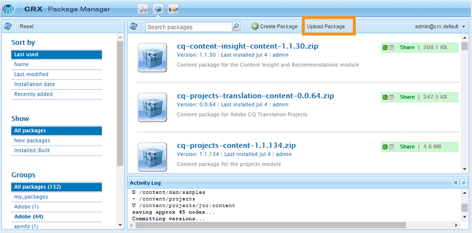
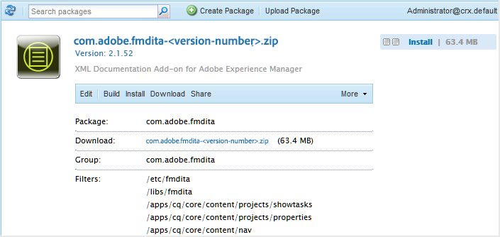

# AEM Guidesを初めてダウンロードしてインストールする {#id213BCL00KEV}

AEM Guidesを初めてダウンロードしてインストールするには、次の手順を実行します。

>[!IMPORTANT]
>
> LivefyreとAEM Guidesを併用する場合は、AEM Guidesをインストールする前に、必ず3.0より前のバージョンのLivefyreをインストールしてください。 Livefyre バージョン 3.0以降を使用している場合、そのような制限はありません。

1. [AEM Guides Software Distribution Portal](https://experience.adobe.com/#/downloads/content/software-distribution/ja/aem.html)からAdobeをダウンロードします。

   >[!NOTE]
   >
   >Experience Manager Guidesをインストールする前に、お使いのシステムが[技術要件](../install-conf-guide/aemg-technical-requirements.md)を満たしていることを確認してください。

1. AEM インスタンスにログインし、CRX Package Managerに移動します。 パッケージマネージャーにアクセスするためのデフォルトのURLは次のとおりです。

   ```http
   http://<server name>:<port>/crx/packmgr/index.jsp
   ```

   パッケージマネージャーは、ローカルのAEM インストール上のパッケージを管理します。 パッケージマネージャーの操作について詳しくは、AEM ドキュメントの[ パッケージの操作方法](https://helpx.adobe.com/jp/experience-manager/6-5/sites/administering/using/package-manager.html)を参照してください。

   {width="650"}

1. AEM Guides パッケージをアップロードするには、**パッケージをアップロード**&#x200B;をクリックします。

1. アップロードパッケージダイアログで、手順1でダウンロードしたAEM Guides ファイルに移動し、**OK**&#x200B;をクリックします。

   パッケージがAEM インスタンスにアップロードされます。

1. パッケージをインストールするには、**インストール**&#x200B;をクリックします。

   {width="650"}

1. パッケージをインストール ダイアログで、**Install**&#x200B;をクリックします。

1. AEM Guidesを使い始めるには、CRX Package Managerの左上隅にあるホームボタン をクリックします。


>[!NOTE]
>
> セットアップ内のすべてのAEM サーバーのインスタンスに対して、インストール手順を実行します。
