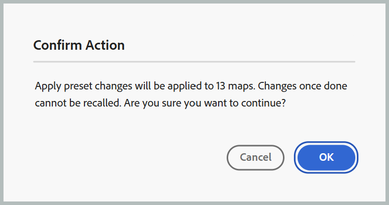

# 出力生成用のテンプレートプリセットの設定

>[!NOTE]
>
> テンプレートプリセットは、2026.08.0 リリース以降のExperience Manager Guides as a Cloud Serviceで使用できます。 この機能を有効にするには、カスタマーサクセス チームにお問い合わせください。

テンプレートプリセットを使用すると、管理者は複数のDITA マップ間で出力プリセット設定を標準化できます。 マップごとに同じ出力プリセットを個別に設定するのではなく、プリセットをテンプレートとして定義し、フォルダープロファイルに関連付けられているすべてのマップに適用できます。

これにより、プロジェクト間で一貫性のある公開設定を維持し、手作業による設定作業を削減できます。

## メリット

テンプレートプリセットを使用すると、次のような利点があります。

- 複数のマップ間で一貫した公開設定を実現します。
- 繰り返しのプリセット設定を排除し、手作業を減らします。
- 出力プリセット設定の一元管理を有効にします。

## サポートされる出力タイプ

テンプレートプリセットは、次を除くすべての出力プリセットタイプでサポートされています。

- Edge 配信サービス
- ナレッジベース
- SCORM

## テンプレートプリセットの作成と管理

>[!NOTE]
>
> - テンプレートプリセットは、**管理者**&#x200B;および&#x200B;**フォルダープロファイル管理者**&#x200B;のみが作成および管理できます。
> - テンプレートプリセットは、設定管理用に作成されたもので、出力生成に直接使用されるものではありません。

1. フォルダーに使用するフォルダープロファイルを設定します。
2. 関連するフォルダーのマップコンソールから&#x200B;**出力プリセット**&#x200B;を開きます。
3. テンプレートとして使用する出力プリセットを作成または選択します。

   >[!NOTE]
   >
   > テンプレートとして使用する出力プリセットを作成または選択する場合は、現在のフォルダープロファイルに追加されていることを確認します。

4. プリセットの「**オプション**」メニューから「**テンプレートとして設定**」を選択します。

   {width="650"}

   選択した出力プリセットがテンプレートプリセットに変換されます。 テンプレートプリセットは、テンプレートアイコンによって識別され、通常のプリセットと区別されます。 テンプレートのステータスを削除するには、テンプレートプリセットの&#x200B;**オプション** メニューから「**テンプレートとして設定を解除**」を選択します。

   {width="650"}

5. テンプレートプリセットの&#x200B;**オプション** メニューから「**プリセット変更を適用**」を選択し、選択したフォルダープロファイル内のすべての既存のマップに更新されたプリセット設定を適用します。

   **プリセットの変更を適用** ダイアログが開きます。

   {width="350"}

6. 既存のプリセットを上書きするには、「**既存のプリセットを上書き**」チェックボックスを選択し、「**OK**」を選択します。 上書きすると、プリセットは更新されますが、ターゲットプリセットのベースライン、条件プリセット、DITAVAL、トピックリストまたはパブリッシュコンテキスト設定は変更されません。 これらの設定は変更されません。

   プリセットの変更が適用されるマップの数を示す&#x200B;**アクションの確認** ダイアログが開きます。

   {width="350"}

7. 「**OK**」を選択します。

変更は、関連フォルダー内のすべてのマップのすべてのプリセットに適用されます。

>[!NOTE]
>
> 関連するフォルダーに新しいマップを作成する場合、新しく作成したマップでもテンプレートプリセットのローカルコピーを使用できます。

## 出力生成動作

テンプレートプリセットは設定テンプレートであり、直接公開を目的としたものではありません。 プリセットがテンプレートとしてマークされている場合：

- 出力の生成は使用できません。
- テンプレートプリセットは公開に使用できません。
- テンプレートのプリセットがテンプレートに変換される前に作成された既存の生成された出力は、引き続きアクセスできます。

