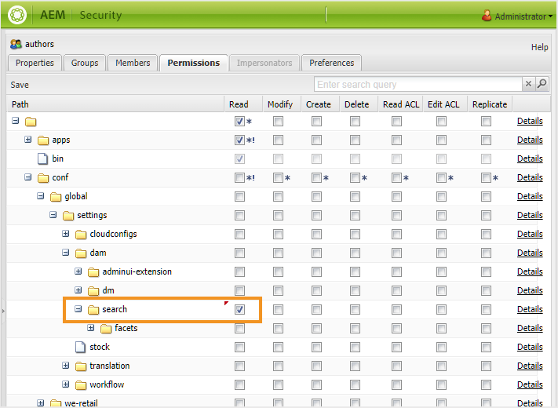

# AEM Assets UI の検索の設定 {#id192SC800MY4}

デフォルトでは、AEMは DITA コンテンツを認識しないので、リポジトリ内で DITA コンテンツを検索するメカニズムは提供されません。 AEM Guidesを使用すると、AEM リポジトリに DITA コンテンツ検索機能を追加できます。

デフォルトでは、AEMは DITA コンテンツを認識しないので、リポジトリ内で DITA コンテンツを検索するメカニズムは提供されません。 また、UUID に基づいてコンテンツを検索する OOTB 機能はありません。 AEM Guidesを使用すると、DITA コンテンツ検索機能と UUID ベースの検索機能をAEM リポジトリに追加できます。

DITA コンテンツ検索を設定するには、次のタスクを実行します。

1. [Assets UI での DITA Element 検索コンポーネントの追加](#id192SF0F50HS)
1. [Assets UI に UUID ベースの検索コンポーネントを追加します](#id2034F04K05Z)
1. [ユーザーへの権限の付与](#id192SF0G0RUI)
1. [検索でのカスタム要素または属性の追加](#id192SF0G10YK)
1. [既存のコンテンツからのメタデータの抽出](#id192SF0GA0HT)

検索機能の追加に加えて、検索に含めないフォルダーを設定することもできます。 詳しくは、[ 検索結果から一時ファイルを除外する ](#id197AHI0035Z) を参照してください。

## Assets UI での DITA Element 検索コンポーネントの追加 {#id192SF0F50HS}

次の手順を実行して、AEM Assets UI に DITA コンテンツ検索コンポーネントを追加します。

1. Adobe Experience Managerに管理者としてログインします。

1. 上部の **Adobe Experience Manager** リンクをクリックし、「**ツール**」を選択します。

1. ツールのリストから **一般** を選択し、**Formsを検索** タイルをクリックします。

1. **Formsを検索** リストで、**Assets管理者の検索レール** を選択します。

1. 「**編集**」をクリックします。
1. 「**述語を選択** タブで、リストの最後までスクロールします。

1. **DITA Element Predicate** を検索フォーム内の必要な場所にドラッグアンドドロップします。

   {width="650" align="left"}

1. 「**完了**」をクリックして変更を保存します。

   Assets UI で「フィルター」オプションにアクセスすると、DITA エレメント検索フィルタリングオプションが表示されます。

   {width="350" align="left"}


## Assets UI に UUID ベースの検索コンポーネントを追加します {#id2034F04K05Z}

AEM Assets UI に UUID ベースの検索コンポーネントを追加するには、次の手順を実行します。

1. Adobe Experience Managerに管理者としてログインします。

1. 上部の **Adobe Experience Manager** リンクをクリックし、「**ツール**」を選択します。

1. ツールのリストから **一般** を選択し、**Formsを検索** タイルをクリックします。

1. **Formsを検索** リストで、**Assets管理者の検索レール** を選択します。

1. 「**編集**」をクリックします。
1. 「**述語を選択**」タブで「**プロパティの述語**」を選択し、検索フォームの必要な場所にドラッグ&amp;ドロップします。

1. 「**設定**」タブで、新しく追加した **プロパティの述語** コンポーネントに次の詳細を入力します。

   - **フィールドラベル**:UUID
   - **プロパティ名**:jcr:content/fmUuid
1. 「**完了**」をクリックして変更を保存します。

   Assets UI で「フィルター」オプションにアクセスすると、UUI ベースの検索フィルタリングオプションを取得できます。


## ユーザーへの権限の付与 {#id192SF0G0RUI}

作成者と公開者がAssets UI から検索機能にアクセスできるようにするには、明示的な権限が必要になります。 これらの権限を付与しないと、ユーザーはエレメント/属性値または UUID に基づいて DITA コンテンツを検索できません。

次の手順を実行して、DITA 検索機能へのアクセスを提供します。

1. ユーザーおよびグループの権限ページにアクセスします。 ページにアクセスするためのデフォルトの URL は次のとおりです。

   `http://<server name>:<port>/useradmin.html`

1. アクセス権を付与するユーザーグループまたは個々のユーザーを検索します。 例えば、作成者グループのすべてのユーザーにアクセス権を付与するには、「**フィルタークエリ**」フィールドに作成者を入力し、**Enter** キーを押します。

   {width="350" align="left"}

1. **authors** グループを選択します。

1. 右側のウィンドウで、「**権限**」タブを選択します。

1. 次のフォルダーの場所に移動します。

   /conf/global/settings/dam/search

1. 検索フォルダーに対する **読み取り** 権限を付与します。

   {width="650" align="left"}

1. 「**保存**」をクリックします。


選択したユーザーまたはユーザーグループは、Assets UI の DITA コンテンツの検索機能にアクセスできるようになります。

## 検索でのカスタム要素または属性の追加 {#id192SF0G10YK}

DITA 検索が機能するには、DITA コンテンツの前処理が必要です。 この前処理ステップでは、個々の DITA マップとトピックから選択したコンテンツを抽出し、インデックスを作成して検索を高速化します。 内部的には、このプロセスは *シリアル化* と呼ばれます。 DITA ファイルのシリアル化は、コンテンツのアップロード中に実行されるか、オンデマンドで実行することもできます。 設定ファイルを使用して、各 DITA ファイルからインデックスを作成するコンテンツの量を決定します。 シリアル化ファイルのデフォルトの場所は次のとおりです。

/libs/fmdita/config/serializationconfig.xml

デフォルトの検索設定を使用すると、DITA `prolog` エレメント内のすべてのエレメントと属性を検索できます。 他の要素または属性に基づいて検索する場合は、検索シリアル化ファイルを設定する必要があります。

>[!NOTE]
>
> `prolog` 要素内でデフォルトの検索設定を使用する場合は、このプロセスをスキップできます。

このファイルには、「属性セット」と「ルールセット」という 2 つの主要セクションがあります。 ルールセットセクションのスニペットを次に示します。

```XML
<ruleset filetypes="xml dita"><!-- Element rules --><rule xpath="//[contains(@class, 'topic/topic')]/[contains(@class, 'topic/prolog')]//*[not(*)]" text="yes" attributeset="all-attrs" /><!-- Attribute rules --><rule xpath="//[contains(@class, 'topic/topic')]/[contains(@class, 'topic/prolog')]///@[local-name() != 'class']" /></ruleset>
```

「ルールセット」セクションでは、次の項目を指定できます。

- 要素を抽出するルール

- 属性を抽出するルール


ルールは、次の要素で構成されます。

**xpath** - DITA ファイルからエレメントまたは属性を取得する XPath クエリです。 要素ルールのデフォルト設定では、すべての要素 `prolog` 取得されます。 また、属性ルールのデフォルト設定では、`prolog` 要素のすべての属性が取得されます。 検索する要素または属性をシリアル化する XPath クエリを指定できます。

XPath クエリには、ドキュメントタイプのクラス名が含まれます。 `topic/topic` クラスは、トピック型の DITA 文書に使用されます。 他の DITA 文書用の規則を作成する場合は、次のクラス名を使用する必要があります。

| ドキュメントタイプ | クラス名 |
|-------------|----------|
| トピック | - トピック/トピック |
| タスク | - トピック/トピックタスク/タスク |
| 概念 | - トピック/トピックの概念/概念 |
| 参照 | - トピック/トピックの参照/参照 |
| Map | - マップ/マップ |

**text** – 指定した要素内のテキストを検索する場合は、yes 値を指定します。 値として no を指定した場合、要素内の属性のみがシリアル化されます。 検索する属性は、属性セットセクションで指定する必要があります。

**attributeset** – このルールに関連付ける属性セットの ID を指定します。 値 all-attrs は、このルールのすべての属性をシリアル化する必要があることを示す特殊なケースです。

属性セットには、DITA コンテンツ内で検索する属性のリストが含まれます。 属性セットには、次の内容が含まれます。

**id** – 属性セットの一意の識別子。 この ID は、ルールセットの attributeset パラメーターで指定されます。

**attribute** – 検索する属性のリスト。 属性ごとに、`attribute` 要素に個別のエントリを作成する必要があります。

次の手順を実行して、カスタム DITA エレメントまたはカスタム属性を検索シリアル化ファイルに追加します。

1. AEMにログインし、CRXDE Lite モードを開きます。

1. 次の場所にあるシリアル化設定ファイルに移動します。

   /libs/fmdita/config/serializationconfig.xml

1. `apps` ノード内に `config` フォルダーのオーバーレイノードを作成します。

1. `apps` ノードで使用可能な設定ファイルに移動します。

   `/apps/fmdita/config/serializationconfig.xml`

1. 必要な要素または属性ルールセットを追加します。

1. ファイルを保存します。

1. Adobe Experience Manager Web コンソール設定ページを開きます。 設定ページにアクセスするためのデフォルトの URL は次のとおりです。

   http://&lt;server name\>:&lt;port\>/system/console/configMgr

1. *com.adobe.fmdita.config.ConfigManager* バンドルを検索してクリックします。

1. 「**保存**」をクリックします。


新しいシリアル化情報が保存され、検索用にアクティブ化されます。 ただし、既存の DITA コンテンツからメタデータを抽出して検索できるようにする必要があります。

## 既存のコンテンツからのメタデータの抽出 {#id192SF0GA0HT}

デフォルトの検索シリアル化ファイルを変更したら、*com.adobe.fmdita.config.ConfigManager* バンドルの「DITA メタデータ抽出」オプションを有効にし、ワークフローを実行してメタデータを抽出する必要があります。 これにより、既存の DITA ファイルから必要なメタデータが抽出され、検索可能になります。

シリアル化ファイルを更新した後で新しいファイルを作成したり任意のファイルを編集したりする場合、メタデータはこれらのファイルから自動的に抽出されます。 メタデータの抽出プロセスは、AEM リポジトリーに既に存在するファイルに対してのみ必要です。

既存の DITA ファイルからメタデータを抽出するには、次の 2 つのタスクが必要です。

1. configMgr でのメタデータ抽出オプションの有効化
1. メタデータ抽出ワークフローの実行

configMgr でメタデータ抽出オプションを有効にするには、次の手順を実行します。

1. Adobe Experience Manager Web コンソール設定ページを開きます。 設定ページにアクセスするためのデフォルトの URL は次のとおりです。

   http://&lt;server name\>:&lt;port\>/system/console/configMgr

1. *com.adobe.fmdita.config.ConfigManager* バンドルを検索してクリックします。

1. 「**DITA メタデータ抽出を有効にする**」オプションを選択します。

1. 「**保存**」をクリックします。


メタデータ抽出ワークフローを実行するには、次の手順を実行します。

1. Adobe Experience Managerに管理者としてログインします。

1. 上部の **Adobe Experience Manager** リンクをクリックし、「**ツール**」を選択します。

1. ツールのリストから「**Guides**」を選択し、「**DITA Metadata Extraction**」タイルをクリックします。

1. 1 つのファイルとその依存関係からメタデータを抽出する場合は、「**ファイルを選択**」リンクをクリックしてファイルを参照します。

1. 1 つのフォルダー内の複数のファイルからメタデータを抽出する場合は、「**フォルダーを選択\（s\）**」リンクをクリックし、必要なフォルダーを参照して選択します。 **追加** ボタンをクリックして、フォルダーをシリアル化タスク リストに追加します。

   >[!NOTE]
   >
   > シリアル化タスクには、複数のフォルダーを選択して追加できます。

1. 「**開始**」をクリックします。

1. メタデータの抽出を確認ダイアログで、「**OK**」をクリックします。


## 検索結果から一時ファイルを除外 {#id197AHI0035Z}

デフォルトでは、検索はAEMのリポジトリ全体で実行されます。 検索から除外したい場所がいくつかあります。 例えば、コンテンツ翻訳ワークフローを開始しても、承認されていないファイルは一時フォルダーの場所に残ります。 検索を実行すると、この一時的な場所にあるファイルも検索結果に返されます。

AEM Guidesが一時的な翻訳フォルダーの場所を検索しないようにするには、除外リストに一時フォルダーの場所を追加する必要があります。

一時的な翻訳フォルダーを検索から除外するには、次の手順を実行します。

>[!NOTE]
>
> この手順を使用して、除外リストにその他のフォルダーの場所を追加できます。

1. AEMにログインし、CRXDE Lite モードを開きます。

1. 次の場所にある damAssetLucene ノードに移動します。

   /oak:index/damAssetLucene

1. damAssetLucene ノードに次のプロパティを追加します。

   | プロパティ名 | タイプ | 値 |
   |-------------|----|-----|
   | excludedPaths | String\[\] | このプロパティに次の値を追加します：<br>/content/dam/projects/translation\_output |

1. 次の場所にある lucene ノードに移動します。

   /oak:index/lucene

1. Lucene ノードの次のプロパティを追加します。

   | プロパティ名 | タイプ | 値 |
   |-------------|----|-----|
   | excludedPaths | String\[\] | このプロパティに次の値を追加します：<br><ul><li>/var/dxml</li><li>/content/dam/projects/translation\_output</li></ul> |
