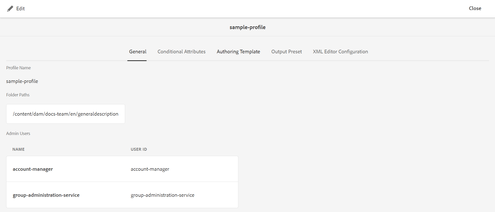
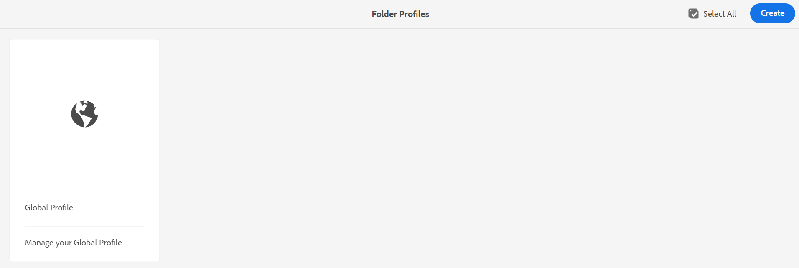
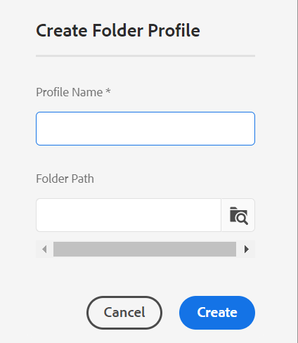
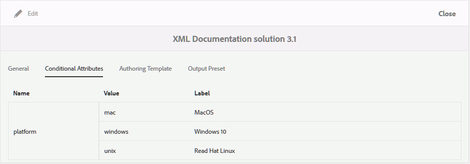
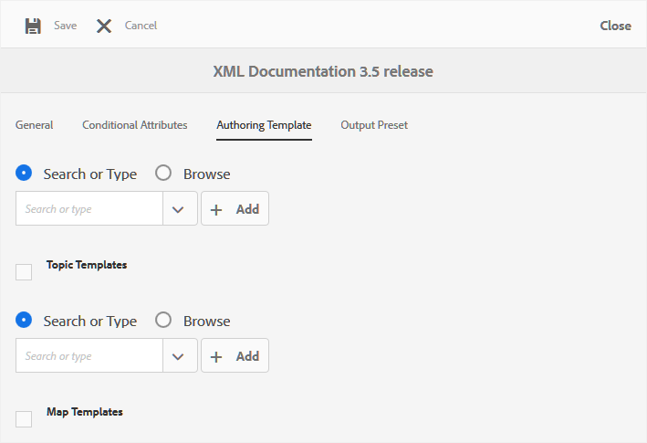
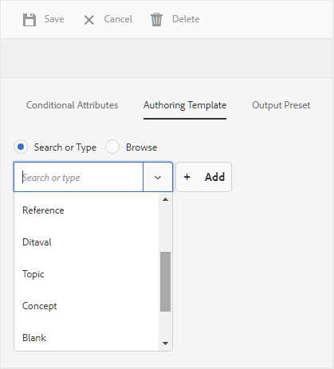
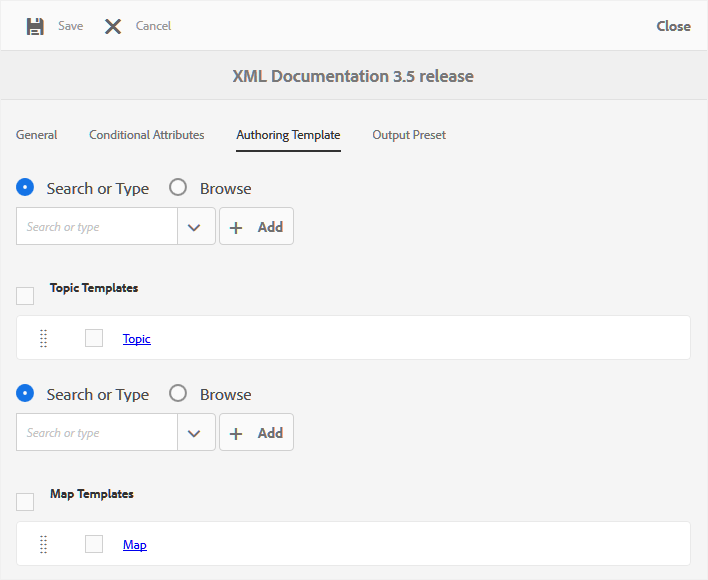

# グローバルレベルまたはフォルダーレベルのプロファイルの設定 {#id181AH2003PF}

企業では、異なるグループまたは製品が、異なるオーサリングテンプレート、出力テンプレート、条件付き属性プロファイル \（またはサブジェクトスキーム\）、およびWeb エディター設定を使用する場合があります。 これらをエンタープライズ（またはグローバル）レベルでのみ設定すると、作成者に関係のないテンプレートやプロファイルが表示されるため、作成者は操作が難しくなります。

AEM Guidesでは、オーサリング \（topicまたはmap\） テンプレート、出力テンプレート、条件付き属性、およびWeb エディターの設定を、エンタープライズ \（global\） レベルとフォルダーレベルで設定できます。 これにより、企業内のさまざまな部門や製品の設定を分離できます。

また、フォルダー固有の設定を部門または製品管理者に委任して、管理を分散化することもできます。

ガイド設定の「フォルダープロファイル」タイルを使用すると、次のタブで設定を行うことができます。

{width="800" align="left"}

- **一般**：一般タブは、フォルダーレベルの\（またはプロジェクト/製品\）設定を構成している場合にのみ使用できます。 設定が適用されるフォルダーパスや、設定を作成または更新する管理者権限を持つユーザーなどの設定を設定できます。

- **条件付き属性**：このタブを使用して、グローバルまたはフォルダーレベルで条件付き属性を設定します。 条件付き属性は、属性名と値の組み合わせです。また、そのラベルを定義することもできます。 標準のDITA属性または独自のカスタム属性を使用できます。 グローバルレベルで定義した条件付き属性は、プロジェクトのすべてのユーザーが利用できます。 フォルダーレベルの条件付き属性を定義した場合、グローバルに定義された条件付き属性と結合されます。

- **オーサリングテンプレート**：このタブを使用して、作成者がDITA コンテンツの作成に使用するテンプレートを設定します。 次のトピックテンプレートは、すぐに使用できます。

   - 用語集

   - 参照

   - トピック

   - コンセプト

   - タスク

   - トラブルシューティング

   - 空白

   - DITAVAL

  >[!NOTE]
  >
  > 既存のテンプレートのいずれかをベースとして使用して、新しいテンプレートを作成できます。 空白のDITA テンプレートには、他のテンプレートのような構造や要素は含まれません。 任意のOOTB DITA テンプレートをベースとして使用し、変更を加え、別の名前で保存できます。 必要な変更を行った後、更新されたテンプレートをグローバルレベルまたはフォルダーレベルのオーサリングテンプレート設定に追加すると、オーサリングで使用できるようになります。

  トピックテンプレートに加えて、作成者が利用できるマップテンプレートを定義することもできます。 次のマップテンプレートは、すぐに使用できます。

   - Map

   - Bookmap

- **出力プリセット**: オーサリングテンプレートと同様に、5つの事前設定済み出力プリセットがあります。

   - AEMサイト

   - PDF

   - HTML5

   - EPUB

   - カスタム

  これらの出力プリセットを使用して、コンテンツを公開できます。 これらのプリセットは、グローバルプロファイルまたはフォルダーレベルのプロファイルの管理者が設定できます。 設定が完了すると、パブリッシングプリセットは、新しく作成したDITA マップに対してパブリッシャーで使用できるようになります。 既存のDITA マップに公開プリセットを適用することもできます。詳しくは、[ プリセットの変更を適用](#id18AGD0K0OHS)を参照してください。

- **XML エディターの設定**：このタブを使用して、Web エディターのルックアンドフィールや様々な機能をカスタマイズします。 Web エディターでは、次の設定可能な設定を使用できます。

   - XML エディターのUI設定
   - CSS テンプレートレイアウト
   - XML エディターのスニペット
   - XML コンテンツバージョンラベル
   - Rootmap \（フォルダーレベルでのみ\）

グローバルプロファイルとフォルダーレベルのプロファイルの両方を設定できます。 フォルダーレベルのプロファイルでは、設定を適用するフォルダーを定義できます。 これらの設定には、条件付き属性、オーサリングテンプレート、出力プリセット、XML エディターの設定が含まれます。 コンディショナルプリセット、オーサリングテンプレート、XML エディター設定は、設定されたフォルダーで作業する作成者が使用できるようになります。 同様に、パブリッシャーは、設定されたフォルダー内で定義された設定された出力プリセットにアクセスできます。

フォルダーレベルのプロファイルは、グローバルプロファイルで設定された設定を上書きします。 つまり、フォルダーにフォルダーレベルのプロファイルがある場合、対応するフォルダープロファイルで設定されたオーサリングテンプレート、出力テンプレート、XML エディター設定が表示されます。 グローバルプロファイルで設定された設定は表示されません。 ただし、これは条件付き属性には適用されません。 条件付き属性の場合、条件付き属性はグローバルレベルとフォルダーレベルで結合されます。

次の節では、グローバルプロファイルとフォルダーレベルのプロファイルを設定する手順について説明します。

## グローバルプロファイルの設定

グローバルプロファイルを設定するには、次の手順を実行します。

1. Adobe Experience Managerに管理者としてログインします。

1. 上部のAdobe Experience Manager リンクをクリックし、**ツール**&#x200B;を選択します。

1. ツールのリストから&#x200B;**ガイド**&#x200B;を選択し、**フォルダープロファイル**&#x200B;をクリックします。

   フォルダープロファイルページが初めて表示され、グローバルプロファイルタイルのみが表示されます。

   {width="800" align="left"}

1. 「**グローバルプロファイル**」タイルをクリックします。

1. **条件付き属性**&#x200B;を設定するには、[ グローバルまたはフォルダーレベルのプロファイルの条件付き属性の設定](#id1889D0I305Z)を参照してください。

1. **オーサリングテンプレート**&#x200B;を設定するには、[ オーサリングテンプレートの設定](#id1889D0IL0Y4)を参照してください。

1. **出力プリセット**&#x200B;を設定するには、[出力プリセットの設定](#id18AGD0IH0Y4)を参照してください。

1. XML エディター設定を設定するには、[XML Web エディターの設定とカスタマイズ ](#id2065G300O5Z)を参照してください。

1. 必要なすべての更新を行ったら、**グローバルプロファイル**&#x200B;を保存して閉じます。


## フォルダーレベルのプロファイルの作成と設定

フォルダーレベルのプロファイルを設定するには、次の手順を実行します。

1. Adobe Experience Managerに管理者としてログインします。

1. 上部のAdobe Experience Manager リンクをクリックし、**ツール**&#x200B;を選択します。

1. ツールのリストから「**ガイド**」を選択し、**フォルダープロファイル** タイルをクリックします。

   フォルダープロファイルページが初めて表示され、デフォルトのグローバルプロファイルタイルのみが表示されます。

1. 「**作成**」をクリックします。

   {width="300" align="left"}

1. **フォルダープロファイルの作成** ダイアログに次の詳細を入力します。
   - フォルダープロファイルの名前。
   - プロファイルが適用されるフォルダーのパス。

     >[!NOTE]
     >
     > フォルダーに複数のフォルダープロファイルを適用することはできません。 ここで選択しているフォルダーに、他のプロファイルが適用されていないことを確認します。 独自の特定のプロファイルを持つ親子フォルダーの場合、子フォルダーは独自のプロファイルの設定を使用します。 親フォルダーの設定は、子フォルダーの設定を上書きしません。

1. 「**作成**」をクリックします。

   フォルダープロファイルの名前が付いた新しいタイルがフォルダープロファイルページに作成されます

1. フォルダープロファイルタイルをクリックして編集します。

   フォルダープロファイルの名前と設定されたフォルダー情報を含む「一般」タブが表示されます。

1. 「**編集**」をクリックして、複数のフォルダーと、フォルダープロファイルを変更するための管理アクセス権を持つユーザーを追加します。

   >[!NOTE]
   >
   > ここに追加するユーザーには、このフォルダープロファイル用に設定された条件付き属性、オーサリングテンプレート、出力プリセットを更新するための管理者権限が付与されます。

1. フォルダーを追加するには、フォルダーパスの「参照」アイコンをクリックし、フォルダーに移動して選択し、「追加」をクリックして、このプロファイルにフォルダーを追加します。

   >[!NOTE]
   >
   > ここで選択したフォルダーに、他のフォルダーレベルのプロファイルが関連付けられていないことを確認します。

1. ユーザーを追加するには、**管理者ユーザー** ドロップダウンからユーザーを選択し、**追加**&#x200B;をクリックします。

   >[!NOTE]
   >
   > ドロップダウンリストからフォルダープロファイルに複数のユーザーを追加できます。 ユーザーIDの横にある削除アイコンをクリックして、リストから既存の管理者ユーザーを削除することもできます。

1. 必要なすべてのフォルダーとユーザーをフォルダープロファイルに追加したら、**保存**&#x200B;をクリックします。


これで、条件付き属性、オーサリングテンプレート、出力プリセット、XML エディターを設定する準備が整いました。

>[!IMPORTANT]
>
> フォルダープロファイルを作成する場合、デフォルトではオーサリングテンプレートは含まれません。 作成者が利用できるようにするには、必要なオーサリングテンプレートをフォルダープロファイルに追加する必要があります。

## グローバルレベルまたはフォルダーレベルのプロファイルに対する条件付き属性の設定 {#id1889D0I305Z}

次の手順を実行して、グローバルレベルまたはフォルダーレベルで標準のDITAでサポートされる条件付き属性を設定します。

1. フォルダーレベルのプロファイルに管理者権限を持つユーザーとして、Adobe Experience Managerに管理者としてログインします。

1. 上部のAdobe Experience Manager リンクをクリックし、**ツール**&#x200B;を選択します。

1. ツールのリストから「**ガイド**」を選択し、**フォルダープロファイル** タイルをクリックします。

1. 設定するプロファイルタイルをクリックします。

   >[!NOTE]
   >
   > グローバルプロファイルまたはフォルダーレベルのプロファイルで、条件付き属性を設定できます。

1. プロファイルページで、「**条件付き属性**」タブをクリックします。

1. 「**編集**」をクリックします。

1. 「**追加**」をクリックします。

1. 条件付き属性に&#x200B;**Name**、**Value**&#x200B;および&#x200B;**Label**&#x200B;を入力します。

   属性名のみでプロファイルを保存できます。 ただし、属性は、値が指定されている場合にのみ使用できます。 属性に値とラベルの両方を指定すると、Web エディターに条件付き属性のラベルが表示されます。 また、コンディショナルプリセットの作成時に、ラベルが公開管理者に表示されます。

   次のスクリーンショットは、可能な値とラベルを持つ`platform`属性の定義を示しています。

   {width="650" align="left"}

1. 同じ属性に値をさらに追加する場合は、**+** アイコンをクリックし、追加の値とラベルを入力します。

1. さらに属性を追加する場合は、**追加**&#x200B;をクリックします。

1. 「**保存**」をクリックします。


**カスタム属性を使用**

カスタム属性を使用する場合は、DTDでサポートされている有効なDITA属性である必要があります。 標準のDITA属性ではない属性を使用する場合は、次の追加手順を実行します。

1. カスタム属性をDTD ファイルに追加します。 例えば、DTD ファイルがcommonElements.modの場合、このファイルをDTD ディレクトリに配置する必要があります。 システム DTD ファイルのデフォルトパスは次のとおりです。

   /libs/fmdita/dita\_resources/DITA-1.3/dtd/base/dtd/commonElements.mod

   >[!IMPORTANT]
   >
   > 専用のDTD ファイルは、カスタムコードのデプロイメントの一部である必要があります。 /etcの下のDTDは製品デプロイメントの一部であるため、新しいリリースのインストールで上書きされます。 プロジェクトフォルダー内の/appsの下に専用DTDを追加し、DTD/カタログパスをDITA プロファイルに含めることをお勧めします。詳しくは、[DITA特殊化の統合](dita-ot-specialization.md#id211MB0E00XA)を参照してください。

1. Adobe Experience Manager Web コンソールの設定ページを開きます。

1. *com.adobe.fmdita.config.ConfigManager* バンドルを検索してクリックします。

1. 設定を保存します。

   これにより、システムのキャッシュがクリアされます。

1. 次の場所にあるcondAttrList.xml ファイルに移動します。

   /libs/fmdita/config/condAttrList.xml

1. `config` ノード内に`apps` フォルダーのオーバーレイノードを作成します。

1. に移動し、`apps` ノードのcondAttrList.xml ファイルにカスタム属性を追加します。

   `/apps/fmdita/config/condAttrList.xml`

1. ファイルを保存します。

1. カスタム属性をグローバルレベルまたはフォルダーレベルのプロファイルに追加します。


## オーサリングテンプレートの設定 {#id1889D0IL0Y4}

AEM Guidesには、7つのオーサリングテンプレートと2つのDITA マップテンプレートが用意されています。 作成者が利用できるテンプレートの数を増やすこともできます。 カスタムテンプレートを使用する場合は、同じものを設定し、オーサリングで利用できるようにします。 フォルダープロファイル設定の「オーサリングテンプレート」タブを使用して、グローバルレベルまたはフォルダーレベルのプロファイルからトピックまたはマップテンプレートを追加または削除します。

トピックまたはマップテンプレートをグローバルレベルまたはフォルダーレベルで設定する前でも、カスタムオーサリングテンプレートを保存する場所を定義できます。 オーサリングテンプレートを保存するカスタムの場所を設定するには、[ カスタム DITA テンプレートフォルダーパスの設定](conf-template-tags-custom-dita-topic-template.md#id191LCF0095Z)を参照してください。

次の手順を実行して、トピックまたはマップテンプレートをフォルダープロファイルに追加します。

1. フォルダーレベルのプロファイルに管理者権限を持つユーザーとして、Adobe Experience Managerに管理者としてログインします。

1. 上部のAdobe Experience Manager リンクをクリックし、**ツール**&#x200B;を選択します。

1. ツールのリストから「**ガイド**」を選択し、**フォルダープロファイル** タイルをクリックします。

1. 設定するプロファイルタイルをクリックします。

   >[!NOTE]
   >
   > グローバルプロファイルまたはフォルダーレベルのプロファイルで、オーサリングテンプレートを設定できます。

1. プロファイルページで、「**オーサリングテンプレート**」タブをクリックします。
1. 「**編集**」をクリックします。

   デフォルトの場所から検索するか参照することで、トピックとマップテンプレートを追加するオプションが表示されます。

   >[!NOTE]
   >
   > デフォルトでは、すべてのオーサリングテンプレートは/content/dam/dita-templates フォルダーに保存されます。 `dita-templates` フォルダーには、トピックとマップテンプレートを保存する`topics`と`maps`個のサブフォルダーが含まれています。 カスタムテンプレート \（.dita、.xmlまたは.ditamapfiles\）は、デフォルトのテンプレートフォルダーに追加できます。 デフォルトのフォルダーにテンプレートを追加すると、グローバルプロファイルまたはフォルダープロファイルにテンプレートを追加できるようになります。 Web エディターを使用したカスタムテンプレートの作成について詳しくは、[ カスタムオーサリングテンプレートの作成](#id1917D0EG0HJ)を参照してください。

   {width="550" align="left"}

1. 必要なトピックとマップテンプレートをプロファイルに追加します。

   テンプレートを追加するには、次のいずれかの操作を行います。

   - **検索またはタイプ**&#x200B;を選択し、ドロップダウンリストからテンプレートの名前を入力または選択します。 ドロップダウンリストは、すべてのデフォルトテンプレートと、作成した新しいテンプレートで構成されます。

     {width="350" align="left"}

   - 「**参照**」をクリックし、DAMからテンプレートを選択します。

1. 「**追加**」をクリックします。

   選択したテンプレートがテンプレートリストに追加されます。

   {width="550" align="left"}

   >[!NOTE]
   >
   > テンプレートをリスト内の目的の位置にドラッグ&amp;ドロップすることで、テンプレートの順序を変更できます。 テンプレートの位置は、トピックまたはマップ作成ワークフローのブループリントページに表示される順序を制御します。

1. 「**保存**」をクリックします。


フォルダーレベルのプロファイルでテンプレートを設定した場合、設定されたテンプレートは、設定されたフォルダーに関連付けられます。 設定されたフォルダーの下で作成されたすべてのプロジェクトは、フォルダーレベルのプロファイルの下で設定されたテンプレートのみにアクセスできます。

## カスタムオーサリングテンプレートの作成 {#id1917D0EG0HJ}

AEM Guidesでは、オーサリングテンプレートを簡単に作成できます。 システム管理者は、Web エディターを使用してオーサリングテンプレートをゼロから作成できます。 その後、グローバルプロファイルに新しいテンプレートを追加するか、フォルダー固有のプロファイルを使用して特定のフォルダーに割り当てることができます。

カスタムオーサリングテンプレートを作成するには、次の手順を実行します。

1. Adobe Experience Managerに管理者としてログインします。

1. Assets UIで、テンプレートファイルを保存するように設定されているフォルダーに移動します。 デフォルトでは、すべてのトピックテンプレートは/content/dam/dita-templates/topics フォルダーに保存されます。

   >[!NOTE]
   >
   > トピックまたはマップテンプレートを保存するカスタム場所を設定するには、[ カスタム DITA テンプレートフォルダーパスの設定](conf-template-tags-custom-dita-topic-template.md#id191LCF0095Z)を参照してください

1. **作成** \> **DITA テンプレート**&#x200B;をクリックします。

1. ブループリントページで、作成するDITA トピックテンプレートのタイプを選択します。

   >[!NOTE]
   >
   > 空白テンプレートを使用すると、最初から開始できます。 空白テンプレートには構造や要素がありません。

1. 「**次へ**」をクリックします。

1. 新しいテンプレートのプロパティ ページで、テンプレートの&#x200B;**タイトル**、**名前**、および&#x200B;**説明**&#x200B;を入力します。

   >[!NOTE]
   >
   > 名前は、テンプレートのタイトルに基づいて自動的に提案されます。 名前を手動で指定する場合は、「名前」にスペース、アポストロフィ、または中括弧が含まれておらず、.ditaで終わっていることを確認します。

1. *\（オプション\）* ブラウザーに&#x200B;**サムネールを追加** ボタンをクリックし、テンプレートに関連付けるサムネールを選択します。

1. 「**作成**」をクリックします。

   トピック作成メッセージが表示されます。

   Web エディターで編集用にテンプレートを開くか、テンプレートファイルをテンプレートストアの場所に保存するかを選択できます。 テンプレートを作成したら、Web エディターを使用して、オーサリングのニーズに応じてテンプレートをカスタマイズできます。 テンプレートを配置したら、必ずグローバルプロファイルまたはフォルダーレベルのプロファイルに関連付けます。


## 出力プリセットの設定 {#id18AGD0IH0Y4}

一般的なエンタープライズ設定では、異なる製品やユーザーガイドに対して異なる出力テンプレートを使用することができます。 また、すべてのパブリッシャーが使用する一般的な出力生成プロセスと、特定のパブリッシャーまたはプロジェクトのグループに対する特定の出力生成プロセスのセットが存在する場合もあります。

AEM Guidesを使用すると、管理者は特定の設定を使用して出力プリセットを作成できます。このプリセットは、すべてのパブリッシャーまたは特定のパブリッシャーで使用して出力を生成できます。 例えば、管理者は1つの出力プリセットを作成して、すべてのパブリッシャーに共通するユーザーガイドを生成できます。 また、一連のパブリッシャーに固有のプログラミングユーザーマニュアルを作成する方法もあります。 これらのプリセットはどちらも、異なる出力テンプレートを使用するように設定できます。 この例では、ユーザーガイドを生成するための一般的な公開プリセットをグローバルレベルで設定できます。 また、プログラミングユーザマニュアルを生成するための出力プリセットをフォルダレベルで設定することができる。

デフォルトの出力プリセットがシステムで作成されたら、その後に作成されるすべてのDITA マップは、デフォルトのプリセットを使用して出力を生成します。 ただし、既存のすべてのDITA マップでは、以前に設定した出力プリセットが引き続き使用されます。 既存のすべてのDITA マップに新しい出力プリセットを適用する場合は、「プリセットの変更を適用」ワークフローを実行する必要があります。

グローバルレベルまたはエンタープライズレベルで設定されたプリセットに加えて、パブリッシャーにはさらに多くの出力プリセットを作成する権限があります。 ただし、これらのプリセットは、作成されたDITA マップに関連付けられます。 DITA マップの通常の出力プリセットの作成について詳しくは、*Adobe Experience Manager Guidesの使用*&#x200B;の出力プリセットの作成、編集、複製、削除&#x200B;*を参照してください。*

グローバルまたはフォルダー固有の出力プリセットを設定するには、次の手順を実行します。

1. フォルダー固有のプロファイルに対する管理者権限を持つユーザーとして、Adobe Experience Managerに管理者としてログインします。

1. 上部のAdobe Experience Manager リンクをクリックし、**ツール**&#x200B;を選択します。

1. ツールのリストから「**ガイド**」を選択し、**フォルダープロファイル** タイルをクリックします。

1. 設定するプロファイルタイルをクリックします。

   >[!NOTE]
   >
   > グローバルプロファイルまたはフォルダー固有のプロファイルで、出力プリセットを設定できます。

1. プロファイルページで。 「**出力プリセット**」タブをクリックします。

   AEM サイト、PDF、HTML 5、EPUB、カスタムなど、すぐに使用できる出力プリセットの一覧が表示されます。

1. 出力プリセットを作成または編集するには、次のいずれかの操作を行います。

   - **作成**&#x200B;をクリックして、新しい出力プリセットをゼロから作成します。
   - 「複製」をクリックして、選択した出力プリセットのコピーを作成します。 複製したプリセットを変更して保存できます。

   - 「**編集**」をクリックして、選択したプリセットの設定を編集用に開きます。

     出力プリセットの設定について詳しくは、「Adobe Experience Manager Guidesの使用」の「*出力プリセットについて*」を参照してください。

1. 「**保存**」をクリックして、プリセット設定を保存します。


この後に作成またはアップロードされたすべてのDITA マップには、新しい出力プリセットまたは更新された出力プリセットが含まれます。

## プリセットの変更を適用 {#id18AGD0K0OHS}

グローバルレベルで作成された新しい出力プリセットは、今後作成するすべての新しいDITA マップで使用できます。 同様に、新しい出力プリセットがフォルダーレベルで作成された場合、そのプリセットは、設定されたフォルダーに作成されるすべてのマップで使用できるようになります。 デフォルトでは、新しい出力プリセットは既存のDITA マップでは使用できません。

既存の出力プリセットを更新した場合、または既存のDITA マップで新しい出力プリセットを使用できるようにする場合は、次の手順を実行します。

1. フォルダー固有のプロファイルに対する管理者権限を持つユーザーとして、Adobe Experience Managerに管理者としてログインします。

1. 上部のAdobe Experience Manager リンクをクリックし、**ツール**&#x200B;を選択します。

1. ツールのリストから「**ガイド**」を選択し、**フォルダープロファイル** タイルをクリックします。

1. 設定するプロファイルタイルをクリックします。

   >[!NOTE]
   >
   > グローバルプロファイルまたはフォルダー固有のプロファイルで、出力プリセットを設定できます。

1. プロファイルページで。 「**出力プリセット**」タブをクリックします。

   AEM サイト、PDF、HTML 5、EPUB、カスタムなど、すぐに使用できる出力プリセットの一覧が表示されます。

1. 既存のDITA マップに適用する出力プリセットを選択します。

1. メインツールバーの「**プリセット変更を適用**」をクリックします。

1. プリセットの変更を適用ダイアログでは、次のオプションから選択できます。

   - **既存のプリセットを上書きオプションの選択**：このオプションを選択すると、既存の出力プリセットで行った更新は、そのプリセットが使用されているすべての既存のDITA マップの設定を上書きします。 ただし、そうすると、マップに関連付けられている既存のコンディショナルプリセットとベースライン情報が失われます。

   - **既存のプリセットを上書きオプションを選択していません**：このオプションを選択しない場合、既存の出力プリセットで行った更新は、既存のDITA マップには影響しません。 新しく追加されたプリセットのみが、既存のDITA マップに追加されます。 新しく作成されたDITA マップは、更新された出力プリセットと新しく追加されたプリセットの両方を取得することに注意してください。

1. **OK**&#x200B;をクリックして、選択した出力プリセットの変更をすべての既存のDITA マップに適用します。


## XML Web エディターの設定とカスタマイズ {#id2065G300O5Z}

デフォルトでは、XML Web エディターには、作成者がDITA ドキュメントを作成するのに役立つ多くの機能が搭載されています。 制限のある環境で作業する場合は、作成者に公開する機能を選択できます。 「XML エディターの設定」タブを使用すると、機能を簡単に制御したり、Web エディターのルックアンドフィールを変更したりできます。 管理者は、Web エディターの次のコンポーネントをカスタマイズできます。

**XML エディターのUI設定**

この設定は、Web エディターのツールバーとその他のユーザーインターフェイス要素を制御します。 **ダウンロード** アイコンをクリックして、最新のui\_config.json ファイルをローカルシステムにダウンロードします。 その後、ファイルに変更を加え、同じようにアップロードできます。 **既定をダウンロード** アイコンをクリックして、ローカル システムに既定のui\_config.json ファイルをダウンロードします。 デフォルトのファイルをダウンロードして、変更を加え、アップロードすることができます。ファイルをアップロードする場所に応じて、グローバルまたはフォルダーレベルのプロファイルが適用されます。 ui\_config.json ファイルを使用してXML エディターをカスタマイズする方法について詳しくは、[ ツールバーをカスタマイズ ](conf-web-editor-customize-toolbar.md#)を参照してください。

**CSS テンプレート レイアウト**

この節で使用可能なファイルをダウンロードして、Web エディターでプレビューまたは編集用に開いたときにドキュメントの外観をカスタマイズします。 ダウンロード可能なデフォルトのCSS ファイルはテストファイルのみであり、カスタマイズには使用しないでください。 Web エディターのカスタマイズを含むCSS ファイルを作成し、それをアップロードできます。 例えば、次のコードで.css ファイルを作成できます。

```css
.title {    font-size: 9em;}
```

このファイルを保存し、CSS テンプレートレイアウト セクションにアップロードします。 次回ファイルをダウンロードする際には、Web エディターで使用されている最新のCSS ファイルが表示されます。

**XML エディターのスニペット**

このセクションの設定ファイルを使用して、デフォルトのスニペットを作成し、作成者と共有することができます。 ファイルのデフォルトの構造は次のとおりです。

```css
{
   "snippetID": {
      "name": "snippet Name",
      "description": "snippet Description",
      "value": "<i>this is snippet value</i>"
  }
}
```

スニペットを作成するには、次の詳細が必要です。

- **snippetID:**   スニペットの固有ID。 英数字を使用できます。

- **の名前：**   スニペットを識別するためのわかりやすい名前。 この名前は、スニペットパネルに表示されます。

- **説明：**   スニペットの説明情報を追加します。

- **値：**   スニペットのXML コードを指定します。

>[!NOTE]
>
> スニペット定義の最後にコンマ\（,\）を追加し、次のスニペットに同じ構造を繰り返すことで、さらにスニペットを追加できます。

**XML コンテンツ バージョン ラベル**

デフォルトでは、作成者は任意のラベルを作成し、それらをトピックファイルに関連付けることができます。 ただし、これは同じラベルの多くのバリエーションを引き起こす可能性があります。たとえば、トピックの同じ段階を識別するための「リリース 1.0」、「リリース 1.0」、「リリース 1」のラベルを持つことができます。 システム内でこのような一貫性のないラベル付けを避けるために、作成者が選択できるラベルの事前定義済みリストを作成できます。 一貫したラベル付けがあれば、システム内のファイルをより適切に管理できます。

バージョンラベル設定を使用すると、組織の有効なラベルのリストをアップロードできます。 デフォルトのlabel.json ファイルをダウンロードし、次に示すように変更します。

```css
{
"label1":"Draft",
"label2":"PM-Review",
"label3":"Engg-Review",
"label4":"QE-Review",
"label5":"Ready for Loc",
"label6":"Ready for Publish"
}
```

上記の例では、「label1」はラベルシーケンスの識別子であり、ラベルが必要な場合に作成者に表示されるラベルが付けられます。 このファイルを保存し、「XML コンテンツバージョンラベル」セクションにアップロードします。

>[!IMPORTANT]
>
> フォルダーレベルの設定を有効にするには、ユーザーはWeb エディターのユーザー環境設定でプロファイルを選択する必要があります。

**ルートマップ**

作成者が特定のルートマップを使用している場合は、そのルートマップを参照して選択できます。 なお、ロードマップはフォルダーレベルのプロファイルに対してのみ定義できます。
