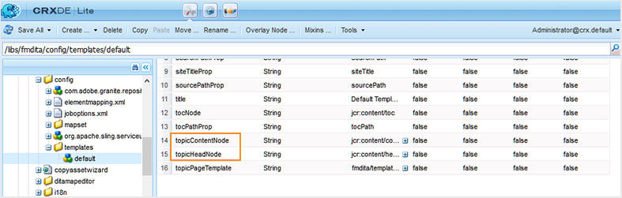

# 出力生成設定の指定 {#id181AI0B0E30}

AEM Guidesには、出力生成プロセスをカスタマイズするための多くの設定オプションが用意されています。 このトピックでは、出力生成プロセスの設定に役立つすべての設定とカスタマイズについて説明します。

## DITA マップダッシュボードの「ベースライン」タブの設定 {#id223MD0D0YRM}

マップダッシュボードで使用可能な「ベースライン」タブを設定したり非表示にしたりできます。

**ベースライン タブを非表示にする** オプションは既定では有効になっていないため、configMgr からこれを有効にする必要があります。 Web エディターでこのオプションをデフォルトで有効にするには、次の手順を実行します。

1. Adobe Experience Manager Web コンソール設定ページを開きます。

   設定ページにアクセスするためのデフォルトの URL は次のとおりです。

   ```http
   http://<server name>:<port>/system/console/configMgr
   ```

1. **com.adobe.fmdita.config.ConfigManager** バンドルを検索してクリックします。

1. 「**ベースラインタブを非表示**」オプションを選択します。

1. 「**保存**」をクリックします。

   >[!NOTE]
   >
   > この設定はデフォルトで無効になっており、マップダッシュボードで「ベースライン」タブを使用できます。


## FrameMaker Publishing Serverの設定 {#id1678G0Z0TN6}

FrameMaker Publishing Server \（FMPS\）を使用して、DITA コンテンツの出力を生成できます。 FMPS を設定すると、FMPS でサポートされている複数の形式で出力を生成できます。

>[!NOTE]
>
> FMPS を使用して出力を生成するには、FMPS サーバを設定する必要があります。 インストールと設定について詳しくは、FrameMaker Publishing Server ユーザーガイドを参照してください。

FMPS を使用するようにAEM Guidesを設定するには、web コンソールで `com.adobe.fmdita.config.ConfigManager` バンドルの次のプロパティを更新します。

>[!NOTE]
>
> http://&lt;server name\>:<port\>/system/console/configMgr の URL にアクセスして web コンソールを開きます。

| プロパティ | 説明 |
|--------|-----------|
| FrameMaker Publishing Server ログインドメイン | FrameMaker Publishing Serverがホストされているドメイン名またはワークグループ名を指定してください。 FMPS のバージョンに応じて、ドメイン名を :- のように指定します。   **FMPS 2020**:192.168.1.101 の IP アドレス <br>- **FMPS 2019 以前**:IP アドレスまたはドメイン名 |
| FRAMEMAKER PUBLISHING SERVER URL | FrameMaker Publishing Serverの URL を指定します。 FMPS バージョンに基づいて、FMPS URL を次のように指定します。<br>- **FMPS 2020**: `http://<fmps_ip>:<port>` \（http://192.168.1.101:7000\） <br> - **FMPS 2019 以前**: `http://<fmps_ip>:<port>/fmserver/v1/` |
| FMPS バージョン | FrameMaker Publishing Serverのバージョン番号を指定します。 FMPS のバージョンに応じて、バージョン情報を <br>- **FMPS 2020**: 2020 <br> - **FMPS 2019 以前**: 2019 または 2017 のように指定します。 |
| FrameMaker Publishing Serverのユーザー名とパスワード | FrameMaker Publishing Serverにアクセスするためのユーザー名とパスワードを指定します。 |
| FMPS タイムアウト | \（*オプション*\） FrameMaker Publishing ServerからのレスポンスをAEM Guidesが待つ時間を秒単位で指定します。 指定した時間内に応答がない場合、AEM Guidesは公開タスクを終了し、タスクには失敗とフラグが付けられます。 <br> デフォルト値：300 秒\（5 分\） |
| 外部AEM URL | *\（オプション\）* FrameMaker Publishing Serverが生成された出力ファイルを配置するAEM URL。 例えば、`http://<server-name>:<port>/` のように指定します。 |
| AEM管理者のユーザー名とパスワード | *\（オプション\）* AEM設定の管理者用のユーザー名とパスワード。 これは、FrameMaker Publishing ServerがAEMと通信するために使用されます。 |
| FMPS タスク実行待機タイムアウト | この設定は、FMPS 2020 にのみ適用されます。 FMPS がこのプロセスの実行を待機するのを停止するまでの時間を秒単位で指定します。 |

## 既存のAEM サイト内で混合型公開を設定する {#id1691I0V0MGR}

DITA コンテンツを含むAEM Site がある場合は、AEM Site 出力を設定して、DITA コンテンツをサイト内の事前定義済みの場所に公開できます。 例えば、次のAEM サイトページのスクリーンショットでは、`ditacontent` ノードは DITA コンテンツを格納するために予約されています。

{width="300" align="left"}

ページの残りのノードは、AEM サイトエディターから直接作成されます。 DITA コンテンツを事前定義済みの場所に公開するように公開設定を指定すると、既存の非 DITA コンテンツがAEM Guides公開プロセスで変更されることはありません。

定義済みノードに DITA コンテンツを発行できるようにするには、既存のサイトで次の設定を実行する必要があります。

- サイトのテンプレートプロパティの設定

- サイトにノードを追加して DITA コンテンツを公開


既存のサイトのテンプレートプロパティを設定するには、次の手順を実行します。

1. AEMにログインし、CRXDE Lite モードを開きます。

1. サイトのテンプレート設定ノードに移動します。 例えば、AEM Guidesは、次のノードにデフォルトのテンプレート設定を格納します。

   `/libs/fmdita/config/templates/default`

   >[!NOTE]
   >
   > `libs` ノードでデフォルトの設定ファイルをカスタマイズする必要はありません。 `libs` ノードに `apps` ノードのオーバーレイを作成し、`apps` ノードでのみ必要なファイルを更新する必要があります。

1. 以下のプロパティを追加します。

   | プロパティ名 | タイプ | 値 |
   |-------------|----|-----|
   | `topicContentNode` | 文字列 | DITA コンテンツを公開するノード名を指定します。 例えば、AEM Guidesが DITA コンテンツを公開するデフォルトのノードは <br>`jcr:content/contentnode` です。 |
   | `topicHeadNode` | 文字列 | DITA コンテンツのメタデータ情報を保存するノード名を指定します。 例えば、AEM Guidesがメタデータ情報を格納するデフォルトのノードは <br>`jcr:content/headnode` です。 |


次のスクリーンショットは、AEM Guidesのデフォルトテンプレートノードに追加されたプロパティを示しています。

{width="800" align="left"}

次にサイトのテンプレート設定を使用して DITA コンテンツを公開すると、そのコンテンツは `topicContentNode` および `topicHeadNode` プロパティで指定したノードに公開されます。

ただし、既存のサイトの場合は、`topicContentNode` ノードと `topicHeadNode` ノードを手動で追加する必要があります。

次の手順を実行して、必要なノードを既存のサイトに追加します。

1. AEMにログインし、CRXDE Lite モードを開きます。

1. サイトノード内で `jcr:content` を見つけます。

1. サイトのテンプレート設定で指定した名前と同じ名前のノード `topicContentNode` および `topicHeadNode` を追加します。


## AEM サイト出力のカスタマイズ {#id166TG0B30WR}

AEM Guidesでは、次の形式での出力の作成がサポートされています。

- AEM サイト

- PDF

- HTML5
- EPUB
- DITA-OT によるカスタム出力

AEM サイトの出力については、異なる出力タスクに異なるデザインテンプレートを割り当てることができます。 これらのデザインテンプレートは、異なるレイアウトで DITA コンテンツをレンダリングできます。 例えば、内部オーディエンスと外部オーディエンスに対して異なるデザインテンプレートを指定できます。

カスタマイズした DITA Open Toolkit \（DITA-OT\） プラグインをAEM Guidesで使用することもできます。 これらのカスタム DITA-OT プラグインをアップロードすると、特定の方法でPDF出力を生成できます。

>[!TIP]
>
> AEM サイトの出力を作成するためのベストプラクティスについては、ベストプラクティスガイド *appendix.md\#* の [AEM サイトの公開 &#x200B;](appendix.md#) の節を参照してください。

### 出力を生成するためのデザインテンプレートのカスタマイズ {#customize_xml-add-on}

AEM Guidesでは、事前定義済みの一連のデザインテンプレートを使用して、AEM Site 出力を生成します。 AEM Guidesのデザインテンプレートをカスタマイズして、企業のブランディングに合った出力を生成できます。 デザインテンプレートは、様々なスタイル \（CSS\）、スクリプト \（サーバー側とクライアント側の両方\）、リソース \（画像、ロゴ、その他のアセット\）、およびこれらすべてのリソースを結び付ける JCR ノードのコレクションです。 デザインテンプレートは、単一のサーバーサイドスクリプトと複数の JCR ノードのみで構成するか、スタイル、リソース、JCR ノードの複雑な組み合わせで構成することができます。 デザインテンプレートは、AEM Guides サイト出力を生成する際にAEM パブリッシングサブシステムで使用され、生成された出力の構造、ルックアンドフィールを制御します。

デザイン テンプレート リソースをサーバ上のどこに配置するかについては制限はありませんが、通常は機能に応じて論理的に編成されます。 例えば、デフォルトのテンプレートでは、すべてのJavaScriptと CSS ファイルがフォルダーに保存 `/etc/designs/fmdita/clientlibs/siteoutput/default` れています。 これらのファイルが配置されている場所では、それらのファイルは JCR ノードのコレクションによってリンクされます。 これらの JCR ノードとファイルによって、デザインテンプレート全体が構成されます。

AEM Guidesに付属しているデフォルトのデザインテンプレートを使用すると、ランディング、トピックおよび検索ページのコンポーネントをカスタマイズできます。 デフォルトのデザインと対応する参照テンプレートのコピーを作成し、異なるコンポーネントを指定して目的の出力を生成できます。

次の手順を実行して、AEM Site の出力生成に使用する独自のデザインテンプレートを指定します。

1. AEMにログインし、CRXDE Lite モードを開きます。

1. デフォルトのデザインテンプレートノードに移動します。 デフォルトのデザインテンプレートのノードは次の場所にあります。

   `/libs/fmdita/config/templates/`

   {width="300" align="left"}

   >[!NOTE]
   >
   > `libs` フォルダーから `apps` フォルダーに既定のデザイン テンプレートのコピーを作成し、`apps` フォルダーで変更を行います。 また、デフォルトのテンプレートノードから参照されたテンプレートに変更を加える必要もあります。 参照されるテンプレートは、ノード `/libs/fmdita/templates/default/cqtemplates` 下に配置されます。 変更を加える前に、参照されているテンプレートのコピーを `apps` フォルダーに作成します。

1. *templates* ノードの *default* コンポーネントをクリックして、そのプロパティにアクセスします。

   次の表に、AEM Guidesのデザインテンプレートプロパティを示します。

   | プロパティ | 説明 |
   |--------|-----------|
   | `landingPageTemplate`、`searchPageTemplate`、`topicPageTemplate`、`shadowPageTemplate` | これらの対応するページの `cq:Template` ノード （ランディング、検索、トピック\）を指定してください。 デフォルトでは、これらのページの `cq:Template` ノードは `/libs/fmdita/templates/default/cqtemplates` ノードにあります。 このノードは、ランディングページ、検索ページ、トピックページの構造とプロパティを定義します。 <br>`shadowPageTemplate` は、チャンクされたコンテンツの最適化に使用されます。 このプロパティの値を <br> に設定する必要があります。 `fmdita/templates/default/cqtemplates/shadowpage` <br> **メモ** `topicPageTemplate` の値を指定する必要があります。 `landingPageTemplate` と `searchPageTemplate` はオプションのプロパティです。 検索ページとランディングページを生成しない場合は、これらのプロパティを指定しないでください。 |
   | `title` | デザインテンプレートのわかりやすい名前。 |
   | `topicContentNode` | トピックページ内の DITA コンテンツを格納するノードの場所。 パスは、トピックページを基準とした相対パスです。 |
   | `topicHeadNode` | DITA コンテンツから派生したヘッド値\（またはメタデータ\）を含むノードの場所。 パスはトピックページを基準とした相対パスです。 |
   | `tocNode` | 目次を含むノードの場所。 パスは、ランディングページまたは宛先パスを基準とした相対パスです。 |
   | `basePathProp` | 公開されたサイトのルートのパスを保存するプロパティ名。 |
   | `indexPathProp` | 公開されたサイトのランディングページまたはインデックスページのパスを保存するプロパティ名。 |
   | `pdfPathProp` | トピックのPDFの生成が有効な場合に、トピックのPDFのパスを保存するためのプロパティ名。 |
   | `pdfTypeProp` | PDF世代のタイプを格納するプロパティ名。 現在、このプロパティには常に「トピック」が含まれています。 |
   | `searchPathProp` | テンプレートに検索ページが含まれている場合に、検索ページのパスを保存するためのプロパティ名。 |
   | `siteTitleProp` | 公開するサイトのタイトルを保存するためのプロパティ名。 通常、このタイトルはパブリッシュするマップのタイトルと同じです。 |
   | `sourcePathProp` | 現在のページのソース DITA トピックのパスを保存するためのプロパティ名。 |
   | `tocPathProp` | 公開されたサイトの目次ルートのパスを保存するプロパティ名。 |


>[!NOTE]
>
> カスタムデザインテンプレートノードを作成したら、AEM サイト出力プリセットのデザインオプションを更新して、カスタムデザインテンプレートノードを使用する必要があります。

詳しくは、[&#x200B; 最初のAdobe Experience Manager 6.3 の Web サイトの作成 &#x200B;](https://helpx.adobe.com/experience-manager/using/first_aem63_website.html) および [&#x200B; 基本 &#x200B;](https://helpx.adobe.com/experience-manager/6-3/sites/developing/using/the-basics.html) のAEMでの独自の Web サイトの開発を参照してください。

### AEM サイト出力の生成にドキュメントタイトルを使用

AEM Site 出力を生成する場合、URL の生成方法は、コンテンツの検出性に重要な役割を果たします。 UUID ベースのファイル名を使用している場合、ファイルの UUID に基づいて URL を生成しても、検索しづらくなります。 管理者または公開者は、AEM サイト出力の URL の生成方法を制御できます。 AEM Guidesでは、UUID ベースのファイル名ではなくファイルのタイトルを使用して、AEM サイト出力の URL を生成できる設定を提供します。 デフォルトでは、UUID ベースのファイルシステムの場合、このオプションはオンになっています。 つまり、UUID ベースのファイルシステムに対してAEM サイト出力を生成する場合、ファイルの UUID ではなく URL の生成にファイルのタイトルが使用されます。

AEM Site 出力を生成する場合、URL の生成方法は、コンテンツの検出性に重要な役割を果たします。 UUID ベース以外のファイルシステムの場合、AEM サイトの出力は、ファイルのタイトルではなくファイル名を使用して生成されます。 管理者または公開者は、AEM サイト出力の URL の生成方法を制御できます。 AEM Guidesでは、ファイル名の代わりにファイルのタイトルを使用してAEM サイト出力の URL を生成できる設定を提供しています。 デフォルトでは、このオプションはオフになっています。 つまり、AEM サイト出力を生成する際に、ファイルのタイトルではなく、ファイル名を使用して URL が生成されます。 このオプションを有効にすると、ファイルのタイトルに基づいて URL を生成できます。

>[!NOTE]
>
> さらに、AEM Site 出力の URL に一連の文字のみを含めるルールを設定することもできます。 詳しくは、[&#x200B; トピックを作成し、AEM サイトの出力を公開するためのファイル名のサニタイズルールの設定 &#x200B;](#id2164D0KD0XA) を参照してください。

AEM サイト出力に URL を生成するには、次の手順を実行します。

1. Adobe Experience Manager Web コンソール設定ページを開きます。

   設定ページにアクセスするためのデフォルトの URL は次のとおりです。

   ```http
   http://<server name>:<port>/system/console/configMgr
   ```

1. **com.adobe.fmdita.config.ConfigManager** バンドルを検索してクリックします。

1. 「**AEM サイトページ名のタイトルを使用**」オプションを選択します。

   >[!NOTE]
   >
   > ファイル名を使用して出力を生成する場合は、このオプションの選択を解除します。

1. 「**保存**」をクリックします。


### トピックを作成し、AEM サイトの出力を公開するためのファイル名のサニタイズルールを設定する {#id2164D0KD0XA}

管理者は、ファイル名に使用できる有効な特殊文字のリストを定義できます。これらの特殊文字が、最終的にAEM サイトの出力の URL になります。 以前のリリースでは、`@`、`$`、`>` などの特殊文字を含むファイル名を定義できていました。 これらの特殊文字により、AEM サイトページの生成時に URL がエンコードされていました。

3.8 リリース以降、ファイル名で使用できる特殊文字のリストを定義する設定が追加されました。 デフォルトでは、有効なファイル名設定には「`a-z A-Z 0-9 - _`」が含まれます。 つまり、ファイルを作成する際に、ファイルのタイトルに任意の特殊文字を含めることができますが、内部的には、ファイル名ではハイフン\（`-`\）に置き換えられます。 例えば、ファイルのタイトルを Introduction 1 またはIntroduction@1にすることができ、これらの場合に生成される対応するファイル名は Introduction-1 になります。

有効な文字のリストを定義する場合、これらの文字「`*/:[\]|#%{}?&<>"/+`」と `a space` は常にハイフン \（`-`\）に置き換えられることに注意してください。

>[!NOTE]
>
> 有効な特殊文字リストを設定しないと、ファイル作成プロセスで予期しない結果が生じる場合があります。

ファイル名およびAEM サイト出力に有効な特殊文字を設定するには、次の手順を実行します。

1. Adobe Experience Manager Web コンソール設定ページを開きます。

   設定ページにアクセスするためのデフォルトの URL は次のとおりです。

   ```http
   http://<server name>:<port>/system/console/configMgr
   ```

1. *com.adobe.fmdita.common.SanitizeNodeNameImpl* バンドルを検索してクリックします。

1. **AEM Sitesに公開する際に使用できない文字セット** プロパティで、プロパティが ```'<>`@$``` に設定されていることを確認します。 このリストにさらに特殊文字を追加できますが、必要な特殊文字が含まれている必要があります。

   >[!NOTE]
   >
   > ファイル名での **小文字を使用**、無効な文字を処理するための **区切り文字**、ファイル名で許可されている **最大文字数** など、他のプロパティも設定できます。

1. 「**保存**」をクリックします。

1. **com.adobe.fmdita.config.ConfigManager** バンドルを検索してクリックします。

1. **Regex for Valid Characters** プロパティで、プロパティが `[-a-zA-Z0-9_]` に設定されていることを確認します。 このリストにさらに文字を追加できますが、これらの基本文字を含み、リストをハイフン \（`-`\）で始める必要があります。

   >[!NOTE]
   >
   > このプロパティは、新しいファイルの作成に使用される有効な文字のリストを定義します。

1. 「**保存**」をクリックします。


### AEM サイトノード構造のフラット化の設定

AEM Site 出力を生成すると、トピック内の各要素のノードが内部に作成されます。 何千ものトピックを持つ DITA マップの場合、このノード構造は深くなりすぎることがあります。 このタイプの深くネストされたノード構造は、大規模なサイトの場合にパフォーマンスの問題が発生する可能性があります。 次のスナップショットは、AEM Site 出力の深くネストされたノード構造を示しています。

{width="300" align="left"}

上記のスナップショットでは、`p` 要素とその後に続くサブ要素ごとにノードが作成され、トピックで使用されるその他のすべての要素に対して同様の構造が作成されます。

AEM Guidesを使用すると、AEM サイト出力のノード構造が内部でどのように作成されるかを設定できます。 指定した要素のノード構造を統合できます。つまり、メイン要素と見なされる要素を定義し、その中のすべてのサブ要素をメイン要素と結合できます。 例えば、`p` 要素を統合する場合、`p` 要素内に表示される要素は、メインの `p` 要素と結合されます。 `p` 要素内のサブ要素に対しては、別のメモは作成されません。 次のスナップショットは、要素でフラット化されたノード構造 `p` 示しています。

{width="300" align="left"}

AEMサイトのノード構造を統合するには、次の手順を実行します。

1. ノード構造を統合する要素を指定します。

   1. `libs` ノードの `apps` ノードをオーバーレイし、elementmapping.xml ファイルを開きます。

   1. ノード構造を統合する要素の定義に `<flatten>true</flatten>` プロパティを追加します。 例えば、`p` 要素のノード構造を統合する場合は、次に示すように、要素の定義に flatten 属性 `p` 追加します。

      ```XML
      <ditaelement>
          <name>p</name>
          <class>- topic/p</class>
          <componentpath>fmdita/components/dita/wrapper</componentpath>
          <type>COMPOSITE</type>
          <target>para</target>
          <flatten>true</flatten>
          <wrapelement>div</wrapelement>
      </ditaelement>
      ```

      >[!NOTE]
      >
      > デフォルトでは、`p` 要素に flatten ノードプロパティが設定されています。

1. configMgr でサイトノードのフラット化の設定を有効にします。

   1. Adobe Experience Manager Web コンソール設定ページを開きます。

      設定ページにアクセスするためのデフォルトの URL は次のとおりです。

      ```http
      http://<server name>:<port>/system/console/configMgr
      ```

   1. *com.adobe.dxml.flattening.FlatteningConfigurationService* バンドルを検索してクリックします。

   1. **Property flattening.enabled** オプションを選択します。

   1. 「**保存**」をクリックします。


>[!IMPORTANT]
>
> elementmapping.xml ファイルに変更を加えた場合は、configMgr を開いて、変更を有効にするためにバンドルを保存してください。

これで、AEM Site 出力を生成すると、`p` 要素内のノードが統合され、`p` 要素自体に保存されます。 CRXDE の `p` 要素の新しいフラット化プロパティを参照してください。

{width="650" align="left"}

**AEM サイトノート構造のフラット化の防止**

AEM サイト出力を統合するノードを指定する場合と同様に、この設定から除外する要素を指定することもできます。 例えば、`body` の要素のノードを統合しても、`table` 内の `body` 要素を統合しない場合は、`table` 要素の定義内に exclude プロパティを追加できます。

`table` 要素をフラット化から除外するには、`table` 要素の定義に次のプロパティを追加します。

`<preventancestorflattening>true|false</preventancestorflattening>`

### AEM Site 出力での削除済みページのバージョン管理の設定

「既存の出力ページ」設定で **削除および** 作成 **&#x200B;**&#x200B;オプションを選択してAEM サイト出力を生成すると、削除するページ\（s\）のバージョンが作成されます。 削除前にバージョンの作成を停止するようにシステムを設定できます。

次の手順を実行して、削除するページ\（s\）のバージョンの作成を停止します。

1. Adobe Experience Manager Web コンソール設定ページを開きます。

   設定ページにアクセスするためのデフォルトの URL は次のとおりです。

   ```http
   http://<server name>:<port>/system/console/configMgr
   ```

1. *com.adobe.fmdita.config.ConfigManager* バンドルを検索してクリックします。

1. 「**削除されたページのバージョンを作成しない**」オプションを選択します。

   >[!NOTE]
   >
   > このオプションを選択すると、ユーザーは、バージョンを作成せずに任意のページ\を直接削除できます。 このオプションを選択しない場合は、ページが削除される前にバージョンが作成されます。

1. 「**保存**」をクリックします。

## DITA-OT 経由での出力の公開でのメタデータの使用 {#id191LF0U0TY4}

AEM Guidesには、DITA-OT を使用して出力を公開する際に、カスタムメタデータを渡す方法が用意されています。 管理者および公開者は、次のタスクを実行して、公開された出力にカスタムメタデータを設定して使用する必要があります。

- 管理者は、必要なメタデータをシステムに追加して、DITA マップの「プロパティ」 ページで使用できるようにします。

- 管理者は、カスタムメタデータをメタデータリストに追加して、DITA マップコンソールに表示されるようにします。

- パブリッシャーとして、DITA マップを使用してカスタムメタデータを設定および追加し、必要な出力を生成します。


必要なメタデータをシステムに追加するには、次の手順を実行します。

1. Adobe Experience Managerに管理者としてログインします。

1. 上部の「Adobe Experience Manager」リンクをクリックし、「**ツール**」を選択します。

1. ツールのリストから **0&rbrace;Assets&rbrace; を選択します。**

1. **メタデータスキーマ** タイルをクリックします。

   メタデータスキーマFormsページが表示されます。

1. リストから **デフォルト** フォームを選択します。

   >[!NOTE]
   >
   > DITA マップの「プロパティ」 ページに表示されるプロパティは、このフォームから取得されます。

1. 「**編集**」をクリックします。

1. 公開済みの出力で使用するカスタムメタデータを追加します。 例えば、次の手順を使用してオーディエンスメタデータを追加します。

   1. **フォームを作成** コンポーネントリストから、**1 行のテキスト** コンポーネントをフォームにドラッグ&amp;ドロップします。

   1. 新しいフィールドを選択して、フィールドの **設定** を開きます。

   1. **フィールドラベル** に、メタデータ名「オーディエンス」を入力します。

   1. **プロパティにマッピング** 設定で、を指定します。/jcr:content/metadata/&lt; メタデータの名前\> この例では、をに設定します。/jcr:content/metadata/audience.

   これらの手順を使用して、必要なメタデータパラメーターをすべて追加します。

1. 「**保存**」をクリックします。


すべての DITA マップの「プロパティ」 ページに新しいパラメータが表示されます。

{width="650" align="left"}

次に、DITA マップコンソールでカスタムメタデータを使用できるようにする必要があります。 次の手順を実行して、DITA マップダッシュボードでカスタムメタデータを使用できるようにします。

1. AEMにログインし、CRXDE Lite モードを開きます。

1. 次の場所にある metadataList ファイルにアクセスします。

   /libs/fmdita/config/metadataList

   >[!NOTE]
   >
   > metadataList ファイルには、マップダッシュボードの DITA マップの **プロパティ** ドロップダウンリストに表示されるプロパティのリストが含まれています。 デフォルトでは、このファイルには 4 つのプロパティ（docstate、dc:language、dc:description、および dc:title）がリストされています。

1. メタデータスキーマのFormsページに追加したカスタムメタデータを追加します。 この例では、デフォルトリストの末尾にオーディエンスパラメーターを追加します。

1. 「**すべて保存**」をクリックします。


これで、DITA マップコンソールの **プロパティ** ドロップダウンリストにカスタムメタデータが表示されます。

最後に、パブリッシャーとして、公開出力にカスタムメタデータを含める必要があります。 出力の生成時にカスタムメタデータを処理するには、次の手順を実行します。

1. Assets UI で、公開する DITA マップに移動します。

1. DITA マップファイルを選択し、そのプロパティページを開きます。

1. プロパティ ページで、カスタムメタデータの値を指定します。 この例では、オーディエンスパラメーターに External の値を指定しました。

   {width="650" align="left"}

1. 「**保存して閉じる**」をクリックします。

1. DITA マップファイルをクリックして、DITA マップコンソールを開きます。

1. 「**出力プリセット**」タブで、出力の生成に使用する出力プリセットを選択します。

1. 「**編集**」をクリックします。

1. **プロパティ** ドロップダウンリストから、公開プロセスに渡すプロパティを選択します。

   {width="650" align="left"}


選択したプロパティやメタデータが公開プロセスに渡され、最終的な出力で使用できるようになります。

## AEM コンポーネントを使用した DITA 要素マッピングのカスタマイズ {#id1679J600HEL}

AEM Guides内の DITA エレメントは、対応するAEM コンポーネントにマッピングされます。 AEM Guidesは、公開やレビューなどのワークフローでこのマッピングを使用して、DITA 要素を対応するAEM コンポーネントに変換します。 マッピングは `elementmapping.xml` ファイルで定義されます。このファイルには、CRXDE Lite モードからアクセスできます。 CRXDE Lite モードで次の URL にアクセスします。

`/libs/fmdita/config/elementmapping.xml`

>[!NOTE]
>
> ``libs`` ノードでデフォルトの設定ファイルをカスタマイズする必要はありません。 ``libs`` ノードに ``apps`` ノードのオーバーレイを作成し、``apps`` ノードでのみ必要なファイルを更新する必要があります。

定義済みの DITA エレメントマッピングを使用するか、カスタムのAEM コンポーネントに DITA エレメントをマッピングできます。 カスタム AEM コンポーネントを使用するには、`elementmapping.xml` ファイルの構造を理解している必要があります。

### elementmapping.xml 構造

`elementmapping.xml` の構造の概要を以下に説明します。

1. すべての DITA 要素は、最初に要素名に基づいて対応するコンポーネントマッピングを検索されます。 例：

   ```XML
   <ditaelement>     
      <name>**substeps**</name>  
      <class>- topic/ol task/substeps</class>  
      <componentpath>dita/components/ditaolist</componentpath>  
      <type>COMPOSITE</type>  
      <target>para</target>
   </ditaelement>
   ```

   上記の例では、すべて `substeps`DITA エレメントが `dita/components/ditaolist` コンポーネントを使用してレンダリングされます。

1. DITA エレメントが名前に基づく一致を見つけられない場合は、`class` に基づく一致が行われます。 例：

   ```XML
   <ditaelement>  
      <name>topic</name>  
      <class>**- topic/topic**</class>  
      <componentpath>fmdita/components/dita/topic</componentpath>  
      <type>COMPOSITE</type>  
      <target>para</target>  
      <attributemap> 
         <attribute from="id" to="id" />  
      </attributemap>
   </ditaelement>
   ```

   上記の例では、`task` 要素にマッピングが定義されていない場合、`task` 要素は上記のコンポーネントにマッピングされます。`task` れは、`topic` コンポーネントから継承されるからです。

1. 要素が対応するコンポーネントマッピングを持つ場合、その子要素のさらなる処理は `type` によって決定される。 例：

   ```XML
   <ditaelement>  
      <name>title</name>  
      <class>- topic/title</class>  
      <componentpath>foundation/components/title</componentpath>  
      <type>**STANDALONE**</type>  
      <target>para</target>  
      <textprop>jcr:title</textprop>
   </ditaelement>
   ```

   `type` は次の値を取ります。

   - COMPOSITE：要素からコンポーネントへ *子要素のマッピングも継続*。

   - STANDALONE：現在の要素の子要素が *それ以上マッピングされない*。

   上記の例では、`<title>` 要素に子要素がある場合、それらは他のコンポーネントにはマッピングされません。 要素のコンポーネントは `<title>` `<title>` 要素内のすべての子要素のレンダリングを担当します。

1. 1 つの DITA エレメントに複数のコンポーネントがマッピングされている場合は、そのエレメントに最適なコンポーネントが選択されます。 最適なマッチコンポーネントを選択するには、DITA エレメントのドメインと構造的特殊化が考慮されます。

   ドメイン特殊化された DITA エレメントがあり、あるコンポーネントがドメイン特殊化にマップされている場合、そのコンポーネントは高い優先度を与えられます。

   同様に、構造的特殊化された DITA エレメントがあり、あるコンポーネントが構造的特殊化用にマッピングされている場合、そのコンポーネントは高い優先度を与えられます。

1. 要素マッピングで `<attributemap>` を使用して、属性値を対応するノードプロパティにマッピングできます。

1. `textprop` を使用して、DITA 要素のテキストコンテンツをノードプロパティにシリアル化できます。 また、要素タグで複数回使用して、公開階層内の複数の場所にあるテキストコンテンツをシリアル化できます。 ターゲットプロパティの場所と名前をカスタマイズすることもできます。 例：

   ```XML
   <ditaelement> 
       <name>title</name> 
       <class>- topic/title</class> 
       <componentpath>foundation/components/title</componentpath> 
       <type>STANDALONE</type> 
       <target>para</target> 
       <textprop>**jcr:title**</textprop>
   </ditaelement>
   ```

   上記の要素マッピングでは、要素のテキストコンテンツ `<title>`、出力ノードの `jcr:title` という名前のプロパティの値として保存されることを指定しています。

1. 特定 `xmlprop` 要素の XML 全体をノードプロパティにシリアル化するために使用できます。 その後、コンポーネントはこのノードプロパティを読み取り、カスタムレンダリングを実行できます。 例：

   ```XML
   <ditaelement> 
       <name>svg-container</name> 
       <class>+ topic/foreign svg-d/svg-container</class> 
       <componentpath>fmdita/components/dita/svg</componentpath> 
       <type>STANDALONE</type> 
       <target>para</target> 
       <xmlprop>**data**</xmlprop>
   </ditaelement>
   ```

   上記の要素マッピングは、要素 `<svg-container>` の XML マークアップ全体が、出力ノードの `data` という名前のプロパティの値として保存されることを指定しています。

1. 出力生成プロセスでパス解決を処理するために、特別な属性マッピングがあります。 例：

   ```XML
   <attributemap> 
       <attribute from="href" to="fileReference" ispath="true" rel="source" /> 
       <attribute from="height" to="height" /> 
       <attribute from="width" to="width" />
   </attributemap>
   ```

   上記の `attributemap` では、DITA 要素の `href` 属性が `fileReference` という名前のノードプロパティにマッピングされます。 `ispath` が `true` に設定されているので、出力生成プロセスはこのパスを解決して、ノードプロパティに設定 `fileReference` ます。

   この解決がどのように行われるかは、属性マッピングの `rel` 属性の値に基づいて決定されます。

   - `rel=source` の場合、現在処理中の DITA ソースファイルに関して `href` の値が解決されます。 `href` の値が解決され、プロパティの値 `fileReference` 配置されます。

   - `rel=target` の場合、`href` の値はルートの公開場所を基準に解決されます。 `href` の値が解決され、プロパティの値 `fileReference` 配置されます。

   パス属性に対して前処理または解決を実行しない場合は、`ispath` 属性を指定する必要はありません。 値がそのままコピーされ、コンポーネントは必要な解決を実行できます。


### DITA 要素スキーマ

ファイル内の DITA 要素スキーマの例 `elementmapping.xml` 次に示します。

```XML
<ditaelement>         
    <name>element_name</name>     
    <class>element_class</class>     
    <componentpath>fmdita/components/dita/component_name</componentpath>     
    <type>COMPOSITE|STANDALONE</type>      
    <attributeprop>propname_a</attributeprop>       
    <textprop>propname_t</textprop>     
    <xmlprop>propname_x</xmlprop>      
    <xpath>xpath expression string</xpath>      
    <target>head|para</target>      
    <wrapelement>div</wrapelement>      
    <wrapclass>class_name</wrapclass>      
    <attributemap>           
    <attribute from="attrname" to="propname" ispath="true|false" rel="source|target" />     
    </attributemap>     
    <skip>true|false</skip> 
</ditaelement>
```

次の表に、DITA エレメントスキーマのエレメントを示します。

| 要素 | 説明 |
|-------|-----------|
| `<ditaelement>` | 各マッピング要素の最上位ノード。 |
| `<class>` | コンポーネントを書き込むターゲット DITA 要素のクラス属性。 <br> たとえば、DITA トピックの class 属性は <br>`topic/topic` のようになります。 |
| `<componentpath>` | マッピングされたAEM コンポーネントの CRXDE パス。 |
| `<type>` | 使用可能な値：<br>- **COMPOSITE**：子要素も処理 <br>- **STANDALONE**：子要素の処理をスキップします |
| `<attributeprop>` | シリアル化された DITA アトリビュートと値をプロパティとしてAEM ノードにマッピングするために使用します。 例えば、`<note type="Caution">` 要素があり、この要素用にマッピングされるコンポーネントに `<attributeprop>attr_t</ attributeprop>` がある場合、ノードの属性と値は、対応するAEM ノードの `attr_t` プロパティ \（`attr_t->type="caution"`\）にシリアル化されます。 |
| `<textprop>propname_t</textprop>` | `getTextContent()` 出力を `propname_t.` で定義されたプロパティに保存します **メモ：** これは最適化されたプロパティです。 |
| `<xmlprop>propname_x </xmlprop>` | このノードのシリアル化された XML を `propname_x.` で定義されたプロパティに保存します **注意：** これは最適化されたプロパティです。 |
| `<xpath>` | XPath 要素が要素マッピングで指定されている場合、使用するコンポーネントマッピングについて、要素名およびクラスと共に XPath 条件も満たす必要があります。 |
| `<target>` | DITA 要素を crx リポジトリ内の指定した場所に配置します。 <br> 使用可能な値：<br>- **head**:head ノードの下 <br>- **text**：段落ノードの下 |
| `<wrapelement>` | コンテンツを含めるHTML要素。 |
| `<wrapclass>` | プロパティ `wrapclass.` の要素値 |
| `<attributemap>` | 1 つ以上の `<attribute>` ノードを含むコンテナノード。 |
| `<attribute from="attrname" to="propname" ispath="true\|false" rel="source\|target" />` | DITA 属性をAEM プロパティにマップします。<br>- **`from`**: DITA 属性名 <br>- **`to`**: AEM コンポーネントプロパティ名 <br>- **`ispath`**：属性がパス値の場合\（例：*image*\） <br>- **`rel`**: パスがソースまたはターゲットの場合 <br>**注意：**`attrname` が `%` で始まる場合は、`attrname minus '%'` を prop &#39; `propname`&#39;にマップします。 |

**補足事項**

- デフォルトの要素マッピングをオーバーライドする場合は、デフォルトの `elementmapping.xml` ファイルを変更しないことをお勧めします。 新しいマッピング XML ファイルを作成し、ファイルを別の場所（できれば、作成したカスタムアプリフォルダー内）に配置する必要があります。

- `elementmapping.xml` ファイルには、fmdita/components/dita/wrapper コンポーネントを参照するマッピングエントリが多数あります。 ラッパーは、サイトノードのプロパティを使用して比較的単純な DITA 構成をレンダリングし、関連するHTMLを生成する汎用コンポーネントです。 `wrapelement` プロパティを使用して囲むタグを生成し、子レンダリングを対応するコンポーネントに委任します。 これは、コンテナコンポーネントのみを必要とする場合に便利です。 `div` や `p` などの特定のコンテナタグをレンダリングする新しいコンポーネントを作成する代わりに、`wrapelement` プロパティと `wrapclass` プロパティを持つラッパーコンポーネントを使用して、同じ効果を得ることができます。

- 大量のテキストを文字列 JCR プロパティに保存することはお勧めしません。 出力生成の最適化されたプロパティタイプ計算により、大きなテキストコンテンツが文字列タイプとして保存されなくなります。 代わりに、特定のしきい値を超えるコンテンツを保存する必要がある場合は、プロパティのタイプをバイナリに変更します。 デフォルトでは、このしきい値は 512 バイトに設定されていますが、*バイナリしきい値として保存* 設定を変更することで、Configuration Manager \（**com.adobe.fmdita.config.ConfigManager**\）で変更できます。

- 一部の\（すべてではない\）の要素マッピングを上書きする場合は、`elementmapping.xml` ファイル全体をレプリケートする必要はありません。 新しい XML マッピングファイルを作成し、上書きする要素のみを定義する必要があります。

- カスタムの場所に XML ファイルを作成したら、`Override Element Mapping` バンドルの `com.adobe.fmdita.config.ConfigManager` 設定を更新します。


## DITA マップコンソールのカスタマイズ {#id188HC08M0CZ}

AEM Guidesには、DITA マップコンソールの機能を柔軟に拡張する機能があります。 例えば、AEM Guidesで使用可能なものとは異なる一連のレポートがある場合、そのようなレポートをマップコンソールに追加できます。 マップコンソールをカスタマイズするには、必要な機能を実行するコードを含むAEM クライアントライブラリ \（または ClientLib \）を作成する必要があります。

>[!NOTE]
>
> 製品の新しいリリースで上書きされるので、ページコンポーネントを直接変更することはお勧めしません。

AEM Guidesには、マップコンソールをカスタマイズするための `apps.fmdita.dashboard-extn` カテゴリが用意されています。 マップコンソールが読み込まれると、`apps.fmdita.dashboard-extn` カテゴリの下に作成された機能が実行されて読み込まれます。

>[!NOTE]
>
> AEM クライアントライブラリの作成について詳しくは、[&#x200B; クライアントサイドライブラリの使用 &#x200B;](https://helpx.adobe.com/experience-manager/6-4/sites/developing/using/clientlibs.html) を参照してください。

## 出力生成時の画像レンディションの処理 {#id177BF0G0VY4}

AEMには、アセットの処理に使用するデフォルトのワークフローとメディアハンドルのセットが付属しています。 AEMには、最も一般的な MIME タイプのアセット処理を処理するための事前定義済みワークフローがあります。 通常、アップロードする画像ごとに、AEMによって同じ画像の複数のレンディションがバイナリ形式で作成されます。 これらのレンディションは、サイズ、解像度、透かしの追加、その他の変更された特性が異なる場合があります。 AEMでのアセットの処理方法について詳しくは、AEM ドキュメントの [&#x200B; メディアハンドラーとワークフローを使用したAssetsの処理 &#x200B;](https://helpx.adobe.com/experience-manager/6-5/assets/using/media-handlers.html) を参照してください。

AEM Guidesでは、ドキュメントの出力を生成する際に使用する画像レンディションを設定できます。 例えば、デフォルトの画像レンディションの 1 つから選択するか、画像レンディションを作成し、それを使用してドキュメントを公開することができます。 ドキュメントを公開するための画像レンディションマッピングは、`/libs/fmdita/config/ **renditionmap.xml**` ファイルに保存されます。 ファイルのスニペ `renditionmap.xml` トを次に示します。

>[!NOTE]
>
> `renditionmap.xml` ファイルのコピーを、すべてのカスタマイズ用に `apps` フォルダーに作成することをお勧めします。

```XML
<renditionmap>
   <mapelement>
      <mimetype>image/png</mimetype>
      <rendition output="AEMSITE">cq5dam.web.1280.1280.jpeg</rendition>
      <rendition output="PDF">original</rendition>
      <rendition output="HTML5">cq5dam.web.1280.1280.jpeg</rendition>
      <rendition output="HTML5" outputName="ditahtml5">cq5dam.thumbnail.319.319.png</rendition>
      <rendition output="EPUB">cq5dam.web.1280.1280.jpeg</rendition>
      <rendition output="CUSTOM">cq5dam.web.1280.1280.jpeg</rendition>
   </mapelement>
...
</renditionmap>
```

`mimetype` 要素は、ファイル形式の MIME タイプを指定します。 `rendition output` 要素は、出力形式のタイプと、指定した出力の公開に使用するレンディションの名前\（例：`cq5dam.web.1280.1280.jpeg`\）を指定します。 サポートされる全ての出力形式（AEMSITE、PDF、HTML5、EPUB、CUSTOM）で使用する画像レンディションを指定できます。

出力プリセットに異なる画像レンディションを指定する場合は、`outputName` 属性を使用して、同じ出力タイプの特定の出力プリセットにカスタムレンディションを定義できます。 これは、公開シナリオごとに異なる画像サイズや画像の形式が必要な場合に役立ちます。

例：


```XML
<renditionmap>
   <mapelement>
      <mimetype>image/png</mimetype>
      
      <rendition output="HTML5">cq5dam.web.1280.1280.jpeg</rendition>
      <rendition output="HTML5" outputName="ditahtml5">cq5dam.thumbnail.319.319.png</rendition>
      
   </mapelement>
...
</renditionmap>
```

上記のレンディションでは、レンディションで `outputName` 属性を定義した場合、ditahtml5 プリセットは `cq5dam.thumbnail.319.319.png` を使用し、`outputName` を定義していない場合、HTML5 の出力はすべて `cq5dam.web.1280.1280.jpeg` を使用します。

指定したレンディションが存在しない場合、AEM Guides公開プロセスは、指定された画像の web レンディションを最初に検索します。 Web レンディションも見つからない場合は、画像の元のレンディションが使用されます。

>[!NOTE]
>
> これらの画像レンディションは、出力の生成のみを制御します。 画像の web レンディションは、ドキュメントをプレビューまたはレビュー用に開いたときに使用されます。

## 出力履歴の自動パージ期間の設定 {#id19AAI070V8Q}

出力を生成すると、出力が出力ログと共に作成されます。 大きな DITA マップの場合、これらのログはリポジトリ内に大量の領域を取る可能性があります。 デフォルトでは、ログはリポジトリ内の次の場所に保存されます。

/var/dxml/metadata/outputHistory/

時間が経つと、すべてのログファイルの全体のサイズが GB に達する可能性があります。 AEM Guidesでは、これらのログファイルをリポジトリに保持する期間を設定できます。 指定した期間が経過すると、ログは出力生成履歴と共にリポジトリから削除されます。

>[!NOTE]
>
> 出力生成履歴は、「出力」タブの「生成された出力」リスト内のログエントリです。

履歴パージ機能を設定すると、リポジトリ内のすべての DITA マップの出力生成に影響します。 DITA マップの「出力」タブでは、履歴は指定した日数が経過した後、設定で指定した時間にパージされます。

>[!NOTE]
>
> ログファイルと出力生成履歴を削除しても、生成された出力には影響しません。

次の手順を実行して、出力履歴とログをパージする日時を設定します。

1. Adobe Experience Manager Web コンソール設定ページを開きます。

   設定ページにアクセスするためのデフォルトの URL は次のとおりです。

   ```http
   http://<server name>:<port>/system/console/configMgr
   ```

1. **com.adobe.fmdita.config.ConfigManager** バンドルを検索してクリックします。

1. 「**出力履歴のパージ期間**」プロパティで、出力履歴と出力ログがパージされるまでの日数を指定します。 デフォルトでは 5 日に設定されています。 この機能を無効にする場合は、このプロパティを 0 に設定します。

1. 「**出力履歴のパージ時間**」プロパティで、パージプロセスが開始される時間を指定します。 デフォルトでは 0:00\（または 12:00 午前 0 時\）に設定されています。 この時点では、毎日、「出力履歴のパージ期間 **プロパティで指定した日数より前に生成された出力に対してパージプロセスが実行され** す。

   >[!NOTE]
   >
   > デフォルトでは、パージ機能は 5 日より前の出力では毎日午前 0 時に実行されます。

1. 「**保存**」をクリックします。


## 最近生成された出力リストの制限の変更 {#id1679JH0H0O2}

DITA マップの「出力」 タブに表示される出力の最大数を変更できます。 デフォルトでは、直近で生成された 25 個の出力のリストが表示されます。 リストに表示する出力数を変更するには、**バンドルの** 出力リスト制限 `com.adobe.fmdita.config.ConfigManager` 設定を更新します。

>[!TIP]
>
> 出力履歴の操作に関するベストプラクティスについては、ベストプラクティスガイド *appendix.md\#* の [&#x200B; 出力履歴 &#x200B;](appendix.md#) の節を参照してください。

## 出力生成パフォーマンスの最適化 {#id176LB050VUI}

AEM Guidesでは、同時に実行する出力生成プロセスの数を制御する、出力生成プロセスのプールサイズを設定できます。 デフォルトでは、プロセスプールのサイズは、システムで使用可能な処理コアの数に 1 を加えた数に設定されます。 順次公開する場合は、この値を 1 に変更できます。 この場合、最初の公開タスクが実行され、次の公開タスクが公開キューに保存されます。

出力生成処理プールのサイズを変更するには、**バンドル内の** 生成プールサイズ `com.adobe.fmdita.publish.manager.PublishThreadManagerImpl` 設定を更新します。
