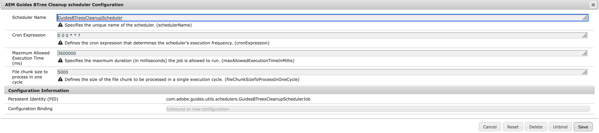
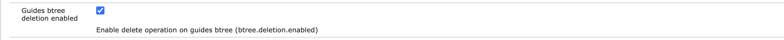

# B ツリークリーンアップの設定

B ツリーのクリーンアップ ジョブを設定し、`Guides B-tree deletion`設定を管理して、システムを最適化し、ストレージをクリーンに保ちます。

## B ツリーのクリーンアップ ジョブの設定

B ツリーのクリーンアップジョブを設定するには、次の手順を実行します。

1. Adobe Experience Manager Web コンソールの設定ページを開きます。

   設定ページにアクセスするためのデフォルトのURLは次のとおりです。

   ```http
   http://<server name>:<port>/system/console/configMgr
   ```

1. *com.adobe.guides.utils.schedulers.GuidesBTreesCleanupSchedulerJob* バンドルを検索して選択します。

1. Cron式を更新して、B ツリークリーンアップスケジューラージョブの実行頻度を設定します。

1. 次に示すように、B ツリークリーンアップスケジューラーを設定します。

   

1. 「**保存**」を選択します。


## ガイド B ツリー削除の有効化の設定

設定を有効にするには、次の手順を実行します。

1. Adobe Experience Manager Web コンソールの設定ページを開きます。

   設定ページにアクセスするためのデフォルトのURLは次のとおりです。

   ```http
   http://<server name>:<port>/system/console/configMgr
   ```

1. *com.adobe.fmdita.config.ConfigManager* バンドルを検索して選択します。
1. 設定`Guides btree deletion enabled`を有効にします。

   

1. 「**保存**」を選択します。
