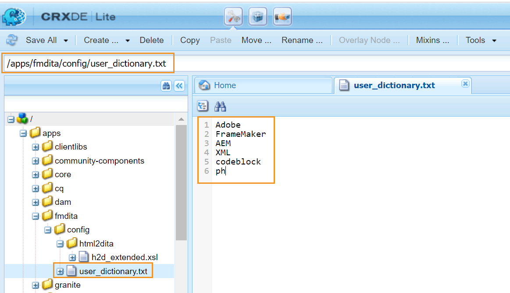

# AEMのデフォルトディクショナリのカスタマイズ {#id209SD8000WU}

Web エディターは、AEMのスペルチェッカーまたはブラウザーのスペルチェッカーを使用するように設定できます。 AEMのスペルチェッカーを使用すれば、独自の単語リストを柔軟に定義できます。 次に、これらのカスタム単語がAEMの辞書に追加され、これらの単語はWeb エディターで\（不正な\）フラグが付けられません。

次の手順を実行して、AEM ディクショナリに追加されたカスタム単語リストを作成します。

1. AEMにログインし、CRXDE Lite モードを開きます。

1. 次のノードに移動します。

   /apps/fmdita/config

1. user\_dictionary.txtという名前の新規ファイルを作成します。

1. ファイルを開き、カスタム辞書で定義する単語のリストを追加します。

   次のスクリーンショットは、user\_dictionary.txt ファイルに追加されたカスタム単語リストを示しています。

   {width="650"}

1. ファイルを保存して閉じます。

作成者は、AEM ディクショナリでカスタム単語リストを更新するには、Web エディターセッションを再起動する必要がありました。

**親トピック：**&#x200B;[&#x200B; Web エディターのカスタマイズ &#x200B;](conf-web-editor.md)
