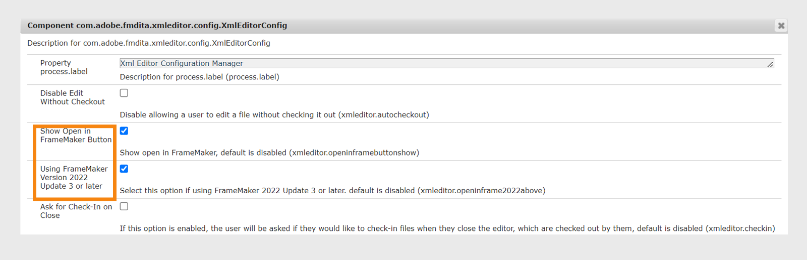

# デスクトップベースのXML エディターの統合 {#id181GB01G0HS}

市場には多くのXML エディターがあり、すでに使用している可能性があります。 Adobe FrameMakerは、AEM コネクタを備えた最も強力なXML エディターの1つです。 FrameMakerのAEM コネクタを使用すると、AEM リポジトリへの接続、ファイルのチェックアウトとチェックイン、FrameMakerでのファイルの直接編集を簡単に行うことができます。 また、Web エディターからFrameMakerを起動するようにExperience Manager Guidesを設定することもできます。 FrameMakerでファイルを開いた後、ファイルを編集してAEM リポジトリに戻すことができます。

## Web エディターからFrameMakerでのファイル編集を有効にする

FrameMakerまたはその他のDITA エディターを使用して、DITA コンテンツを作成および更新できます。 ただし、組織でFrameMakerをDITA エディターとして使用している場合は、AEMからFrameMakerでDITA ドキュメントを直接開くオプションをユーザーに提供できます。

デフォルトでは、AEM ツールバーに「**FrameMakerで開く**」ボタンは表示されません。 AEM ツールバーにこのボタンを追加するには、次の手順を実行します。

1. Adobe Experience Manager Web コンソールの設定ページを開きます。

   設定ページにアクセスするためのデフォルトのURLは次のとおりです。

   ```http
   http://<server name>:<port>/system/console/configMgr
   ```

1. **com.adobe.fmdita.xmleditor.config.XmlEditorConfig** バンドルを検索してクリックします。
   

1. 「**FrameMakerで開くボタンを表示**」オプションを選択します。

1. バージョン 4.6およびFrameMaker 2022年9月リリース – アップデート 3を使用している場合は、ユーザーがExperience Manager Guides サーバーの詳細をFrameMakerに渡すために、**FrameMaker バージョン 2022 アップデート 3以降**&#x200B;の設定を有効にする必要があります。 このオプションは、デフォルトで無効になっています。


1. 「**保存**」をクリックします。


「**FrameMakerで開くボタンを表示**」オプションを有効にすると、「**FrameMakerで開く**」ボタンが、AEM リポジトリ内の任意のDITA ファイルを選択したときに表示されます。 このオプションが&#x200B;*有効になっていない*&#x200B;場合、「**FrameMakerで開く**」ボタンは、リポジトリで.fmまたは.book ファイルを選択した場合にのみ表示されます。


