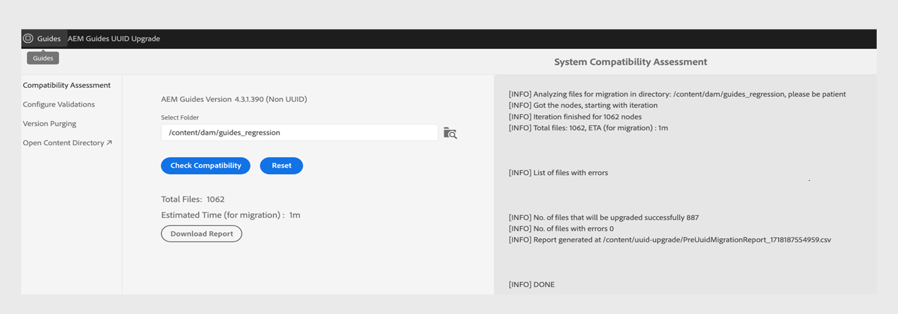
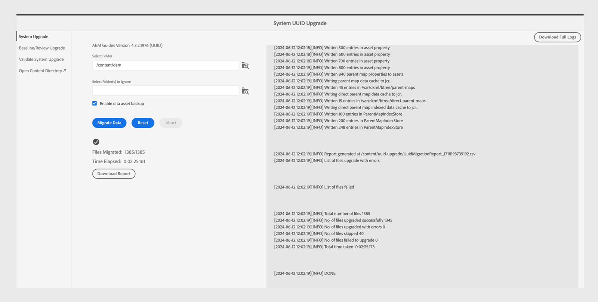
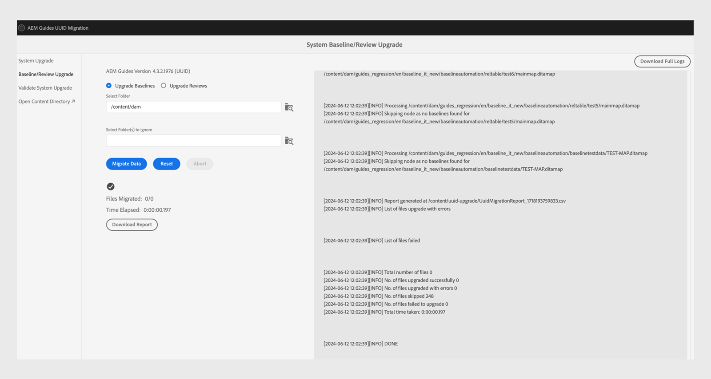

# 4.3.1非UUIDから4.3.2 UUID コンテンツへの移行

UUID バージョン 4.3.1以外からUUID バージョン 4.3.2にコンテンツを移行するには、次の手順を実行します。

>[!IMPORTANT]
>
> * 移行プロセスを開始する前に、次のことを確認してください。
>
>   1. アクティブなレビューをすべて閉じました。
>   1. すべての翻訳タスクを閉じました。
> * UUID サーバーにコンテンツを移行する前に、互換性のあるAEM Guides バージョンがインストールされているUUID以外のサーバーが存在することを確認します。
> * 4.3.1より前のバージョンを使用している場合は、バージョン 4.3.1にアップグレードします。製品のライセンス版に固有の[&#x200B; アップグレード手順](./upgrade-xml-documentation.md)に従います。
> * 現在、4.3.1以降のバージョンは移行でサポートされていません。

## パッケージインストール

お使いのバージョンに応じて、Adobe Software Distribution Portalから必要なパッケージをダウンロードします。

1. **Pre-migration**: [com.adobe.guides.pre-uuid-migration-1.2.27.zip](https://experience.adobe.com/#/downloads/content/software-distribution/en/aem.html?package=%2Fcontent%2Fsoftware-distribution%2Fen%2Fdetails.html%2Fcontent%2Fdam%2Faem%2Fpublic%2Faemdox%2Fother-packages%2Fuuid-migration%2F3-0%2Fcom.adobe.guides.pre-uuid-migration-1.2.27.zip)
1. **UUID バージョン 4.3.2**&#x200B;をダウンロード：[com.adobe.fmdita-6.5-uuid-4.3.2.1977.zip](https://experience.adobe.com/#/downloads/content/software-distribution/en/aem.html?package=%2Fcontent%2Fsoftware-distribution%2Fen%2Fdetails.html%2Fcontent%2Fdam%2Faem%2Fpublic%2Faemdox%2Fother-packages%2Fuuid-migration%2F3-0%2Fcom.adobe.fmdita-6.5-uuid-4.3.2.1977.zip)
1. **移行**: [com.adobe.guides.uuid-upgrade-1.2.110.zip](https://experience.adobe.com/#/downloads/content/software-distribution/en/aem.html?package=%2Fcontent%2Fsoftware-distribution%2Fen%2Fdetails.html%2Fcontent%2Fdam%2Faem%2Fpublic%2Faemdox%2Fother-packages%2Fuuid-migration%2F3-0%2Fcom.adobe.guides.uuid-upgrade-1.2.110.zip)

## 移行前の確認

非UUID バージョン 4.3.1に対して、次のチェックを実行します。

1. 移行前パッケージ [com.adobe.guides.pre-uuid-migration-1.2.27.zip](https://experience.adobe.com/#/downloads/content/software-distribution/en/aem.html?package=%2Fcontent%2Fsoftware-distribution%2Fen%2Fdetails.html%2Fcontent%2Fdam%2Faem%2Fpublic%2Faemdox%2Fother-packages%2Fuuid-migration%2F3-0%2Fcom.adobe.guides.pre-uuid-migration-1.2.27.zip)をバージョン 4.3.1にインストールします。

   >[!NOTE]
   >
   >* 移行を実行するには、管理者権限が必要です。
   >* 移行を進める前に、エラーのあるファイルを修正することをお勧めします。

1. システム内に100,000個を超えるDITA ファイルがある場合は、スクリプトが機能するようにクエリ制限の設定を更新します。

   * `/system/console/configMgr and increase both the configs to more than number of assets - queryLimitInMemory`および`queryLimitReads under org.apache.jackrabbit.oak.query.QueryEngineSettingsService`に移動します

1. `http://<server-name>/libs/fmdita/clientlibs/xmleditor_uuid_upgrade/page.html`を起動します。
1. 左側のパネルから「**互換性評価**」を選択し、すべてのアセットの`/content/dam` フォルダーパスを参照します。
1. 互換性を確認して、次の情報を一覧表示します。
   * 合計ファイル数
   * 移行の推定時間
   * エラーのあるファイルの数
   * GUID ファイル名を持つファイル

   移行互換性評価」タブ

1. エラーが表示された場合は、ログを分析してエラーを修正します。 エラーを修正した後、互換性マトリックスを再実行できます。

1. 左側のパネルから「**検証の設定**」を選択します。 次に、**マップを選択**&#x200B;および&#x200B;**マップのプリセット**&#x200B;を選択して設定します。 現在の出力検証リストには、移行前に存在する出力ファイルが表示され、移行後に生成された出力ファイルに対して後で検証できます。

   複数の大きなDITA マップを選択すると、すべてのコンテンツが問題なく正常に移行されたことを検証できます。 ベースラインを含むプリセットを選択すると、ベースラインとバージョンが正常に移行されます。

   

1. （オプション）コンテンツのバージョンのパージを実行して、不要なバージョンを削除し、移行プロセスを高速化します。 バージョンのパージを実行するには、移行画面から「**バージョンのパージ**」オプションを選択し、URL `http://<server- name>/libs/fmdita/clientlibs/xmleditor_uuid_upgrade/page.html`を使用してユーザーインターフェイスに移動します。
   >[!NOTE]
   >
   >このユーティリティは、ベースラインやレビューで使用されているバージョンを削除したり、ラベルを付けたりすることはありません。

詳しくは、[古いバージョンのパージ &#x200B;](../install-guide/version-management.md#purge-older-versions-of-dita-files)を参照してください。

## 移行の前提条件

1. オーサーインスタンスでのみUUID移行を実行します。
1. 次のインフラストラクチャの準備状態を確認します。
   * オーサーインスタンスのサイズは、CPUとメモリでアップグレードされ、処理の高速化と一括アクティビティに必要なメモリの追加がサポートされます。 例えば、現在の割り当て済みCPUとメモリが8 vCPUと24 GB ヒープの場合は、このアクティビティに2倍のサイズを使用します。
   * 全体的なディスク領域と一時ディスク領域`(crx-quickstart directory)`のバッファは、既に消費されているバッファの10倍である必要があります。 移行が完了したら、コンパクションを実行して、ほとんどのディスク領域を再利用できます。
   * このアクティビティを開始する前に、**オフライン Tar コンパクション**&#x200B;を実行してください。
   * この移行の期間に、インデックス作成やシステムのメンテナンスが計画されていないことを確認してください。

1. サポートされているリリースのUUID バージョンを非UUID バージョンにインストールします。 例えば、4.3.1非UUID ビルドを使用している場合は、UUID バージョン 4.3.2 [com.adobe.fmdita-6.5-uuid-4.3.2.1977.zip](https://experience.adobe.com/#/downloads/content/software-distribution/en/aem.html?package=%2Fcontent%2Fsoftware-distribution%2Fen%2Fdetails.html%2Fcontent%2Fdam%2Faem%2Fpublic%2Faemdox%2Fother-packages%2Fuuid-migration%2F3-0%2Fcom.adobe.fmdita-6.5-uuid-4.3.2.1977.zip)）をインストールして移行を実行する必要があります。

1. uuid移行アップグレードパッケージ [com.adobe.guides.uuid-upgrade-1.2.110.zip](https://experience.adobe.com/#/downloads/content/software-distribution/en/aem.html?package=%2Fcontent%2Fsoftware-distribution%2Fen%2Fdetails.html%2Fcontent%2Fdam%2Faem%2Fpublic%2Faemdox%2Fother-packages%2Fuuid-migration%2F3-0%2Fcom.adobe.guides.uuid-upgrade-1.2.110.zip)をインストールします。
1. URL `http://<server-name>/libs/cq/workflow/content/console.html`を使用して、次のワークフローのランチャーを無効にします。

   * DAM アセットの更新ワークフロー
   * DAM メタデータの書き戻しワークフロー

   >[!NOTE]
   >
   >理想的には、`content/dam`内の任意のパスで実行されるワークフローランチャーは無効にする必要があります。

1. 提案された変更に従って、次の設定を更新します。

   | 設定 | プロパティ | 値 |
   |---|---|---|
   | `com.adobe.fmdita.config.ConfigManager` | 後処理ワークフローランチャーの有効化 | Disable（無効） |
   | `com.adobe.fmdita.config.ConfigManager` | uuid: 正規表現 | `^GUID-(?<id>.*)` |
   | `com.adobe.fmdita.postprocess.version.PostProcessVersionObservation` | バージョンの後処理を有効にする | Disable（無効） |
   | Day CQ Tagging Service | 検証を有効にする（validation.enabled） | Disable（無効） |

1. 次の別のロガーを追加します。
   * `com.adobe.fmdita.uuid`
   * `com.adobe.guides.uuid`。

1. （以前に行っていない場合）システムに100,000個を超えるDITA ファイルがある場合は、`queryLimitReads`の`org.apache.jackrabbit.oak.query.QueryEngineSettingsService`を大きな値（存在するアセット数よりも大きい値、例えば200,000）に更新します。

   | PID | プロパティキー | プロパティの値 |
   |---|---|---|
   | org.apache.jackrabbit.oak.query.QueryEngineSettingsService | queryLimitReads | 値：200000   デフォルト値：100000 |

## 移行

1. `http://<server-name>/libs/fmdita/clientlibs/xmleditor_uuid_upgrade/page.html`を起動します。

   
   >[!NOTE]
   >
   > 「DITA アセットバックアップを有効にする」を選択すると、一時バックアップファイルは`/content/uuid-upgrade`に保存され、ファイルの移行が完了するとDITA ファイルバックアップが削除されます。

1. 左側のパネルから「**システムのアップグレード**」を選択して、移行を実行します。 システムが内部的にバッチ処理を最適に処理するため、すべてのデータを一度に移行することをお勧めします。 移行のためにスキップできるのは、DITA アセットではなく、DITA アセットで使用されていないファイルのみです。

1. （オプション）移行をスキップするフォルダーを選択します。 このオプションを使用して、後でこれらのフォルダーを移行するか、移行をスキップします。 これらのフォルダーがDITA アセットを持たず、DITA アセットによって参照されないこと（将来的には参照されないこと）を確認します。 例えば、`content/dam/projects` のように指定します。

1. 移行前にアセットのバックアップを作成する場合は、*Dita アセットのバックアップを有効にする*&#x200B;を選択します。 このバックアップは、ファイルの移行時にエラーが発生した場合にロールバックするために使用されます。 移行が成功した場合、バックアップは削除されます。 ただし、これは移行プロセスを遅らせます。

1. 移行を開始します。
   >[!NOTE]
   >
   > 完全なログをダウンロードし、エラーが発生したかどうかを確認します。 エラーまたは例外が見つかった場合&#x200B;*続行しないでください*。最初にエラーを修正します。 一般的なエラーは、この記事の最後に記載されています。

1. 移行が完了すると、レポートのダウンロードが可能になり、ログ全体もダウンロードできます。

1. 移行中に「**レポートをダウンロード**」を選択し、フォルダー内のすべてのファイルが正しくアップグレードされているかどうか、すべての機能がそのフォルダーでのみ機能するかどうかを確認します。

   >[!NOTE]
   >
   > コンテンツの移行は、フォルダーレベル、完全な`/content/dam`、または同じフォルダー（移行を再実行）で実行できます。

   また、DITA コンテンツで使用した画像やグラフィックなど、すべてのメディアアセットに対してコンテンツの移行を確実に実行することが重要です。

1. すべてのファイルを移行したら、左側のパネルから「**ベースライン/レビューアップグレード**」を選択して、ベースラインを移行し、フォルダーレベルでレビューします。

>[!NOTE]
>
>システムを再起動するか、移行を中止すると、以前と同じパラメーターで再実行すると、スクリプトが再開されます。 シャットダウンが原因で問題が発生した場合は、カスタマーサクセスチームにお問い合わせください。

## 各ステップのレポートの分析

**手順：システムのアップグレード**

| プロセス完了後の概要 | どう解釈するか？ | アクション |
|---|---|---|
| ファイルの総数：345997 | 指定されたフォルダーのセットで処理されたファイルの合計数です。 | 該当なし |
| 正常にアップグレードされたファイルの数：344516 | UUIDに移行されたファイルの数。 | 該当なし |
| エラーが発生してアップグレードされたファイルの数：29 | これらのファイルでエラーが発生したため、移行前の手順で報告したエラーと同じである必要があります。 | 該当なし |
| スキップされたファイル数：1452 | DAM リポジトリー内の一部のファイルにはサブアセットが含まれている場合があり、それらのサブアセットはUUID移行の対象ではないためスキップされます。 | 該当なし |
| アップグレードに失敗したファイル数：0 | カウントが0でない場合は、ログを分析して問題を特定する必要があります。 | 例外を確認してください。エラーを修正し、移行を再実行する必要がある場合があります。 |
| 合計所要時間：2:40:06.157 |  |  |

**手順：ベースラインのアップグレード**

| プロセス完了後の概要 | どう解釈するか？ | アクション |
|---|---|---|
| ファイルの総数：4833 | 少なくとも1つのベースラインがあるDITA マップの数。 |  |
| 正常にアップグレードされたファイルの数：4705 | すべてのベースラインで正常にアップグレードされたDITA マップの数。 |  |
| エラーが発生してアップグレードされたファイルの数：0 | ベースラインがアップグレードされなかったDITA マップの数。 |  |
| スキップされたファイル数：1647 | ベースラインのないDITA マップの数。 |  |
| アップグレードに失敗したファイルの数：128 | 有効でない（空だった）ベースラインオブジェクトの数がレポート（Excel）に表示されます。 | 次のエラー以外のエラーがあるかどうかを確認してください：`baselineObj not found on` |

## 移行後

1. 移行が完了したら、左側のパネルから「**システムアップグレードの検証**」を選択し、移行の前後で出力ファイルを検証して、移行が成功することを確認します。

   

1. サーバーを移行した後、次のワークフローと設定（移行中に最初に無効化されたその他のすべてのワークフローを含む）を正常に有効にして、サーバーでの作業を続行します。

   * DAM アセットの更新ワークフロー
   * DAM メタデータワークフロー

   >[!NOTE]
   >
   >移行を有効にする前に、`content/dam`内の任意のパスで実行していたワークフローランチャーを使用することをお勧めします。

1. 次の設定を有効にします。

   | 設定 | プロパティ | 値 |
   |---|---|---|
   | `com.adobe.fmdita.config.ConfigManager` | *後処理ワークフローランチャーを有効にする* | Enable（有効） |
   | `com.adobe.fmdita.postprocess.version.PostProcessVersionObservation` | *バージョンの後処理を有効にする* | Enable（有効） |
   | Day CQ Tagging Service | *検証を有効にする（validation.enabled）* | Enable（有効） |

1. 移行後に確認するAssets プロパティ：

   | 設定 | プロパティ | 非UUIDでの移行前の値 | UUIDでの移行後の値 |
   |---|---|---|---|
   | `com.adobe.fmdita.config.ConfigManager` | **AEM サイトのページ名にタイトルを使用** | False （既定値） | True |

   >[!NOTE]
   >
   > 移行前にプロパティ **Use title for AEM Site page names** inside `com.adobe.fmdita.config.ConfigManager`を&#x200B;*False*&#x200B;に設定した場合、移行後にこのプロパティを更新する必要があります。

1. 検証が完了した後、コンパクションを実行することで、ほとんどのディスク領域を再利用できます（`https://experienceleague.adobe.com/docs/experience-manager-65/deploying/deploying/revision-cleanup.html?lang=en`を参照）。

