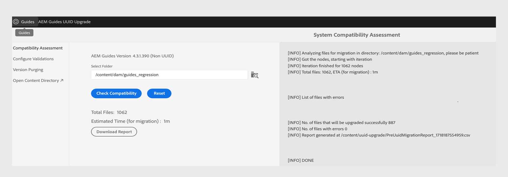

# 4.3.1 非 UUID から 4.3.2 UUID コンテンツへの移行

コンテンツを非 UUID バージョン 4.3.1 から UUID バージョン 4.3.2 に移行するには、次の手順を実行します。

>[!IMPORTANT]
>
> * 移行プロセスを開始する前に、次の点を確認します。
>
>   1. すべてのアクティブなレビューをクローズしました。
>   1. すべての翻訳タスクを終了しました。
> * コンテンツを UUID サーバーに移行する前に、UUID 以外のサーバーに互換性のあるAEM Guides バージョンがインストールされていることを確認します。
> * 4.3.1 より前のバージョンを使用している場合は、バージョン 4.3.1 にアップグレードします。製品のライセンス済みバージョンに固有の [&#x200B; アップグレード手順 &#x200B;](./upgrade-xml-documentation.md) に従います。
> * 現在、4.3.1 より後のバージョンの移行はサポートされていません。

## パッケージのインストール

お使いのバージョンに応じて、Adobe ソフトウェア配布ポータルから必要なパッケージをダウンロードします。

1. **Pre-migration**:[com.adobe.guides.pre-uuid-migration-1.2.27.zip](https://experience.adobe.com/#/downloads/content/software-distribution/en/aem.html?package=%2Fcontent%2Fsoftware-distribution%2Fen%2Fdetails.html%2Fcontent%2Fdam%2Faem%2Fpublic%2Faemdox%2Fother-packages%2Fuuid-migration%2F3-0%2Fcom.adobe.guides.pre-uuid-migration-1.2.27.zip)
1. **UUID バージョン 4.3.2 をダウンロード**:[com.adobe.fmdita-6.5-uuid-4.3.2.1977.zip](https://experience.adobe.com/#/downloads/content/software-distribution/en/aem.html?package=%2Fcontent%2Fsoftware-distribution%2Fen%2Fdetails.html%2Fcontent%2Fdam%2Faem%2Fpublic%2Faemdox%2Fother-packages%2Fuuid-migration%2F3-0%2Fcom.adobe.fmdita-6.5-uuid-4.3.2.1977.zip)
1. **移行**:[com.adobe.guides.uuid-upgrade-1.2.110.zip](https://experience.adobe.com/#/downloads/content/software-distribution/en/aem.html?package=%2Fcontent%2Fsoftware-distribution%2Fen%2Fdetails.html%2Fcontent%2Fdam%2Faem%2Fpublic%2Faemdox%2Fother-packages%2Fuuid-migration%2F3-0%2Fcom.adobe.guides.uuid-upgrade-1.2.110.zip)

## 移行前チェック

非 UUID バージョン 4.3.1 で次のチェックを実行します。

1. バージョン 4.3.1 より前の移行前パッケージ [com.adobe.guides.pre-uuid-migration-1.2.27.zip](https://experience.adobe.com/#/downloads/content/software-distribution/en/aem.html?package=%2Fcontent%2Fsoftware-distribution%2Fen%2Fdetails.html%2Fcontent%2Fdam%2Faem%2Fpublic%2Faemdox%2Fother-packages%2Fuuid-migration%2F3-0%2Fcom.adobe.guides.pre-uuid-migration-1.2.27.zip) をインストールします。

   >[!NOTE]
   >
   >* 移行を実行するには、管理者権限が必要です。
   >* 移行を進める前にエラーのあるファイルを修正することをお勧めします。

1. システムに 100,000 個を超える DITA ファイルがある場合は、スクリプトが機能するようにクエリ制限設定を更新します。

   * `/system/console/configMgr and increase both the configs to more than number of assets - queryLimitInMemory` および `queryLimitReads under org.apache.jackrabbit.oak.query.QueryEngineSettingsService` に移動します。

1. `http://<server-name>/libs/fmdita/clientlibs/xmleditor_uuid_upgrade/page.html` を起動します。
1. 左側のパネルから **互換性評価** を選択し、すべてのアセットの `/content/dam` フォルダーパスを参照します。
1. 互換性を確認して、次の情報を一覧表示します。
   * 合計ファイル数
   * 移行の推定時間
   * エラーのあるファイルの数
   * GUID ファイル名を含むファイル

   

1. エラーが表示された場合は、ログを分析し、それらのエラーを修正します。 エラーを修正した後、互換性マトリックスを再実行できます。

1. 左側のパネルから **検証を設定** を選択します。 次に、マップの **マップを選択** および **プリセットを選択** して設定します。 現在の出力検証リストには、移行前の出力ファイルが表示されます。後で移行後に生成された出力ファイルと照合して検証できます。

   複数および大きな DITA マップを選択することで、すべてのコンテンツが問題なく正常に移行されたことを検証できます。 ベースラインの含まれるプリセットを選択すると、ベースラインとバージョンが正常に移行されます。

   

1. （オプション）コンテンツに対してバージョンのパージを実行して、不要なバージョンを削除し、移行プロセスを高速化します。 バージョンのパージを実行するには、移行画面から「**バージョンのパージ**」オプションを選択し、URL `http://<server- name>/libs/fmdita/clientlibs/xmleditor_uuid_upgrade/page.html` を使用してユーザーインターフェイスに移動します。
   >[!NOTE]
   >
   >このユーティリティは、ベースラインやレビューで使用されているバージョンを削除したり、ラベルを持ったりしません。

詳しくは、「[&#x200B; 古いバージョンのパージ &#x200B;](../install-guide/version-management.md#purge-older-versions-of-dita-files)」を参照してください。

## 移行の前提条件

1. UUID 移行は、オーサーインスタンスでのみ実行します。
1. 次のインフラストラクチャへの対応を確認します。
   * オーサーインスタンスは、CPUとメモリの観点からアップサイズされており、より高速な処理と一括アクティビティに必要な追加メモリをサポートします。 例えば、現在割り当てられているCPUとメモリが 8 vCPU でヒープが 24 GB の場合、このアクティビティの 2 倍のサイズを使用します。
   * 全体のディスク領域と一時ディスク領域 `(crx-quickstart directory)` には、既に消費されている 10 倍のバッファーが必要です。 移行が完了したら、コンパクションを実行して、ディスク領域のほとんどを再利用できます。
   * このアクティビティを開始する前に、**オフライン Tar 圧縮** を実行してください。
   * この移行期間中に、インデックス作成やシステムメンテナンスが計画されていないことを確認してください。

1. サポートされているリリースの UUID バージョンを非 UUID バージョンよりも先にインストールします。 例えば、4.3.1 非 UUID ビルドを使用している場合は、UUID バージョン 4.3.2[com.adobe.fmdita-6.5-uuid-4.3.2.1977.zip](https://experience.adobe.com/#/downloads/content/software-distribution/en/aem.html?package=%2Fcontent%2Fsoftware-distribution%2Fen%2Fdetails.html%2Fcontent%2Fdam%2Faem%2Fpublic%2Faemdox%2Fother-packages%2Fuuid-migration%2F3-0%2Fcom.adobe.fmdita-6.5-uuid-4.3.2.1977.zip)）をインストールして、移行を実行する必要があります。

1. uuid 移行アップグレードパッケージ [com.adobe.guides.uuid-upgrade-1.2.110.zip](https://experience.adobe.com/#/downloads/content/software-distribution/en/aem.html?package=%2Fcontent%2Fsoftware-distribution%2Fen%2Fdetails.html%2Fcontent%2Fdam%2Faem%2Fpublic%2Faemdox%2Fother-packages%2Fuuid-migration%2F3-0%2Fcom.adobe.guides.uuid-upgrade-1.2.110.zip) をインストールします。
1. 次の URL を使用して、次のワークフローのランチャーを無効にします：`http://<server-name>/libs/cq/workflow/content/console.html`。

   * DAM アセットの更新ワークフロー
   * DAM メタデータの書き戻しワークフロー

   >[!NOTE]
   >
   >`content/dam` 内の任意のパスで実行するワークフローランチャーを無効にするのが理想的です。

1. 提案された変更に従って、次の設定を更新します。

   | 設定 | プロパティ | 値 |
   |---|---|---|
   | `com.adobe.fmdita.config.ConfigManager` | 後処理ワークフローランチャーの有効化 | Disable（無効） |
   | `com.adobe.fmdita.config.ConfigManager` | uuid。 正規表現 | `^GUID-(?<id>.*)` |
   | `com.adobe.fmdita.postprocess.version.PostProcessVersionObservation` | バージョンの後処理を有効にする | Disable（無効） |
   | Day CQ タグ付けサービス | 検証を有効にする（validation.enabled） | Disable（無効） |

1. 別のロガーを追加します。
   * `com.adobe.fmdita.uuid`
   * `com.adobe.guides.uuid`。

1. （前の手順で実行しない場合） システムに 100,000 個を超える DITA ファイルがある場合は、`queryLimitReads` の `org.apache.jackrabbit.oak.query.QueryEngineSettingsService` を大きい値（存在するアセットの数を超える値は、たとえば 200,000）に更新します。

   | PID | プロパティキー | プロパティの値 |
   |---|---|---|
   | org.apache.jackrabbit.oak.query.QueryEngineSettingsService | queryLimitReads | 値：200000   デフォルト値：100000 |

## 移行

1. `http://<server-name>/libs/fmdita/clientlibs/xmleditor_uuid_upgrade/page.html` を起動します。

   
   >[!NOTE]
   >
   > 「DITA アセットバックアップを有効にする」を選択すると、一時バックアップファイルが `/content/uuid-upgrade` に保存され、ファイルのマイグレーションが完了すると DITA ファイルバックアップが削除されます。

1. 左側のパネルから **システムアップグレード** を選択して、移行を実行します。 システムがバッチ処理を内部で最適に処理するので、すべてのデータを一度に移行することをお勧めします。 DITA アセットではなく、どの DITA アセットでも使用されていないファイルのみをマイグレーションにスキップできます。

1. （オプション）移行をスキップするフォルダーを選択します。 これらのフォルダーを後で移行する場合や移行をスキップする場合は、このオプションを使用します。 これらのフォルダーに DITA アセットが含まれていないこと、およびが参照しないこと（および今後は参照されないこと）を確認してください。 例えば、`content/dam/projects` のように指定します。

1. 移行前にアセットのバックアップを作成するには、「*Dita アセットバックアップを有効にする*」を選択します。 このバックアップは、ファイルの移行でエラーが発生した場合にロールバックするために使用されます。 移行が成功した場合、バックアップは削除されます。 ただし、これにより移行プロセスが遅くなります。

1. 移行を開始します。
   >[!NOTE]
   >
   > 完全なログをダウンロードし、エラーが発生したかどうかを確認します。 エラーまたは例外が見つかった場合 *続行せず* 最初にエラーを修正します。 一般的なエラーは、この記事の最後に記載しています。

1. 移行が完了すると、レポートをダウンロードできるようになります。また、ログ全体もダウンロードできます。

1. 移行実行中に「**レポートをダウンロード**」を選択し、フォルダー内のすべてのファイルが正しくアップグレードされているかどうか、およびすべての機能がそのフォルダーでのみ機能するかどうかを確認します。

   >[!NOTE]
   >
   > コンテンツの移行は、フォルダーレベル、完全な `/content/dam` ージ、または同じフォルダーで実行できます（移行の再実行）。

   また、DITA コンテンツで使用したすべてのメディアアセット（画像やグラフィックなど）に対してコンテンツの移行が確実に行われるようにすることが重要です。

1. すべてのファイルが移行されたら、左側のパネルから **ベースライン/レビューアップグレード** を選択して、ベースラインを移行し、フォルダーレベルでレビューします。

>[!NOTE]
>
>システムを再起動した場合、または移行が中止された場合は、以前と同じパラメーターで再実行すると、スクリプトが再開されます。 シャットダウンが原因で問題が発生した場合は、カスタマーサクセスチームにお問い合わせください。

## 各ステップでのレポートの分析

**手順：システムアップグレード**

| プロセス完了後の概要 | どのように解釈するか？ | アクション |
|---|---|---|
| ファイルの総数：345997 | 指定されたフォルダーのセットで処理されたファイルの合計数。 | 該当なし |
| 正常にアップグレードされたファイルの数：344516 | ファイル数が UUID に正常に移行されました。 | 該当なし |
| エラーが発生してアップグレードされたファイルの数：29 | これらのファイルで発生したエラーは、移行前手順で報告されたものと同じでなければなりません。 | 該当なし |
| スキップされたファイルの数：1452 | DAM リポジトリー内の一部のファイルにはサブアセットが含まれている場合があり、それらのサブアセットは UUID 移行の対象とならないので、スキップされます。 | 該当なし |
| アップグレードに失敗したファイルの数：0 | カウントが 0 でない場合は、問題がないかログを分析する必要があります。 | 例外を確認します。エラーを修正して、移行を再実行する必要がある場合があります。 |
| 合計所要時間：2:40:06.157 |  |  |

**手順：ベースラインをアップグレードする**

| プロセス完了後の概要 | どのように解釈するか？ | アクション |
|---|---|---|
| ファイルの総数：4833 | ベースラインが 1 つ以上の DITA マップの数。 |
| 正常にアップグレードされたファイルの数：4705 | すべてのベースラインで正常にアップグレードされた DITA マップの数。 |
| エラーが発生してアップグレードされたファイルの数：0 | ベースラインがアップグレードされなかった DITA マップの数。 |
| スキップされたファイルの数：1647 | ベースラインのない DITA マップの数。 |
| アップグレードに失敗したファイルの数：128 | 無効な（空の）ベースラインオブジェクトの数がレポート （Excel）に表示されます。 | `baselineObj not found on` 以外のエラーがあるかどうかを確認します。 |

## 移行後

1. 移行が完了したら、左側のパネルから **システムアップグレードの検証** を選択し、移行前と移行後に出力ファイルを検証して、移行が成功したことを確認します。

   

1. サーバーの移行が成功したら、次のワークフローと設定（移行中に最初に無効にしたその他すべてのワークフローを含む）を有効にして、サーバーで作業を続行します。

   * DAM アセットの更新ワークフロー
   * DAM メタデータワークフロー

   >[!NOTE]
   >
   >移行前に `content/dam` 内の任意のパスで実行していたワークフローランチャーを有効にするのが理想的です。

1. 次の設定を有効にします。

   | 設定 | プロパティ | 値 |
   |---|---|---|
   | `com.adobe.fmdita.config.ConfigManager` | *後処理ワークフローランチャーの有効化* | Enable（有効） |
   | `com.adobe.fmdita.postprocess.version.PostProcessVersionObservation` | *バージョン後処理を有効にする* | Enable（有効） |
   | Day CQ タグ付けサービス | *検証を有効にする（validation.enabled）* | Enable（有効） |

1. 移行後に確認するAssetsのプロパティ：

   | 設定 | プロパティ | 非 UUID の事前移行の値 | UUID の移行後の値 |
   |---|---|---|---|
   | `com.adobe.fmdita.config.ConfigManager` | **AEM サイトのページ名にタイトルを使用** | False （デフォルト値） | True |

   >[!NOTE]
   >
   > 移行前に **内のプロパティ** AEM サイトページ名にタイトルを使用 `com.adobe.fmdita.config.ConfigManager` を *False* に設定した場合、移行後にこのプロパティを更新する必要があります。

1. 検証が完了したら、コンパクションを実行することで、ディスク領域のほとんどを再利用できます（`https://experienceleague.adobe.com/docs/experience-manager-65/deploying/deploying/revision-cleanup.html?lang=ja` を参照）。

