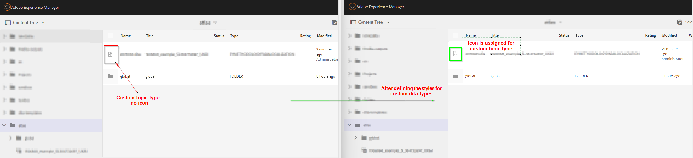

# カスタム/専用dita （トピックまたはマップ）タイプのアイコンの設定


## 問題提起

AEM Guidesで使用されるカスタムスキーマを使用すると、カスタムトピックまたはマップタイプを作成できます。また、カスタムトピックまたはマップタイプがweb エディターまたはAssets UIにアイコンを表示しない場合があります。 参考までに、以下のスクリーンショットを参照してください


カスタムトピック/マップタイプにアイコンを割り当てるには、次の操作を行う必要があります。
- カスタムのトピック/マップタイプの検索
- カスタムタイプの目的のアイコンを追加するスタイルを書き込む


上記の手順を実装して、web エディター（リポジトリビュー）とAssets UIにアイコンを表示できます。 以下はその両方の手順です


## web エディタービューでのカスタムトピック/マップの表示アイコン

_Step 1 :_カスタム dita トピック/apのdita タイプを決定します
- web エディター/ブラウザーで開発者コンソールを開いて、リポジトリビューを開きます
- リストされたトピック/マップの横にあるアイコンスペースを確認します
- カスタムトピックに割り当てられたクラスを確認します
- 詳細については、以下のスクリーンショットを参照してください
- このクラスを使用してアイコンを割り当て、CSSを記述します

_ステップ 2 :_Cssを作成し、このデータ型にアイコンを割り当てる
- /appsの下にクライアントライブラリを作成し、目的のパスの下にcq:ClientLibraryFolderを作成するとします
   - カテゴリ「apps.fmdita.xml_editor.page」を追加します
- このディレクトリの下に「assets」フォルダーを作成し、カスタム dita タイプに使用するすべてのアイコンを追加します
- クライアントライブラリフォルダーにcss ファイルを追加します。「tree-icons.css」と入力します。
   - それに次のコードを追加します

```
            .tree-item-icon {
                &.custommaptype {
                    background-image: url('assets/custommap.svg')
                }
                &.customtopictype {
                    background-image: url('assets/customtopic.svg')
                }
            }
```

- クライアントライブラリフォルダーにcss.txtを追加し、作成したばかりの「tree-icon.css」への参照を追加します
- これらの変更を保存またはデプロイする

詳しくは、以下のスクリーンショットを参照してください。


そして、最終的な出力は以下のスクリーンショットに示されています


## Assets UIでのカスタムトピック/マップの表示アイコン

_ステップ 1 :_カスタム dita トピック/マップのdita タイプを決定する
- これは、以前の方法の手順1で説明しました

_Step 2 :_JavaScriptを作成して、カスタムのトピック/マップタイプ用のカスタム dita タイプに読み込むアイコンを定義します
- /appsの下にクライアントライブラリを作成し、目的のパスの下にcq:ClientLibraryFolderを作成するとします
   - 次のプロパティを追加します。
      - &quot;categories&quot;（multivalue string）値を&quot;dam.gui.admin.coral&quot;として指定します。
      - &quot;dependencies&quot;（multivalue string）値を&quot;libs.fmdita.versioncontrol&quot;として指定します。
- この/apps ディレクトリに「/libs/fmdita/clientlibs/clientlibs/xmleditor/clientlib-dam/topic_type.js」ファイルのコピーを作成します。
   - コピーした「topic_type.js」を編集し、変数「typeImageNameMap」の下にcustomtopictypeを変更/追加します
   - 変数「parentImagePath」の値をカスタムアイコンが保存される場所に変更して、画像フォルダーのパスを変更することもできます
- クライアントライブラリフォルダーにjs.txtという名前のファイルを作成し、「topic_type.js」への参照を追加します
- これらの変更を保存またはデプロイする
詳しくは、以下のスクリーンショットを参照してください。
  

最終的な出力は、スクリーンショット に示すスクリーンショット に示すように表示されます
