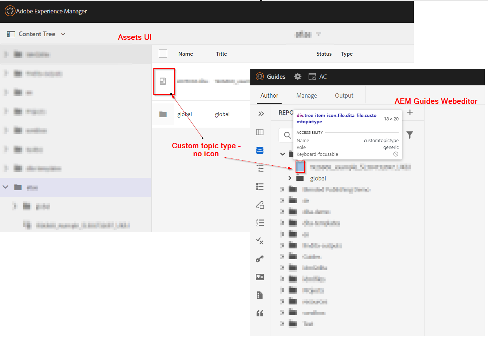

# カスタム/特殊化 Dita （トピックまたはマップ） タイプ用のアイコンの設定


## 問題の説明

AEM Guidesで使用されるカスタムスキーマを使用すると、カスタムトピックまたはマップの種類を作成でき、カスタムトピックまたはマップの種類が web エディターまたはAssets UI にアイコンが表示されないことがあります。 参照については、以下のスクリーンショットを参照してください




カスタムのトピックまたはマップのタイプにアイコンを割り当てるには、次の手順を実行する必要があります。
- カスタムのトピック/マップのタイプを検索
- スタイルを記述して、カスタムタイプに必要なアイコンを追加します


上記の手順を実装して、web エディター（リポジトリビュー）でもAssets UI でもアイコンを表示することができます。 以下は、両方の手順です


## Web エディタービューでカスタムトピック/マップのアイコンを表示しています

_手順 1:_ カスタム dita トピック/ap の dita タイプを決定する
- Web エディターでリポジトリ表示を開く/ ブラウザーで開発者コンソールを開きます。
- リストされたトピック/マップの横にあるアイコンスペースをInspectします
- カスタムトピックに割り当てられているクラスを確認します
- 詳しくは、以下のスクリーンショットを参照してください 
- このクラスを使用してアイコンを割り当て、CSS を記述します

_手順 2:_ css を作成し、この dita タイプにアイコンを割り当てる
- /apps の下にクライアントライブラリを作成します。目的のパスの下に cq:ClientLibraryFolder を作成したとします
   - カテゴリ「apps.fmdita.xml_editor.page」を追加します
- このディレクトリの下に「assets」フォルダを作成し、カスタム dita タイプに使用するすべてのアイコンを追加します
- クライアントライブラリフォルダーに css ファイルを追加します。例えば、「tree-icons.css」とします
   - 次のコードを追加します

```
            .tree-item-icon {
                &.custommaptype {
                    background-image: url('assets/custommap.svg')
                }
                &.customtopictype {
                    background-image: url('assets/customtopic.svg')
                }
            }
```

- クライアントライブラリフォルダーに css.txt を追加し、作成した「tree-icon.css」への参照を追加します
- これらの変更を保存/デプロイ

詳しくは、以下のスクリーンショットを参照してください。


最終的な出力は次のスクリーンショットに示されます。


## Assets UI のカスタムトピック/マップのアイコンを表示しています

_手順 1:_ カスタム dita トピック/マップの dita タイプの決定
- これについては、前のメソッドの手順 1 で説明しました

_手順 2:_ Javacscript を作成して、カスタムのトピック/マップ型用のカスタム dita タイプに読み込むアイコンを定義します
- /apps の下にクライアントライブラリを作成します。目的のパスの下に cq:ClientLibraryFolder を作成したとします
   - 次のプロパティを追加します。
      - 「categories」（複数値文字列）の値が「dam.gui.admin.coral」である
      - 「dependencies」（複数値文字列）値を「libs.fmdita.versioncontrol」として
- この/apps ディレクトリに「/libs/fmdita/clientlibs/clientlibs/xmleditor/clientlib-dam/topic_type.js」ファイルのコピーを作成します。
   - コピーした「topic_type.js」を編集し、変数「typeImageNameMap」の下の customtopictype を変更または追加します
   - また、変数「parentImagePath」の値を、カスタムアイコンが格納されている場所に変更することで、画像フォルダーのパスを変更することもできます
- クライアントライブラリフォルダーに js.txt という名前のファイルを作成し、「topic_type.js」への参照を追加します。
- これらの変更を保存/デプロイ
詳しくは、以下のスクリーンショットを参照してください。
  

最終的な出力はスクリーンショットのように表示されます 
