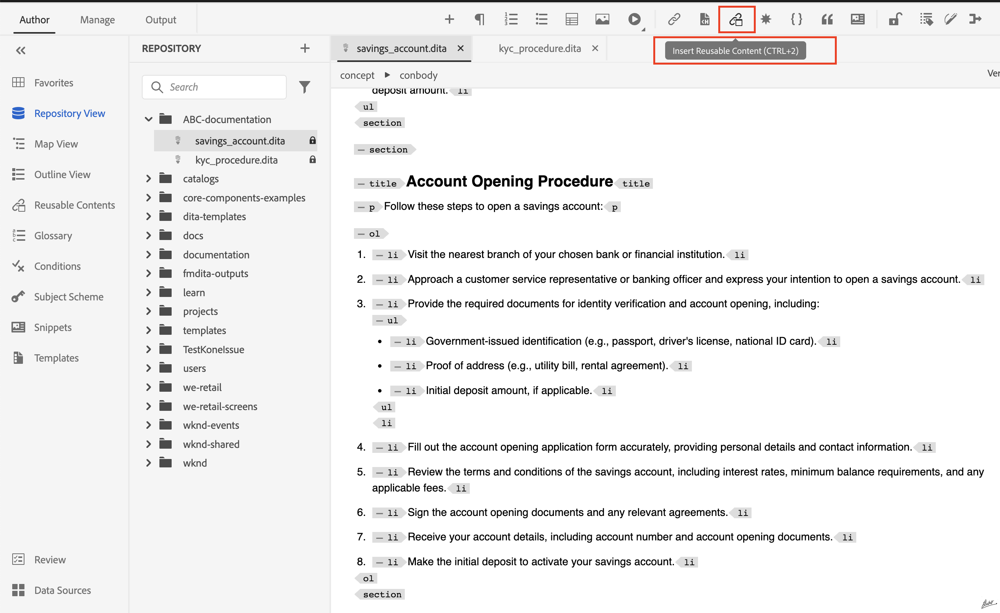
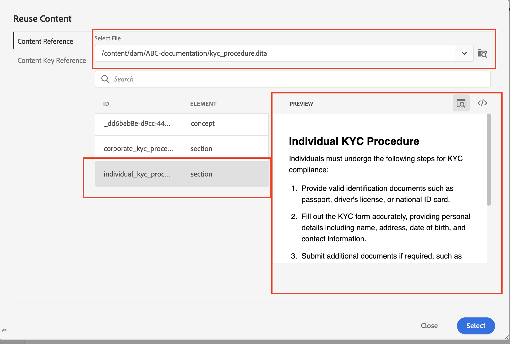

# AEM Guidesでのコンテンツの再利用性

AdobeAEM Guidesは DITA の強みを活用して、コンテンツを再利用するための使いやすいインターフェイスを提供します。

この記事では、以下について説明します。

1. [トピック参照（](#reusability-using-topic-referencestopicref)
2. [コンテンツ参照（](#reusability-using-content-reference-conref--conkeyref)
3. [AEM Guidesでドラッグ&amp;ドロップでコンテンツを再利用するための便利なヒント](#reuse-content-with-a-single-click-in-aem-guides)

## トピック参照（topicref）を使用した再利用性


製造会社で、安全上の注意やトラブルシューティング技術に関する一般的なトピックがあるとします。

これらは、各機械モデルの特定のユーザーマニュアルで参照および適応でき、冗長性を削減し、コア安全情報の一貫性を確保できます。

```
<map id="user_manual_model 100" title="ABC Model 100 User Manual ">


<topicref href="Safety_Information.dita" format="dita">
</topicref>
.
.
.
.
.
</map>
```


モデル 200 でも同様

```
<map id="user_manual_model 200" title="ABC Model 200 User Manual ">

<topicref href="Safety_Information.dita" format="dita">
</topicref>
.
.
.
.
.
  
</map>
```

## コンテンツ参照（conref および conkeyref）を使用した再利用性

コンテンツ参照（conref）属性を使用すると、コンテンツの他の部分にリンクできます。 これにより、再利用性が向上し、冗長性が軽減されます。

例：

金融企業で、KYC の一般的なトピックがあり、個人、企業などの KYC 手順が含まれているとします。

個々の KYC フラグメントを「アカウントの保存」および「アカウントの破損」のトピックに再利用する場合。

```
<section id="kyc_requirements_saving_account">
  <title>Know Your Customer (KYC) Requirements</title>
  <p>To comply with regulations and ensure customer identification, all individual applicants for savings  accounts must fulfill the KYC requirements as outlined below</p>
  <p conref=kyc_procedures.dita#individual_kyc></p>
</section>
```

ここで `conref=kyc_procedures.dita#indvidual_kyc`kyc_procedures.dita はファイル識別子、#individual_kyc はフラグメント識別子です。

Kyc_procedure.dita は、引き続き唯一の情報ソースです。 規制の変更で KYC プロセスの更新が必要な場合は、新しいパスを使用してトピック パスを更新します。 変更内容は、その変更内容を参照するすべてのトピックに自動的に反映されます。

AEM Guidesを使用した、2 回のクリック

手順 1:「再利用可能なコンテンツを挿入」をクリックする


<br>

手順 2：再利用が必要なファイルとフラグメントを選択する。


コンテンツパスを指定する代わりに、キーを使用してコンテンツを参照する場合は、「conref」と同様に「conkeyref」を使用することもできます

コードの例：

```
<section conkeyref="kyc_procedure/individual_kyc_procedure" id="individual_kyc_procedure"></section>
```

キー定義は次のようになります。

```
<map id="ABC_manual">
  <title>ABC_Manual</title>
  <topicref href="kyc_procedure_2020.dita" keys="kyc_procedure" processing-role="resource-only" type="concept">
  </topicref>
  <topicref href="savings_account.dita" type="concept">
  </topicref>
</map>
```

キー – &#39;Kyc_procedure&#39;は引き続き情報の唯一のソースです。 規制の要求に応じて KYC プロセスに変更がある場合は、1 つのトピックパスを新しいトピックパスで更新するだけで、その変更はそれを参照しているすべてのトピックに自動的に反映されます。

```
<map id="ABC_manual">
  <title>ABC_Manual</title>
  <topicref href="kyc_procedure_2024.dita" keys="kyc_procedure" processing-role="resource-only" type="concept">
  </topicref>
  <topicref href="savings_account.dita" type="concept">
  </topicref>
</map>
```

ここで、トピックパスは、最近の規制の変更により、「kyc_procedure_2020.dita」から「kyc_procedure_2024.dita」に変更されています。

AEM Guidesを使用した、2 回のクリック

手順 1:「再利用可能なコンテンツを挿入」をクリックする


手順 2：再利用が必要なルートマップ（オプション）、キー、フラグメントを選択する。


ここでは、ルート マップはマップ ビューで既に開かれているため、自動的に選択されています。


## AEM Guidesでシングルクリックでコンテンツを再利用

AEM Guidesには、コンテンツ参照をワンクリックで追加できる「再利用可能なコンテンツ」機能が用意されています。

手順 1：再利用可能なコンテンツに汎用トピックを追加する


手順 2：追加したら、宛先トピックで再利用するフラグメントをドラッグ&amp;ドロップします。


## FAQ

- ### コンテンツを再利用ダイアログでファイル/キーを選択した後、すべてのコンテンツが表示されない

他のトピックで再使用するフラグメント （Dita エレメント）に ID を割り当てる

- ## コンテンツを再利用ダイアログにキーが表示されません

  キー定義を持つルートマップ/親マップをマップビューで開いていることを確認するか、同じダイアログでルートマップパスを手動で追加します。


<br>
<br>
<br>


クエリについては、AEM Guides コミュニティ [ フォーラム ](https://experienceleaguecommunities.adobe.com/t5/experience-manager-guides/ct-p/aem-xml-documentation) に投稿してください。
