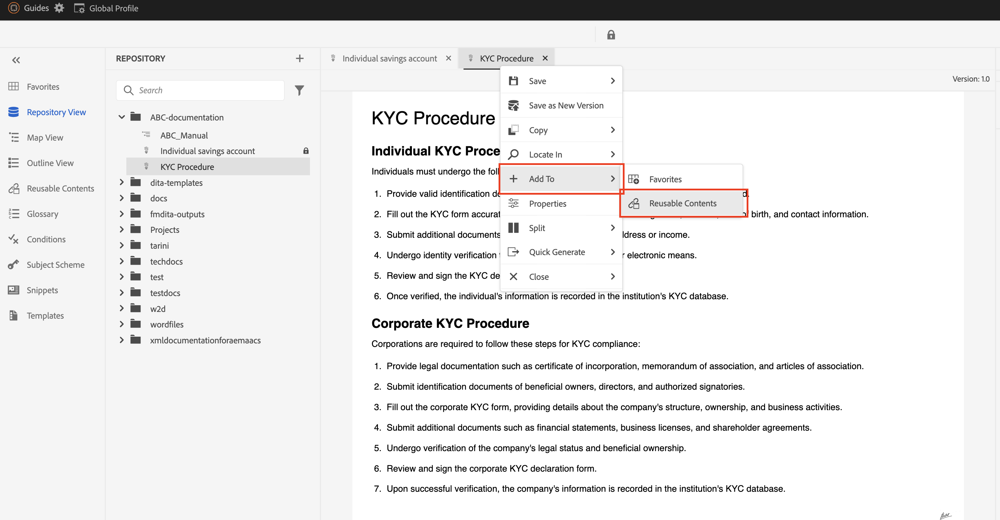

# AEM Guidesのコンテンツ再利用性

Adobe AEM Guidesでは、DITAの強みを活用して、コンテンツを再利用するための使いやすいインターフェイスを提供します。

主な内容：

1. [トピック参照（](#reusability-using-topic-referencestopicref)
2. [コンテンツ参照（](#reusability-using-content-reference-conref--conkeyref)
3. [AEM Guidesでドラッグ&amp;ドロップでコンテンツを再利用するためのボーナスヒント](#reuse-content-with-a-single-click-in-aem-guides)

## トピック参照を使用した再利用性（topicref）


製造企業で、安全上の注意やトラブルシューティングのテクニックに関する一般的なトピックを持っているとします。

これらは、各マシンモデルに固有のユーザーマニュアルで参照および適応できるため、冗長性を低減し、中核的な安全情報の一貫性を維持できます。

```
<map id="user_manual_model 100" title="ABC Model 100 User Manual ">


<topicref href="Safety_Information.dita" format="dita">
</topicref>
.
.
.
.
.
</map>
```


Model 200と同じ

```
<map id="user_manual_model 200" title="ABC Model 200 User Manual ">

<topicref href="Safety_Information.dita" format="dita">
</topicref>
.
.
.
.
.
  
</map>
```

## コンテンツ参照（conrefおよびconkeyref）を使用した再利用性

コンテンツ参照（conref）属性を使用すると、コンテンツの他の部分にリンクできます。 これにより、再利用性を促進し、冗長性を低減できます。

例：

あなたが金融機関で、個人向けKYC手順や企業向けKYC手順などを含むKYCの一般的なトピックを持っているとします。

個々のKYC フラグメントを「アカウントの保存」と「アカウントのデマットテスト」のトピックに再利用する場合。

```
<section id="kyc_requirements_saving_account">
  <title>Know Your Customer (KYC) Requirements</title>
  <p>To comply with regulations and ensure customer identification, all individual applicants for savings  accounts must fulfill the KYC requirements as outlined below</p>
  <p conref=kyc_procedures.dita#individual_kyc></p>
</section>
```

ここでは`conref=kyc_procedures.dita#indvidual_kyc` kyc_procedures.ditaがファイル IDで、#individual_kycがフラグメント IDです。

Kyc_procedure.ditaは引き続き唯一の情報源です。 規制変更でKYC プロセスの更新が必要な場合は、トピックパスを新しいパスに更新します。 変更内容は、それを参照するすべてのトピックに自動的に反映されます。

AEM Guidesでは、クリック数が

手順1:「再利用可能なコンテンツを挿入」をクリックします。


<br>

手順2：再利用する必要があるファイルとフラグメントを選択します。


「conref」と同様に、「conkeyref」も使用できます。コンテンツのパスを指定する代わりに、キーを使用してコンテンツを参照します

コード例：

```
<section conkeyref="kyc_procedure/individual_kyc_procedure" id="individual_kyc_procedure"></section>
```

キーの定義は次のようになります。

```
<map id="ABC_manual">
  <title>ABC_Manual</title>
  <topicref href="kyc_procedure_2020.dita" keys="kyc_procedure" processing-role="resource-only" type="concept">
  </topicref>
  <topicref href="savings_account.dita" type="concept">
  </topicref>
</map>
```

キー – &#39;Kyc_procedure&#39;は引き続き情報の唯一の情報源です。 KYC プロセスに対して規制で要求される変更がある場合は、新しいトピックパスを使用して1つのトピックパスを更新するだけで、その変更は参照するすべてのトピックに自動的に反映されます。

```
<map id="ABC_manual">
  <title>ABC_Manual</title>
  <topicref href="kyc_procedure_2024.dita" keys="kyc_procedure" processing-role="resource-only" type="concept">
  </topicref>
  <topicref href="savings_account.dita" type="concept">
  </topicref>
</map>
```

ここでは、最近の規制の変更により、トピックパスが「kyc_procedure_2020.dita」から「kyc_procedure_2024.dita」に変更されます。

AEM Guidesでは、クリック数が

手順1:「再利用可能なコンテンツを挿入」をクリックします。


手順2：再利用する必要があるルートマップ（オプション）、キー、フラグメントを選択します。


ここでは、ルートマップは既にマップビューで開いているため、自動的に選択されました。


## AEM Guidesでワンクリックでコンテンツを再利用

AEM Guidesでは、コンテンツ参照をワンクリックで追加できる「再利用可能なコンテンツ」機能を提供しています。

手順1：汎用トピックを再利用可能なコンテンツに追加する



ステップ 2：追加したら、宛先トピックで再利用するフラグメントをドラッグ&amp;ドロップします。

を追加


## よくある質問

### コンテンツを再利用ダイアログでファイル/キーを選択した後、すべてのコンテンツが表示されない

他のトピックで再利用するフラグメント（Dita要素）にIDを割り当てる

## コンテンツを再利用ダイアログにキーが表示されない

キー定義を持つmap-viewでルートマップ/親マップを開いているか、同じダイアログでルートマップパスを手動で追加していることを確認します。


<br>
<br>
<br>


質問がある場合は、AEM Guides コミュニティ [&#x200B; フォーラム &#x200B;](https://experienceleaguecommunities.adobe.com/t5/experience-manager-guides/ct-p/aem-xml-documentation)に投稿してください。
