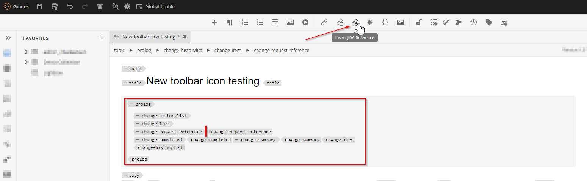

# webeditor ツールバーにアクションとなる新しいカスタムボタンを追加

この記事では、webeditor ツールバーに新しいカスタムボタンを追加し、JavaScript を呼び出して、目的のカスタム操作を実行する方法について説明します。

アクションにつながるボタンを webeditor に追加するには、次の手順を実行します。
- *ui_config.json* の必要な位置にボタンを追加する
- ユーザーがクリック時にアクションを実行できるように、webeditor にボタンのオンクリックイベントを登録する


## 例を使用した実装

作成者がトピックのプロローグセクションに jira 参照を追加する例を使用して、これを理解しましょう。 jira reference-id が埋め込まれた prolog セクションは、次のようになります。


JIRA ID を含む「change-request-id」要素は、API から取得する必要があります（アプリケーションで表示される特定の JIRA クエリに基づいたなど）。 ユーザーがプロローグセクションをオーサリングする際、次のように、ボタンをクリックし、web エディターツールバーから jira 参照 id を挿入できるはずです。


また、ユーザーがボタンをクリックすると、可能なオプションを取り込み、ユーザーが目的の JIRA ID を選択できるダイアログが表示されます。次に例を示します。


すると、プロローグに「change-request-id」が追加されます。


## これを実装する


### *ui_config.json* で設定して、webeditor にボタンを追加します。

フォルダープロファイルを使用して、「XML エディター設定」タブの *ui_config.json* を確認し、「ツールバー」グループの目的のセクションにボタン設定 JSON を追加します

```
{
    "on-click":"insertJIRARef",
    "icon":"linkCheck",
    "variant":"quiet",
    "type":"button",
    "title":"Insert JIRA Reference"
}
```

[&#x200B; フォルダープロファイルと ui_config.json の設定について詳しくは、このリンクを使用してください &#x200B;](https://experienceleague.adobe.com/docs/experience-manager-guides-learn/videos/advanced-user-guide/editor-configuration.html?lang=en)


### 新しいボタンのクリックイベントを処理

メモ：以下に説明する手順は、この投稿に添付されているパッケージとして利用できます。


- フォルダープロファイルを保存したら、プロジェクトディレクトリ（:ClientLibraryFolder/apps *の下など）の下に「cq*」を作成し、次のスクリーンショットに示すようにプロパティを追加します。
  

```
This example uses "coralui3" library to show a dialog as it is used in the Javascript sample we presented.
You may use different library of your choice.
```

- このクライアントライブラリフォルダーの下に、以下に示すように 2 つのファイルを作成します。
   - *overrides.js*:「insertJIRARef」のオンクリックイベントを処理する Javascript コードを持ちます（この JavaScript の内容を取得するには、添付パッケージを使用します）。
   - *js.txt*：これには、この javascript を有効にするための「overrides.js」が含まれます

- 変更を保存すると、テストの準備が整います。


### テスト

- Web エディターを開く
- ユーザーの環境設定から、カスタム *ui_config.json* を追加したフォルダープロファイルを選択します。 グローバルプロファイルに追加した場合は、既に使用している可能性があります。
- トピックを開くと、ツールバーに「Jira 参照を挿入」という新しいボタンがあることがわかります
- 次に、トピックに以下に示すようにプロローグセクションを追加し、プロローグ要素「change-request-reference」の中にある「Jira 参照を挿入」ボタンをクリックしてみてください

```
<prolog>
    <change-historylist>
        <change-item>
            <change-request-reference>
            </change-request-reference>
            <change-completed></change-completed>
            <change-summary></change-summary>
        </change-item>
    </change-historylist>
</prolog>
```

どのように表示されるかについては、以下のスクリーンショットを参照してください。




### 添付ファイル

- ツールバーボタンアクションの JavaScript コードを持つ webeditor クライアントライブラリをインストールするサンプル clientlibs パッケージ：[&#x200B; このリンクを使用してダウンロードしてください &#x200B;](../../../assets/authoring/webeditor-addbuttonontoolbar-insertjira-clientlib.zip)
- フォルダープロファイルにアップロードできるサンプル *ui_config.json*: [download sample ui_config.json](../../../assets/authoring/sample_ui_config_Guides4.2-InsertJiraReference.json)

```
Please note this is compatible to AEM 6.5 and AEM Guides version 4.2.
If you are using a different version please add the toolbar button to the ui_config.json manually.
```
