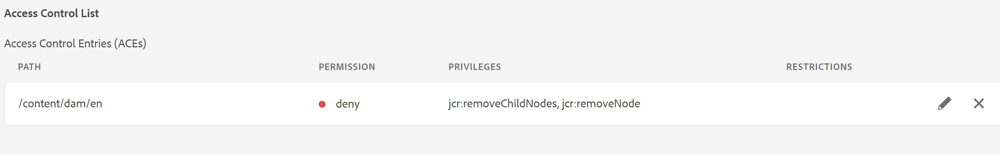

# Webeditorのファイルコンテキストメニューから「削除」オプションを削除する

この記事では、AEM Guides Editorのファイルのコンテキストメニューで「削除」オプションを非表示にする方法について説明します。 ファイルのコンテキストメニューオプションに関するその他のカスタマイズについては、ガイド拡張機能のフレームワークを参照してください。 詳細については、[こちら](https://github.com/adobe/guides-extension/tree/main)を参照してください。

下のスニペットからわかるように、ファイルコンテキストメニューには、この特定のユーザーに対して利用可能な「削除」オプションがあります。


次に、このユーザーの「削除」オプションを非表示にする方法を見てみましょう。

## 導入手順：

- AEMのホームページから、ツール/セキュリティ/権限に移動します。
- 検索ボックスからグループまたはユーザーを選択します。
- 右上隅の「Add ACE」をクリックします。
- フォルダーパスを選択します。
- 権限「jcr:removeChildNodes」と「jcr:removeNode」を含めます。
- 「権限タイプ」を「拒否」として選択し、以下に示すように「追加」をクリックします。

を拒否しました



### テスト

- ACEが追加されたユーザーとしてAEMにログインします。
- web エディターを開きます。
- リポジトリビューに移動し、ACEが追加されたフォルダーを選択します。
- ファイルのコンテキストメニューを開きます。
- 「削除」オプションはコンテキストメニューには表示されません。

ファイルコンテキストメニューは次のようになります。

削除のない

```
Please note that these steps would also remove 'move' and 'rename' options from the Editor as they are also tied to delete process at the backend.
```
