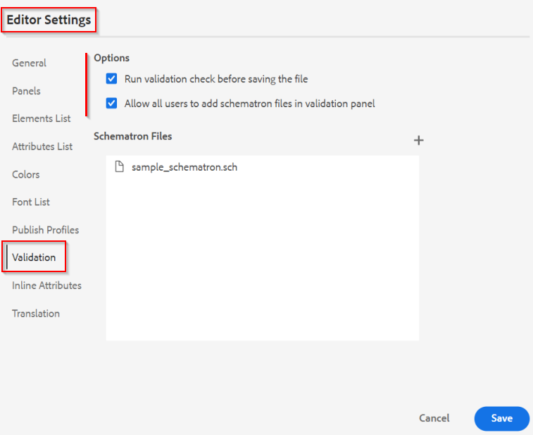

# web エディター内のコンテンツの品質の制御

この記事では、AEM Guides web エディター内での検証の可能性の概要について説明します。
Web エディターでは、システムで設定されたDITA スキーマを利用して、ユーザーにDITA準拠コンテンツの作成を強制します。これにより、システムに保存されているすべてのコンテンツは、構造化され、再利用可能で有効なDITA コンテンツになります。

Web エディターでは、DITA ルールのサポートだけでなく、「*Schematron*」ルールに基づくコンテンツの検証もサポートしています。

「*Schematron*」は、XML ファイルのテストを定義するために使用されるルールベースの検証言語を指します。 スキーマトロンファイルを読み込み、エディターで編集することもできます。 「Schematron」ファイルを使用すると、特定のルールを定義し、DITA トピックまたはマップに対して検証できます。 Schematron ルールは、ルールとして定義された制限を課すことにより、XML構造の一貫性を確保できます。 こうした制限は、コンテンツの品質と一貫性を所有する中小企業によって後押しされています。

メモ：エディターはISO Schematronをサポートしています。


## Web エディターでの「Schematron」の仕組みを理解する

### Schematron ルールの設定

[&#x200B; ユーザーガイド &#x200B;](https://helpx.adobe.com/content/dam/help/en/xml-documentation-solution/4-2/Adobe-Experience-Manager-Guides_UUID_User-Guide_EN.pdf#page=148)の「Schematron ファイルのサポート」セクションを参照してください


### ファイル保存時に検証ルールを適用

Webeditor設定では、ユーザーがコンテンツを更新するたびに実行されるSchematron ルール/ファイルを設定できます。 詳しくは、[&#x200B; ユーザーガイド &#x200B;](https://helpx.adobe.com/content/dam/help/en/xml-documentation-solution/4-2/Adobe-Experience-Manager-Guides_UUID_User-Guide_EN.pdf#page=58)の「検証」の節を参照してください




### 手動で検証を実行できますか？

はい、コンテンツを作成する際に作成者/ユーザーとして、webeditorのSchematron パネルを使用してschematron ファイルをアップロードし、エディターで開いているファイルで検証を実行できます。

これを機能させるには、フォルダープロファイル管理者は、すべてのユーザーが検証パネルにSchemtron ファイルを追加できるようにする必要があります。 エディター設定を参照してください（上記のスクリーンショット）


### サポートされるルール

現在のバージョンのAEM Guidesでは、「アサーション」ベースのルールのみを使用した検証がサポートされています。 （[&#x200B; アセット対レポート &#x200B;](https://schematron.com/document/205.html)を参照）
「Reports」に基づくルールはまだサポートされていません。


### Schematron ルールのサンプルとその他のヘルプ

#### 使用例

- リンクが外部で、スコープが「外部」かどうかを確認します

  ```
  <sch:pattern>
      <sch:rule context="xref[contains(@href, 'http') or contains(@href, 'https')]">
          <sch:assert test="@scope = 'external' and @format = 'html'">
              All external xref links must be with scope='external' and format='html'
          </sch:assert>
      </sch:rule>
  </sch:pattern>
  ```

- マップに少なくとも1つの「topicref」があるか、「ul」の下に少なくとも1つの「li」があるかどうかを確認します

  ```
  <sch:pattern>
      <sch:rule context="map">
          <sch:assert test="count(topicref) > 0">
              There should be atleast one topicref in map
          </sch:assert>
      </sch:rule>
  
      <sch:rule context="ul">
          <sch:assert test="count(li) > 1" >
              A list must have more than one item.
          </sch:assert>
      </sch:rule>
  </sch:pattern>
  ```

- 「indexterm」要素は常に「prolog」に存在する必要があります

  ```
  <sch:pattern>
      <sch:rule context="*[contains(@class, ' topic/indexterm ')]">
          <sch:assert test="ancestor::node()/local-name() = 'prolog'">
              The indexterm element should be in a prolog.
          </sch:assert>
      </sch:rule>
  </sch:pattern>
  ```

#### リソース

- [Schematronの基本](https://da2022.xatapult.com/#what-is-schematron)について
- Schematron[&#128279;](https://www.xml.com/pub/a/2003/11/12/schematron.html#Assertions)の アサーションルールの詳細
- [Schematron ファイルのサンプル](../../../assets/authoring/sample_schematron.sch)
