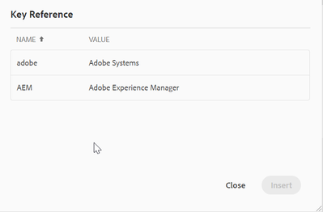

# キーの作成

組織は、多くの場所で使用されていながら変更されやすい、製品名や製品ピッチなどの適切で一般的なテキストがある場合に、キーを使用する必要があります。 このような再利用可能なテキストにキーを使用すると、キー値のように、1 つの場所で変更を行うことで、複数の場所で更新をプッシュできます。

## 手順 1：キーを保存するためのグローバルマップを作成する

マップを作成し、[!UICONTROL keyref] 要素を追加します。

```
<?xml version="1.0" encoding="UTF-8"?>
<!DOCTYPE map PUBLIC "-//OASIS//DTD DITA Map//EN" "technicalContent/dtd/map.dtd">
<mapid="map.ditamap_ffbdbf06-8658-4311-ad84-1c631bba904f">
  <title>global-keys-map</title>
  <keydefkeys="adobe">
    <topicmeta>
      <linktext>Adobe Systems</linktext>
    </topicmeta>
  </keydef>
  <keydefkeys="AEM">
    <topicmeta>
      <linktext>Adobe Experience Manager</linktext>
    </topicmeta>
  </keydef>
</map>
```

ここでは、上記のように、_Adobe Experience Manager[!UICONTROL &#x200B; テキストに対して &lbrace;keyref] を_ AEM _として指定する 2 つの定義を定義し_ す。

## 手順 2：このマップを公開マップに追加する

```
<?xml version="1.0" encoding="UTF-8"?>
<!DOCTYPE map PUBLIC "-//OASIS//DTD DITA Map//EN" "technicalContent/dtd/map.dtd">
<mapid="map.ditamap_cbf4a96d-e382-4e8c-8830-bcc093fe6638">
  <title>sample-map</title>
  <topicrefhref="sample-topic-using-the-keys.dita"type="topic">
  </topicref>
  <maprefformat="ditamap"href="global-keys-map.ditamap"type="map">
  </mapref>
</map>
```

## 手順 3：キーを使用して、グローバルキーマップで定義された変数を参照する

+ トピックを編集し、[!UICONTROL keyref] を使用してキー値を追加します。
+ スクリーンショットに示すように、キーワードを選択できる小さなウィンドウが表示されます。 「keyword」要素を追加すると、これが表示されます。
  
  

```
<?xml version="1.0" encoding="UTF-8"?>
<!DOCTYPE topic PUBLIC "-//OASIS//DTD DITA Topic//EN" "technicalContent/dtd/topic.dtd">
<topicid="topic.dita_31b00e61-04b5-4193-af7a-68503e88b087">
  <title>sample-topic-using-the-keys</title>
  <shortdesc></shortdesc>
  <body>
    <p>This is a sample topic using the keys defined in the global map</p>
    <p>here i am using the key definition for AEM :<keyword keyref="AEM"></keyword></p>
  </body>
</topic>
```
