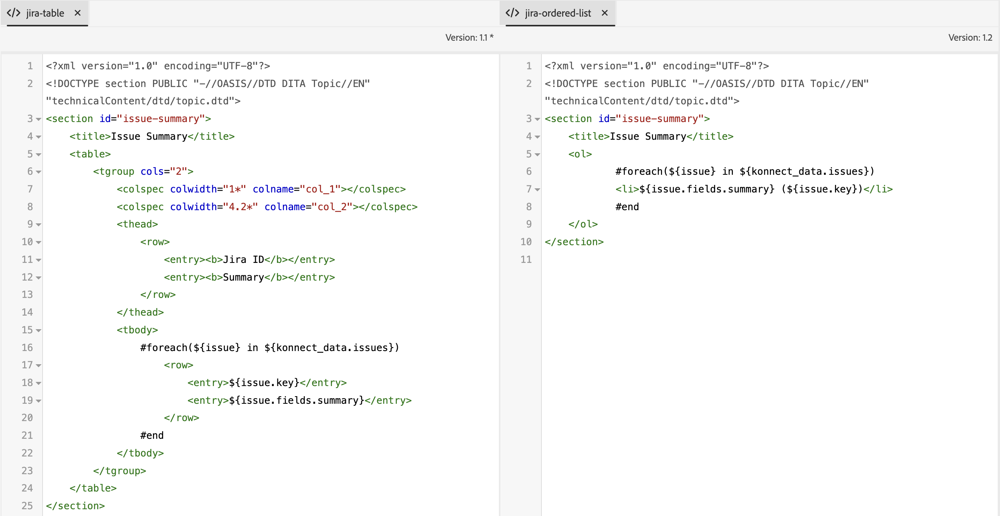

# 外部データソースの統合

外部システムからのデータをExperience Manager Guides インスタンスに簡単に統合できます。 外部データソースに接続すると、コンテンツ管理システムの機能と操作性が大幅に向上します。


データ統合を使用して、外部ソースからデータを効率的に接続および取得できます。 この機能を使用すると、データの取得時に IT チームに依存することなく、手動でデータをコピーして貼り付けたり、外部システムの変更を継続的に更新したりできます。

この機能により、元のソースとの同期が確実に行われ、手動のコピーと貼り付けの操作に依存せずに、ドキュメントを調和よく更新できます。 また、Experience Manager Guidesと外部データソースの間でデータの一貫性を維持するのにも役立ちます。

さらに、外部データソースからコンテンツを取得した後、DITA 形式でコンテンツを作成し、統合コンテンツを再利用することもできます。


## データソース統合フレームワーク

データソースの統合フレームワークには、主に外部データソースとExperience Manager Guides インスタンスへの統合という 2 つの主要なコンポーネントが含まれます。

### 外部データソース

Experience Manager Guidesから接続できるデータソースの一部を次に示します。

- リレーショナルデータベース（RDBMS）
   - PostgreSQL、MySQL、Microsoft SQL Server、MariaDB および SQLite
- 非リレーショナルデータベース
   - MongoDB、Apache Cassandra、Apache CouchDB、Redis
- 製品情報管理（PIM）/製品ライフサイクル管理（PLM）
   - Pimcore、Salsify、Akeneo、Informatica
- 製品管理システム
   - JIRA とMicrosoft Azure DevOps Boards （ADO）
- オンライン分析処理（OLAP）および分析システム

### Experience Manager Guidesでの統合


認証済みコネクタを使用すると、外部システムからデータが転送され、Experience Manager Guides内でデータが生成されます。


### Experience Manager Guidesでの統合

コンテンツをExperience Manager Guidesに統合するには、次の手順を実行します。

1. **データソースコネクタの設定**
   - データソースコネクタは、外部データソースとの接続を確立するためのインターフェイスとして機能します。 接続を確立し、認証方法（`Basic Auth` や `API key Auth` など）を含めるようにコネクタを設定する必要があります。 暗号化された情報を含むすべての設定詳細は、Adobe Experience Managerに安全に保存されます。
   - コネクタレイヤーは拡張可能に設計されており、Experience Manager Guidesでは標準で提供されていない様々なシステムに接続するための実装を作成できます。

     
   >[!NOTE]
   >
   > Connect 定義モジュールにアクセスし、コネクタインターフェイスを実装してカスタムコネクタを作成します。 詳しくは、[ カスタムデータソースコネクタの設定 ](./conf-custom-data-source-connector.md) を参照してください。

1. **Velocity テンプレートのカスタマイズ**

   - Experience Manager Guidesは、JSON ファイルから DITA コンテンツにデータを変換する非常に堅牢なテンプレートエンジンである Velocity （https://velocity.apache.org/）をサポートしています。 Velocity では、任意のレベルのネストを使用して JSON 構造内を柔軟に移動できます。
   - 次の例は、Jira をソースとする velocity テンプレートとデータを統合して、テーブルや順序付きリストを簡単に生成する方法を示しています。
      - Jira の応答

        ```
        {
            "expand": "schema,names",
            "total": 5,
            "hostname": "https://jira.corp.adobe.com",
            "maxResults": "200",
            "issues": [
                {
                    "key": "DXML-12756",
                    "fields": {
                        "description": "Implement the snippet generator in External Data Source integration",
                        "summary": "Implement the snippet generator in External Data Source integration"
                    }
                },
                {
                    "key": "DXML-12755",
                    "fields": {
                        "description": "Implement the topic generator in External Data Source integration",
                        "summary": "Implement the topic generator in External Data Source integration"
                    }
                },
                {
                    "key": "DXML-12745",
                    "fields": {
                        "description": "Implement the ability to register a new connector",
                        "summary": "Implement the ability to register a new connector"
                    }
                }
            ],
            "startAt": 0
        }
        ```

      - テンプレート

        {width="800" align="left"}
      - 同じデータソースから異なるテンプレートで生成されたデータ

        {width="800" align="left"}

1. **テンプレートを使用したコンテンツの生成**
   - 作成したテンプレートからコンテンツを生成できます。
   - 次のような様々なタイプのコンテンツを生成できます。
      - スニペット：これは 1 回限りの使用可能なコンテンツです。 コネクタから定義済みのテンプレートにデータを生成して、目的のタグに埋め込むことができます。
      - DITA トピック：コンテンツ内でそのまま使用するか、*再利用可能なコンポーネント* として再利用できるさまざまなトピックを生成します。
      - DITA トピック + マップ：トピックを使用して完全なマップを生成し、そのデータを直接公開したり、他のデータの *再利用可能なコンポーネント* として使用したりすることもできます。


1. **統合コンテンツをPublish**
   - 公開はExperience Manager Guidesの OOTB 機能で、外部システムから生成されたすべてのデータをPDFまたはAEM サイト出力として直接公開できます。

>[!MORELIKETHIS]
>
> 次のドキュメントでは、コネクタの設定とインスタンスでの使用について詳しく説明します。
> - [ データソースコネクタの設定 ](../../../install-guide/conf-data-source-connector-tools.md)
> - [ スニペットまたはトピックを使用したコンテンツの生成 ](../../../user-guide/web-editor-content-snippet.md)