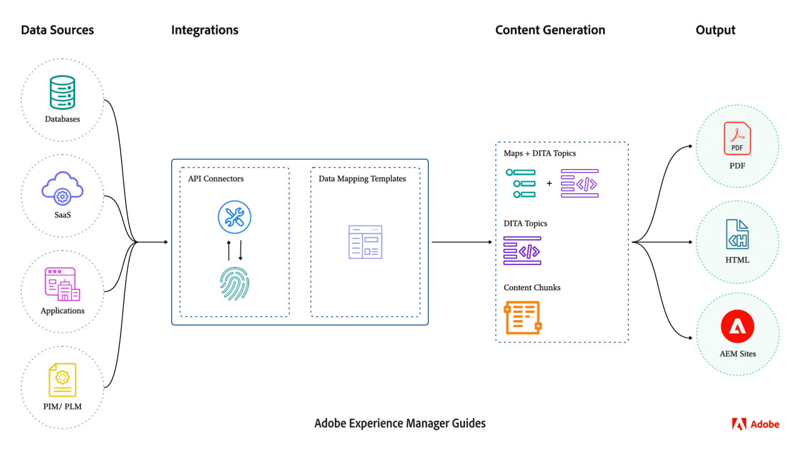
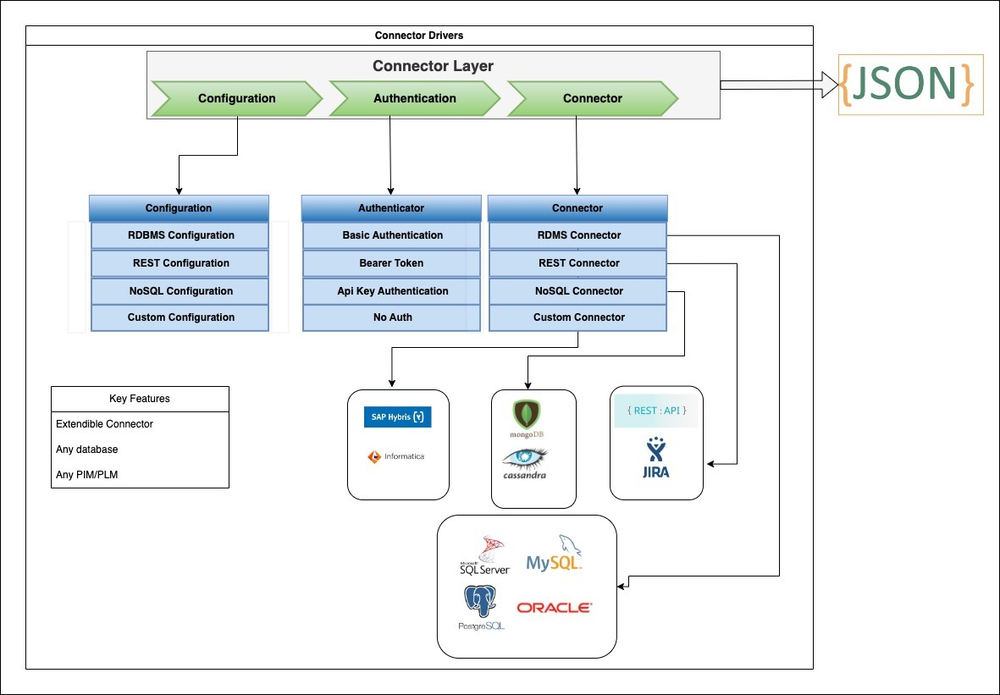
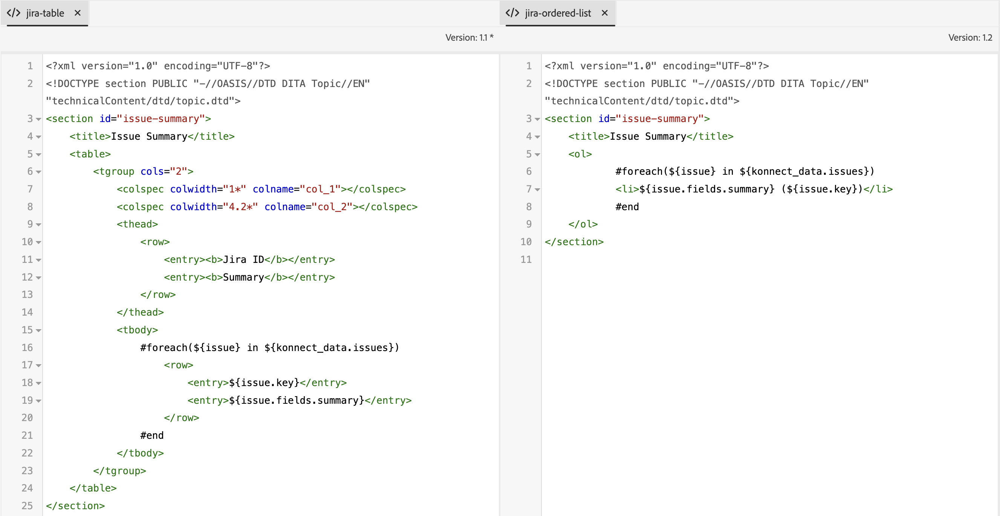
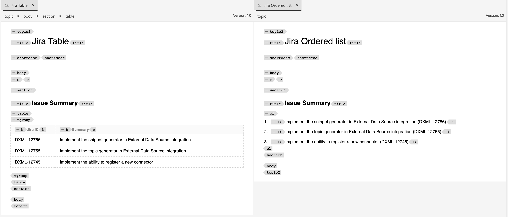

# 外部データソースの統合

外部システムからのデータは、Experience Manager Guidesインスタンスに容易に統合できます。 外部データソースに接続することで、コンテンツ管理システムの機能と使いやすさを大幅に向上させることができます。


データ統合を使用して、外部ソースからデータを効率的に接続および取得できます。 この機能により、データを取得して手動でコピー&amp;ペーストしたり、外部システムで変更を継続的に更新したりするためにIT部門に頼る必要がなくなります。

この機能により、元のソースとの同期が保証され、手作業によるコピー&amp;ペースト操作に頼ることなく、調和のとれたドキュメントの更新が可能になります。 また、Experience Manager Guidesと外部データソース間のデータの一貫性を維持するのにも役立ちます。

さらに、外部データソースからコンテンツを取得した後、DITA形式でオーサリングし、統合されたコンテンツを再利用できます。


## データソース統合フレームワーク

データソースの統合フレームワークは、主に外部データソースとExperience Manager Guides インスタンスへの統合の2つの主要コンポーネントを含みます。

### 外部データソース

Experience Manager Guidesから接続できるデータソースには、次のようなものがあります。

- リレーショナルデータベース（RDBMS）
   - PostgreSQL、MySQL、Microsoft SQL Server、MariaDB、SQLite
- 非リレーショナルデータベース
   - MongoDB、Apache Cassandra、Apache CouchDB、およびRedis
- 製品情報管理（PIM）/製品ライフサイクル管理（PLM）
   - Pimcore、Salsify、Akeneo、Informatica
- 製品管理システム
   - JIRAおよびMicrosoft Azure DevOps Boards （ADO）
- オンライン分析処理（OLAP）と分析システム

### Experience Manager Guidesとの連携


認証済みコネクタを使用して、外部システムからデータを転送し、Experience Manager Guides内でデータを生成します。



### Experience Manager Guidesとの連携

コンテンツをExperience Manager Guidesに統合するには、次の手順を実行します。

1. **データソースコネクタの設定**
   - データソースコネクタは、外部データソースとの接続を確立するためのインターフェイスとして機能します。 接続を確立し、`Basic Auth`や`API key Auth`などの認証方法を含めるには、コネクタを設定する必要があります。 暗号化された情報を含むすべての設定の詳細は、Adobe Experience Managerに安全に保存されます。
   - コネクタレイヤーは拡張可能に設計されているため、Experience Manager Guidesでは標準で提供されていない様々なシステムに接続するための実装を作成できます。
     
   >[!NOTE]
   >
   > Konnect定義モジュールにアクセスし、Connector インターフェイスを実装してカスタムコネクタを作成します。 カスタムデータソースコネクタを[設定する方法について詳しくは、](./conf-custom-data-source-connector.md)を参照してください。

1. **速度テンプレートのカスタマイズ**

   - Experience Manager Guidesは、JSON ファイルからDITA コンテンツにデータを変換する堅牢なテンプレートエンジンであるVelocity （https://velocity.apache.org/）をサポートしています。 Velocityは、あらゆるレベルのネストを使用してJSON構造を柔軟に移動できます。
   - 次の例では、Jiraから取得したベロシティ テンプレートとデータを統合して、テーブルや順序付きリストを簡単に生成する方法を示します。
      - Jira Response

        ```
        {
            "expand": "schema,names",
            "total": 5,
            "hostname": "https://jira.corp.adobe.com",
            "maxResults": "200",
            "issues": [
                {
                    "key": "DXML-12756",
                    "fields": {
                        "description": "Implement the snippet generator in External Data Source integration",
                        "summary": "Implement the snippet generator in External Data Source integration"
                    }
                },
                {
                    "key": "DXML-12755",
                    "fields": {
                        "description": "Implement the topic generator in External Data Source integration",
                        "summary": "Implement the topic generator in External Data Source integration"
                    }
                },
                {
                    "key": "DXML-12745",
                    "fields": {
                        "description": "Implement the ability to register a new connector",
                        "summary": "Implement the ability to register a new connector"
                    }
                }
            ],
            "startAt": 0
        }
        ```

      - テンプレート
        {width="800"}
      - 同じデータソースから異なるテンプレートで生成されたデータ
        {width="800"}

1. **テンプレートを使用してコンテンツを生成**
   - 作成したテンプレートからコンテンツを生成できます。
   - 様々な種類のコンテンツを生成できます。
      - スニペット：これは1回限りの使用可能なコンテンツです。 定義されたテンプレート内のコネクタからデータを生成し、望ましいタグに埋め込むことができます。
      - DITA トピック：コンテンツで様々なトピックをそのまま使用するか、*再利用可能なコンポーネント*&#x200B;として再利用できます。
      - DITA トピック + マップ：完全なマップを生成することもできます。また、トピックを使用してデータを直接公開するか、他のデータで&#x200B;*再利用可能なコンポーネント*&#x200B;として使用することもできます。


1. **統合コンテンツを公開**
   - 公開はExperience Manager GuidesのOOTB機能であり、外部システムから生成されたすべてのデータをPDFまたはAEM サイト出力として直接公開できます。

>[!MORELIKETHIS]
>
> 次のドキュメントでは、コネクタの設定とインスタンスでの使用について詳しく説明します。
> - [&#x200B; データソースコネクタの設定](../../../install-guide/conf-data-source-connector-tools.md)
> - [&#x200B; スニペットまたはトピックを使用してコンテンツを生成](../../../user-guide/web-editor-content-snippet.md)
