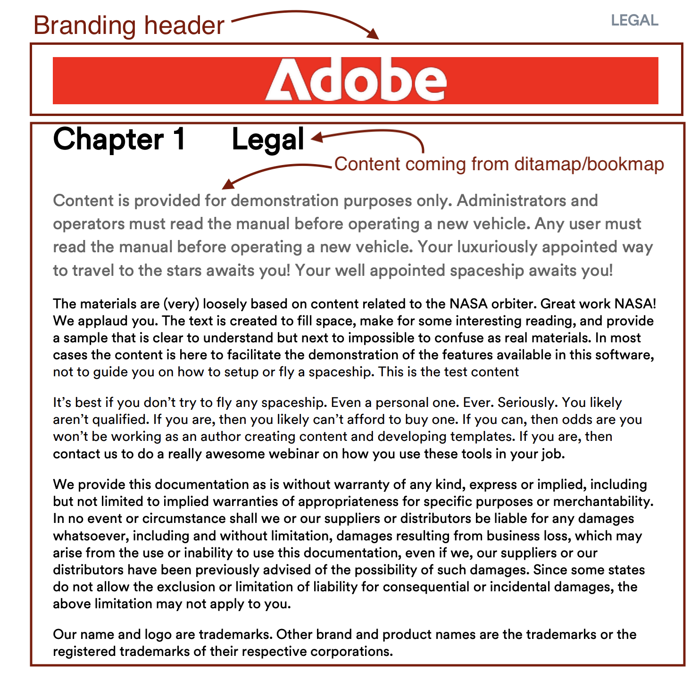

# DITA PDFの最初のページにエンタープライズブランディングを追加

## この記事では、次の内容について説明します。

FrontCover ページとチャプターページをシームレスに結合して企業のブランディングを達成し、企業の ID がコンテンツの上部に目立つように表示されるようにします。

- [コンテンツの設定](#set-up-your-content)
- [PDFテンプレートで必要な変更を行う](#create-necessary-changes-in-pdf-template)

**前：**


<br>
<br>

**After:**



## コンテンツの設定

PDFフォーマットでコンテンツを公開するには、Ditamap またはブックマップを作成する必要があります。

ブックマップ構造のサンプル :

```
<bookmap>
  <title>My Bookmap Title </title>
  <frontmatter>
    <booklists>
      <toc/>
      <figurelist/>
      <tablelist/>
    </booklists>
  </frontmatter>

  <chapter href="chapter1.ditamap">
  <chapter href="chapter2.ditamap">
  </chapter>

  <backmatter>
    <booklists>
      <indexlist/>
    </booklists>
  </backmatter>
</bookmap>
```

Ditamap 構造の例：

```
<map title="My map Title">

  <topicref href="topic1.dita" >
  </topicref>
  <topicref href="topic2.dita">
  </topicref>
  
</map>
```

Bookmap に `<frontmatter>` が含まれている場合、PDFの FrontCover が自動的に生成されます。


## PDFテンプレートで必要な変更を行う

この節では、テンプレートを設定します。 （ハイテク テンプレートを使用または複製して開始できます。）

### テンプレートを設定します。

- ネイティブPDFテンプレートに移動します。
- FrontCover ページのレイアウトに移動して編集します。
- ここでは、`data-region="content"` でブランディング画像を追加します。
- 必要に応じて、チャプターテンプレートにその他の必要な変更を追加します。
- 次に、コンテンツに応じて、次の手順に従います。


#### PDFの生成に Ditamap を使用する場合：

DITAMAP を公開するとき、Native PDFは FrontCover ページを自動生成する機能を提供します。 FrontCover ページの生成を有効または無効にするオプションは、ネイティブPDFテンプレートで設定できます。

結合するには：
- ネイティブのPDFテンプレート設定/ ページレイアウトの順序に移動します。
- 次に、FrontCover と次のページ（チャプターとトピック）を統合します。
  
- テンプレートを保存し、プリセットでこのテンプレートを選択して公開します。


#### PDFの生成に Bookmap を使用する場合

ブックマップの場合、ページレイアウトの順序のシーケンスは、テンプレートの順序ではなく、ブックマップの構造によって制御されます。

Bookmap でこれを実現するために、NativePDF のJavaScript機能を利用します。

- テンプレートのリソースフォルダーで、JavaScriptの下に追加します

```
window.addEventListener('DOMContentLoaded', function () {
    window.pdfLayout.onAfterPagination(function () {
        var frontMatterWrappers = document.querySelectorAll('.rh-front-matter-wrapper');

        frontMatterWrappers.forEach(function(wrapper) {
            var contentDiv = wrapper.querySelector('div[data-region="content"]');
            var chapterBody = document.querySelector('.chapter-body');

            if (contentDiv && chapterBody) {
                chapterBody.insertBefore(contentDiv, chapterBody.firstChild);
            }

            wrapper.remove();
        });
    });
});
```

- このJavaScriptをチャプターテンプレートに含めます。
  

- プリセットオプションからJavaScriptを有効にする
  

- Publish!

## 添付ファイル :

- [適用された変更内容を確認するには、サンプルのPDFテンプレートパッケージをダウンロードします。](../assets/publishing/NativePDF_DemoTemplate.zip)
- [サンプルのPDFプリセットパッケージをダウンロードして、適用された変更を確認します。](../assets/publishing/Preset_Package.zip)


## その他のリソース：

- [DITA Bookmap の目次をPDFに含める方法](./how-to-include-bookmap-toc-in-pdf-publishing.md)
- [ネイティブPDFに関するエキスパートセッションビデオ](../../expert-sessions/native-pdf-publishing-eamples-part1-june2023.md)

