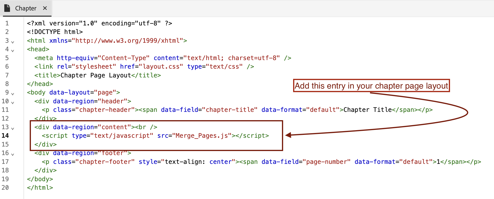
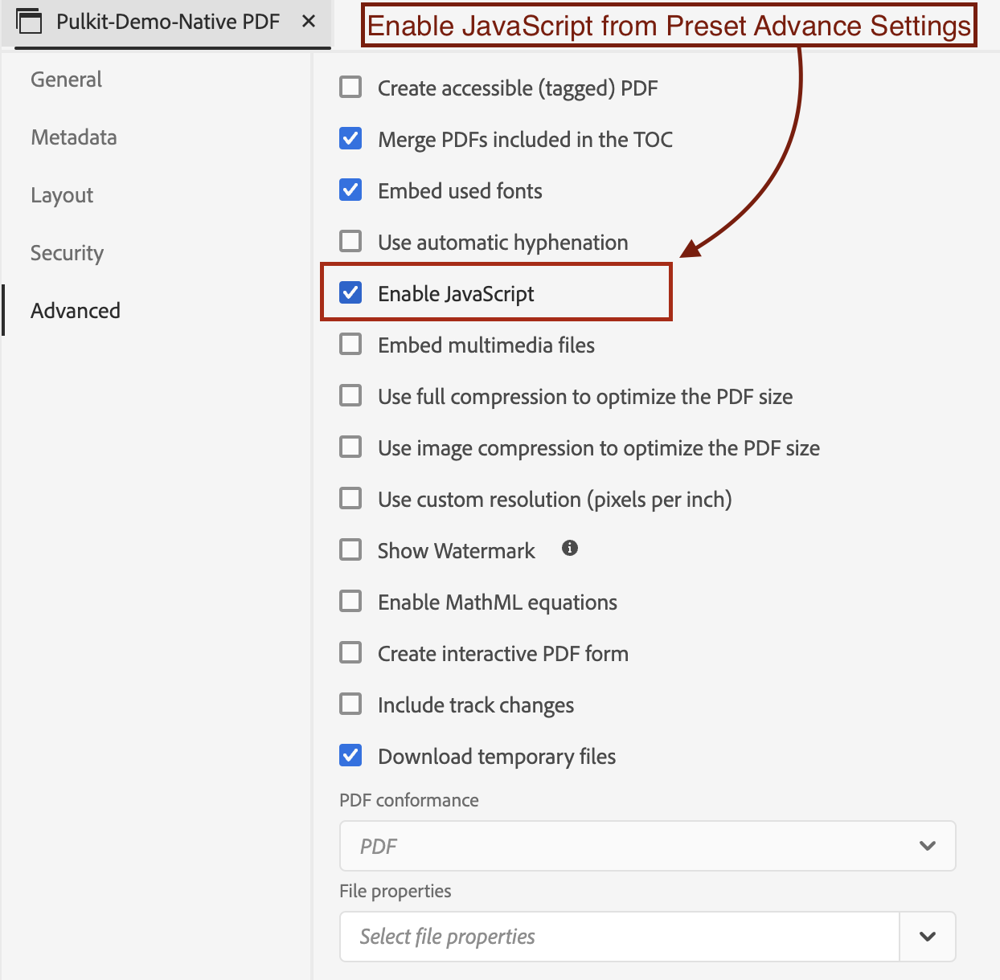

# DITA PDFの最初のページにエンタープライズブランドを追加する

## 解説します。

FrontCover ページとチャプターページをシームレスに統合することで、エンタープライズブランディングを実現し、コンテンツの上部に企業のIDが目立つように表示されます。

- [コンテンツの設定](#set-up-your-content)
- [PDF テンプレートで必要な変更を行う](#create-necessary-changes-in-pdf-template)

**前：**


<br>
<br>

**後：**


## コンテンツの設定

PDF形式でコンテンツを公開するには、DitamapまたはBookmapを作成する必要があります。

ブックマップ構造の例：

```
<bookmap>
  <title>My Bookmap Title </title>
  <frontmatter>
    <booklists>
      <toc/>
      <figurelist/>
      <tablelist/>
    </booklists>
  </frontmatter>

  <chapter href="chapter1.ditamap">
  <chapter href="chapter2.ditamap">
  </chapter>

  <backmatter>
    <booklists>
      <indexlist/>
    </booklists>
  </backmatter>
</bookmap>
```

Ditamap構造の例：

```
<map title="My map Title">

  <topicref href="topic1.dita" >
  </topicref>
  <topicref href="topic2.dita">
  </topicref>
  
</map>
```

Bookmapに`<frontmatter>`が含まれている場合、PDFのFrontCoverは自動生成されます。


## PDF テンプレートで必要な変更を行う

このセクションでは、テンプレートを設定します。 （最初に、ハイテク テンプレートを使用または複製できます）。

### テンプレートの設定：

- PDFのネイティブテンプレートを開きます。
- FrontCover ページレイアウトに移動し、編集します。
- ここで、`data-region="content"`にブランド画像を追加します。
- 必要に応じて、チャプターテンプレートに必要な変更を追加します。
- コンテンツに応じて、次の手順に従います。


#### PDFの生成にDitamapを使用している場合：

DITAMAPを公開する場合、Native PDFには、FrontCover ページを自動生成する機能が用意されています。 FrontCover ページの生成を有効または無効にするオプションは、ネイティブ PDF テンプレートで設定できます。

結合するには：
- PDFのネイティブテンプレート設定/ ページレイアウト順序に移動します
- 次のページ（章とトピック）にFrontCoverを統合します。
  
- テンプレートを保存し、このテンプレートをプリセット用に選択して公開します。


#### BookmapをPDFの生成に使用している場合

ブックマップの場合、ページレイアウト順序の順序は、テンプレートの順序ではなく、ブックマップの構造によって制御されます。

これを実現するため、NativePDFのJavaScript機能を利用します。

- 以下に、テンプレートのリソースフォルダーにJavaScriptを追加します

```
window.addEventListener('DOMContentLoaded', function () {
    window.pdfLayout.onAfterPagination(function () {
        var frontMatterWrappers = document.querySelectorAll('.rh-front-matter-wrapper');

        frontMatterWrappers.forEach(function(wrapper) {
            var contentDiv = wrapper.querySelector('div[data-region="content"]');
            var chapterBody = document.querySelector('.chapter-body');

            if (contentDiv && chapterBody) {
                chapterBody.insertBefore(contentDiv, chapterBody.firstChild);
            }

            wrapper.remove();
        });
    });
});
```

- このJavaScriptを章テンプレートに含めます。
  

- プリセットオプションからJavaScriptを有効にする
  

- 公開します！

## 添付ファイル :

- [サンプルのPDF テンプレートパッケージをダウンロードして、適用された変更を確認します。](../assets/publishing/NativePDF_DemoTemplate.zip)
- [サンプルのPDF プリセットパッケージをダウンロードして、適用された変更を確認します。](../assets/publishing/Preset_Package.zip)


## 関連トピックス：

- [PDFにDITA ブックマップの目次を含める方法](./how-to-include-bookmap-toc-in-pdf-publishing.md)
- [Adobe PDFのエキスパートセッションの動画](../../expert-sessions/native-pdf-publishing-eamples-part1-june2023.md)
