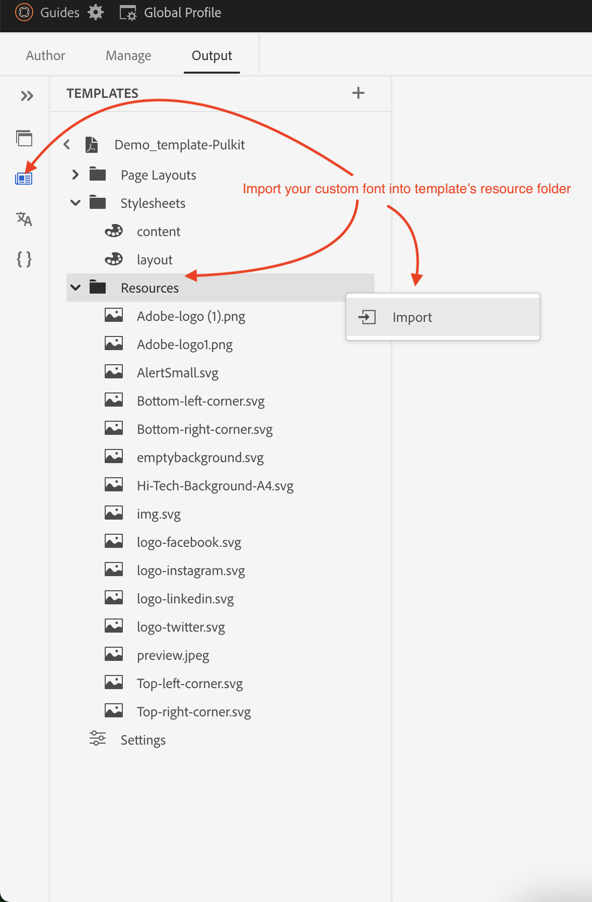

# DITA Native PDFにカスタムフォントを追加する

## 主な内容：

カスタムフォントを追加することで、あらゆるコンテンツでブランドアイデンティティと視覚的な一貫性を強化できます。

このプロセスには、次の3つのステップがあります。

- [カスタムフォントのアップロード](#step-1--upload-the-custom-font-to-the-resource-folder-of-your-template)
- [PDF テンプレートのスタイルシートに必要な変更を加える](#step-2--make-necessary-changes-in-pdf-templatess-stylesheet)

- [使用中のフォントを埋め込む（オプション）](#step-3-optional--embed-used-font-in-pdf)

## 手順1：カスタムフォントをテンプレートのリソースフォルダーにアップロードする

のインポート

## 手順2 :PDF テンプレートのスタイルシートを変更する

PDFのテンプレートのスタイルシート  フォント面

## 手順3 （オプション）：使用したフォントをPDFに埋め込む

## よくある質問

### Adobe Fontsは使用できますか？

> はい、fonts.adobe.comに移動し、「Web プロジェクトに追加」をクリックします。
> 
> `" @import url("https://use.typekit.net/xxxx.css")`のようなインポート コードをコピーします。
>
> コンテンツ CSSを貼り付け、CSS ファイルで必要な変更を行います。

### PDFにフォントが表示されない

> フォント名のスペルをダブルチェック（最も一般的な間違い）
>
> PDFを開いているシステムでフォントが使用できない場合は、フォントを埋め込むことにします

## その他の質問については、それぞれのCSMにお問い合わせください

## 関連トピックス：

- [PDFにDITA ブックマップの目次を含める方法](./how-to-include-bookmap-toc-in-pdf-publishing.md)
- [PDF パブリッシングに目次を含める方法](./how-to-include-bookmap-toc-in-pdf-publishing.md)
- [ネイティブPDFに関するエキスパートセッションの動画](../../expert-sessions/native-pdf-publishing-eamples-part1-june2023.md)
