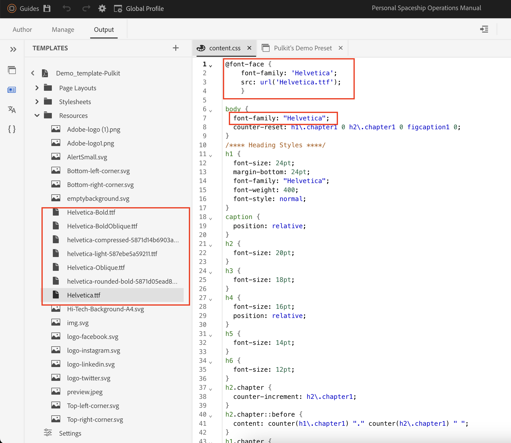

# DITA Native PDFへのカスタムフォントの追加

## この記事では、次の内容について説明します。

カスタムフォントを追加して、すべてのコンテンツでブランドアイデンティティと視覚的な一貫性を強化します。

このプロセスには、次の 3 つのステップが含まれます。

- [カスタムフォントのアップロード](#step-1--upload-the-custom-font-to-the-resource-folder-of-your-template)
- [PDFテンプレートのスタイルシートを必要に応じて変更する](#step-2--make-necessary-changes-in-pdf-templatess-stylesheet)

- [使用中のフォントを埋め込む（オプション）](#step-3-optional--embed-used-font-in-pdf)

## 手順 1：カスタムフォントをテンプレートのリソースフォルダーにアップロードします

## 手順 2 :PDFテンプレートのスタイルシートで必要な変更を行う

 のフォント書体

## 手順 3 （オプション）：使用フォントをPDFに埋め込む

 ードへのカスタムフォントの埋め込み

## FAQ

- ### Adobe Fontsを使用できますか？

> はい、fonts.adobe.comに移動して、「Web プロジェクトに追加」をクリックします。
> 
> `" @import url("https://use.typekit.net/xxxx.css")` のようなインポートコードをコピーします。
>
> コンテンツ CSS に貼り付け、CSS ファイルで必要な変更を行います。

- ### PDFにフォントが表示されない

> フォント名のスペルを再確認する（最も一般的な間違い）
>
> フォントが開いているシステムでPDFが使用できない場合は、フォントを埋め込んでください

- ## その他のクエリについては、それぞれの CSM にお問い合わせください

## その他のリソース：

- [DITA Bookmap の目次をPDFに含める方法](./how-to-include-bookmap-toc-in-pdf-publishing.md)
- [PDFの公開に目次を含める方法](./how-to-include-bookmap-toc-in-pdf-publishing.md)
- [ネイティブPDFに関するエキスパートセッションビデオ](../../expert-sessions/native-pdf-publishing-eamples-part1-june2023.md)