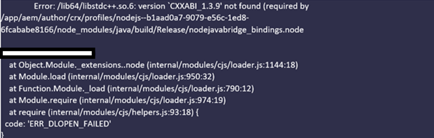

# ネイティブ PDF パブリッシング用のAEM環境の設定

AEM Guidesには、PDFのネイティブなパブリッシングエンジンが搭載されており、PDF形式でコンテンツを設計、開発、公開できます。

様々なページレイアウト、CSS テンプレートを作成し、ページレイアウトやCSSと組み合わせてPDF テンプレートをデザインできます。

AEM Guidesでこのネイティブ PDFを設定する手順は、オペレーティングシステムによって異なります。 AEMがインストールされているオペレーティングシステムに基づいて、次の設定手順を使用します。

## 前提条件

ネイティブPDFを設定するための最小要件：

- インストール済みJava Platform、Standard Edition 8または11 JDK （Java SE Development Kit）およびJRE （Java SE Runtime Environment）
- AEM 6.5 SP13、SP12、SP11またはSP10
- Guides 4.1以降のバージョン（非UUIDまたはUUID）

ネイティブのPDF パブリッシングエンジンでは、AEM crx-quickstart フォルダーにノードモジュールを生成するためにOracle JDKが必要です。 デフォルトでは、次のオペレーティングシステムをサポートしています。

- Windows 10、Windows 2019 server以降。
- Linux - （RHEL 8以降、CentOS 7以降、Ubuntu 18以降のバージョン）
- Mac OS （Intel ベース）

## Windows Serverの設定手順（JAVA 11/8）

1. AEM serverがダウンしていることを確認します。
2. Windows タスクバーで、Windows アイコンを右クリックし、「システム」を選択します。
3. 設定ウィンドウの「関連設定」で、「システムの詳細設定」をクリックします。
4. 「詳細」タブで、「環境変数」をクリックします。
5. システム変数セクションで、「_New_」をクリックして、新しい環境変数を作成します。
6. 変数名をJAVA_HOMEと入力します。
7. 値フィールドにJava インストールパスを指定し、「OK」をクリックします。

   例：

   JAVA 11:

   C:\Program Files\JAVA\jdk-11.0.15.1

   JAVA 8:

   C:\Program Files\JAVA\ jdk1.8.0_144

8. システム変数から選択パスを追加し、「編集」をクリックします。

9. 次に、内部のパス変数でサーバーパスの値を指定し、「OK」をクリックします。

   例：

   JAVA 11:

   %JAVA_HOME%\bin\server\

   JAVA 8:

   %JAVA_HOME%\jre\bin\server\

10. 環境変数ダイアログで「OK」をもう一度クリックします。
11. システムのプロパティ ダイアログで「OK」をもう一度クリックします。
12. 次に、AEM サーバーを起動します。
13. Web エディターのプリセットからネイティブのPDFを生成します。

## Linux サーバー（RHEL7/centOS 7）の設定手順

1. AEM サーバーがダウンしていることを確認します
2. echo $JAVA_HOMEを実行してJAVA_HOME変数を確認します
3. JAVA_HOME変数が設定されていない場合は、手順4に従います。 それ以外は、手順5に直接移動します。
4. インストールされているJava バージョンに基づいて、以下のコマンドを使用してJAVA_HOME変数を設定します

   例：

   JAVA 11:

   1. export JAVA\_HOME=/usr/lib/jvm/java-11.0.15.1
   2. export PATH=$PATH: $JAVA\_HOME/bin
   3. export LD\_LIBRARY\_PATH=/usr/lib/jvm/jdk-11.0.15.1/lib/server:/usr/java/jdk-11.0.15.1/lib/server

   JAVA 8:

   1. export JAVA\_HOME=/usr/lib/jvm/java-11.0.15.1
   2. export PATH=$PATH: $JAVA\_HOME/bin

5. Guides バージョン 4.2以降を使用している場合は、AEM Serverを再起動し、手順12に進みます。
6. この記事の下部に添付されている「_node_ modules.zip_」をcrx-quickstart/profiles/nodejs—b1aad0a7-9079-e56c-1ed8-6fcababe8166/ ディレクトリにコピーします。
7. crx-quickstart/profiles/nodejs—b1aad0a7-9079-e56c-1ed8-6fcababe8166/の場所でターミナルを開きます。
8. 以下のコマンドを使用してnode_modules ディレクトリを削除します

   **rm -rf node_modules**

9. 以下のコマンドを使用してnode_modules.zipを解凍します

   **unzip node_modules.zip**

10. unzip コマンドがインストールまたは認識されない場合は、次のコマンドを使用してインストールできます

   **yum install unzip**

11. fontconfig パッケージをインストールします。
コマンド：yum install fontconfig
12. Web エディターのプリセットからネイティブのPDFを生成します。

**メモ** : node_modules.zip パッケージは[こちら](https://acrobat.adobe.com/link/track?uri=urn:aaid:scds:US:295d8f03-41e1-429b-8465-2761ce3c2fb3)からダウンロードできます。

ダウンロードしたノードモジュールをLinux オペレーティングシステム用に手動で読み込むことは、Guides 4.1以前のバージョンを使用しているユーザーの回避策です（手順6-12）

## Mac マシンの設定手順（JAVA 11/8）

1. Oracle JAVA 11またはOracle JAVA 8をインストールします。
2. JAVA_HOME環境変数をインストール済みのJAVA ディレクトリに設定します。
3. Unix シェルを開きます。
（ここではBashを使用して設定を行います）

   コマンド：nano ～/.bashrc

4. インストールされているJava バージョンに基づいて、以下のコマンドを使用してJAVA_HOME変数を設定します

   例：

   JAVA 11:

   export JAVA\_HOME= /Library/Java/JavaVirtualMachines/jdk-11.0.15.1.jdk/Contents/Home

5. バッシュボードの再読み込み

   コマンド：source ～/.bashrc.

6. コマンド echo $JAVA_HOMEを使用してJAVA_HOMEが設定されていることを確認します

7. AEMのインストールパスから次の3つのコマンドを実行します

   C:/{aem-installation-folder}/crx-quickstart/profiles/nodejs—b1aad0a7-9079-e56c-1ed8-6fcababe8166

   i）を検索します。 -type d -exec chmod 0755 {} \;
ii）を検索します。 -type f -exec chmod 0755 {} \;
iii） ./node-darwin/bin/node node-darwin/lib/node_modules/npm/bin/npm-cli.js —prefix . install —unsafe-perm —scripts-prepend-node-path

8. 次のコマンドを使用して、Javaがインストールされているかどうかを確認します

   i） /crx-quickstart/profiles/nodejs—b1aad0a7-9079-e56c-1ed8-6fcababe8166 フォルダーから&#x200B;**./node-darwin/bin/node** コマンドを実行します

   

   ii） a = require （&#39;java&#39;）

9. fontconfig パッケージをインストールします。
コマンド：apt install fontconfig

10. Web エディターのプリセットからネイティブのPDFを生成します。

## トラブルシューティング

以下は、PDF生成時に環境変数が正しく設定されていない場合に発生する可能性がある一般的なエラーです。

### Windows/Mac OSでのNull ポインターの例外

Java環境設定を修正しても問題が解決しない場合は、次の点を再検証してください。

1. 出力プリセットが正しく定義されているか、スペースなしで新しい出力プリセットを作成するかを確認します。

2. /libs/fmdta/node_resourcesにあるnode resources ディレクトリを確認して、インストール中にすべての必要なライブラリがインストールされていることを確認します。

### RHEL 7 Linux OSでライブラリが見つからない

### 公開プロセスのタイムアウト： 指定された時間0msでプロセスが完了しませんでした

CRX リポジトリの/var/dxml/profiles/b1aad0a7-9079-e56c-1ed8-6fcababe8166/nodejsのnodejs ノードのタイムアウトプロパティ値を検証します。 デフォルト値は 300 です。

上記のいずれかの手順を実行する際に問題が発生した場合は、AEM Guides コミュニティ [ フォーラム ](https://experienceleaguecommunities.adobe.com/t5/experience-manager-guides/ct-p/aem-xml-documentation)に質問を投稿してサポートを受けてください。
