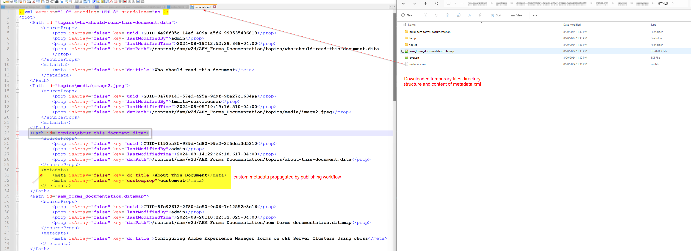

# DITA-OT プラグインが生成した出力へのAEM Assets メタデータの伝播

この文書では、DITA-OT プラグインの変更内容を実装して、metadata.xml _（一時ファイルで使用可能）を読み取り_ AEM Guides パブリッシュワークフローによって渡されたプロパティを DITA-OT プラグインで使用し、生成された出力に設定する方法を説明します。

大まかには、この記事で学ぶ手順を以下に示します。
- AEM Guidesでの ditamap の出力プリセットに対するメタデータの設定
- 出力生成時に、DITA-OT 一時ディレクトリのこの metadata.xml にアクセスします
- この _metadata.xml_ を読み取り、生成された出力で使用可能なプロパティを使用するための DITA-OT プラグインの実装
- 生成された出力を確認して、伝播されたメタデータを確認

## 背景

AEM Guidesでは、DITA-OT プラグインを使用して、設定済みのプラグインを使用して任意の出力形式に公開できます。
また、AEM DAM で管理されるアセットのメタデータを DITA-OT プロセスに渡して、生成される出力で使用することもできます。[output プリセットをメタデータを渡すための ditamap/topics の設定方法 &#x200B;](https://experienceleague.adobe.com/ja/docs/experience-manager-guides/using/user-guide/output-gen/pass-metadata-dita-ot) に関するドキュメントを参照してください。


## 前提

AEMがAEM Guides バージョン 4.4.0/2024.6以降で設定されている。
DITA-OT の動作とそのディレクトリ構造に関する予備知識がある


## 手順

### アセットでのメタデータの設定

AEM Assets メタデータスキーマを使用すると、AEMでAssetsのカスタムプロパティフィールドを作成し、アセットにメタデータを割り当てることができます。 _トピック_ アセットの例では、_customprop_ という名前のメタデータを例として設定できます。以下のスクリーンショットを参照してください。


### DITA-OT に渡す ditamap 出力プリセットのメタデータの設定

メタデータをエクスポートして DITA-OT に渡すには、マップ上で選択した出力プリセットを設定します
例えば、DITA-OT プラグイン（_adobe.html_）を使用してHTML 5 出力を生成しているとします。
マップの出力プリセットを設定してメタデータを DITA-OT プラグインに渡す方法については、以下のスクリーンショットを参照してください。
1. マップを開き、このマップの「_出力_」タブを参照して「HTML5」プリセットを開き、「_詳細_」タブをクリックします。このタブで、変換名は「_adobe.html_」になります（このプラグインは、例として設定および使用するプラグインで、カスタムプラグインを定義することもできます）
2. 一時ファイルをダウンロードして metadata.xml の形式を確認できるようにするには、「_一時ファイルを保持_」を設定します。これを開発に使用できます
3. metadata.xml を使用して DITA-OT に渡すメタデータプロパティを選択します。 この例では、_dc:title_ と _customprop_ を渡すとします
4. プリセットを保存し、出力を生成します
5. プリセットに表示されるボタンを使用して、一時ファイルをダウンロードします

上記の手順を理解するには、以下のスクリーンショットを参照してください。


### DITA-OT プラグインの実装

#### 一時ディレクトリの metadata.xml へのアクセス

ダウンロードした一時ファイルパッケージ内に、プロパティと値の構造を見ることができる metadata.xml ファイルがあります（下のスクリーンショットを参照）


##### metadata.xml について

- このファイルには、公開されるすべてのアセットのリストが含まれています。各アセットには、次の項目が含まれます。
   - dita ディレクトリ内のファイルのパス [ パス要素の id 属性 ]
   - メタデータプロパティの値のペアのリスト [_メタデータ_ 要素の下 ]

```
        <Path id="topics\about-this-document.dita">
            <sourceProps>
                ...
            </sourceProps>
            <metadata>
                <meta isArray="false" key="dc:title">About This Document</meta>
                <meta isArray="false" key="customprop">customval</meta>
            </metadata>
        </Path>
```

#### DITA-OT プラグインの各アセットのメタデータへのアクセス

DITA-OT プラグインで使用可能な _metadata.xml_ とプロパティを読み取るには、次の手順を実行する必要があります。
- _plugins.xml_ でカスタムプラグイン設定を定義します。プラグイン生成用のパラメーターとインテグレーターを定義します。サンプルプラグインファイルは以下のようになります。

```
<?xml version="1.0" encoding="UTF-8"?>
<plugin id="com.adobe.html">
    <require plugin="org.dita.html5"/>
    <feature extension="dita.conductor.transtype.check" value="adobe.html"/>
    <feature extension="ant.import" file="integrator.xml"/>
    <feature extension="dita.conductor.html5.param" file="params.xml"/>
    <feature extension="package.version" value="2024.1"/>
</plugin>
```

- プラグイン開始時：
   - メタデータファイルのパスを定義するプロパティをプラグインの下の _integrator.xml_ すなわち.xml ファイルを指すように変数を設定し、
   - カスタム xsl 変換ルールを実行するファイル（_args.xsl_）を定義します。この場合、ファイル _xsl/adobe-html5.xsl_ を指します。
以下のコードを参照してください。

```
    <property name="adobe.html.xsl.dir" value="${dita.plugin.com.adobe.html.dir}${file.separator}xsl${file.separator}"/>
    <property name="args.xsl" location="${adobe.html.xsl.dir}adobe-html5.xsl" />
    <dirname property="input.dirname" file="${args.input}"/>
    <makeurl file="${input.dirname}/metadata.xml" property="metadata.url"/>
```

- 変数 _metadata.url_ の値をカスタム XSL に渡して、必要に応じて利用します。既存または作成済みの _param.xml で_ パラメーターをプラグインに渡します。以下に params.xml ファイルのサンプルを示します。

```
    <?xml version="1.0" encoding="UTF-8"?>
    <params xmlns:if="ant:if">
        <param name="metadata.url" expression="${metadata.url}" if:set="metadata.url"/>
    </params>
```

- カスタム XSL 変換ファイル _xsl/adobe-html5.xslでは_ メタデータ ファイルからメタデータ値を読み取り、必要な方法で出力に設定することができます。 この例では、メタデータ値を html head/meta タグに追加します。 以下のコードを参照してください。

```
<xsl:import href="plugin:org.dita.html5:xsl/dita2html5.xsl"/>
    <xsl:param name="metadata.url"/>
    <xsl:template name="copyright">
        <xsl:if test="doc-available( $metadata.url )">
            <xsl:variable name="docName" select="tokenize( base-uri(), '/' )[ last() ]"/>
            <xsl:variable name="doc" select="doc( $metadata.url )"/>
            <xsl:for-each select="$doc//Path[ ends-with( @id, concat( '\', $docName ) ) ]/metadata/meta">
                <meta name="{ @key }" content="{ . }"/>
            </xsl:for-each>
        </xsl:if>
    </xsl:template>
```

上記の手順をハイライトした以下のスクリーンショットを参照してください


### プラグイン実装のテスト

次のコマンドを実行してプラグインをテストし、AEM（マップのコンテンツと metadata.xml を含んでいる）からダウンロードした一時ファイルを使用してテストできます

```
./dita --input=docsrc/samples/HTML5/aem_forms_documentation.ditamap --format=adobe.html
```

ダウンロードした一時ファイルを「DITA-OT/docsrc/samples/directory5」のHTMLにコピーしたとします。
また、以下のリソースの節で示すサンプルをダウンロードすることもできます。

上記のコマンドを実行すると、ディレクトリ「DITA-OT/bin/out」の出力を確認できます。このディレクトリでは、「about-this-document.dita」というトピック用に生成された HTML ファイルを確認できます。このトピックには、_head_ 要素にカスタムメタデータが含まれます

```
<head>
    <meta http-equiv="Content-Type" content="text/html; charset=UTF-8">
    <meta charset="UTF-8">
    <meta name="copyright" content="(C) Copyright 2024">
    <meta name="DC.format" content="HTML5">
    <meta name="DC.identifier" content="GUID-f193ea85-989d-4d80-99e2-2f5dea3d5310">
    <meta name="DC.language" content="en-US">
    <meta name="dc:title" content="About This Document">
    <meta name="customprop" content="customval">
    <title>About This Document</title>
</head>
```

### デプロイメント

DITA-OT プラグインを開発したら、DITA-OT ディレクトリの下で _dita —install_ コマンドを使用して DITA-OT に組み込み、AEM サーバーに配備できます [&#x200B; 詳細は、この記事を参照してください &#x200B;](https://experienceleaguecommunities.adobe.com/t5/experience-manager-guides/steps-to-setup-a-custom-dita-ot/td-p/407659?profile.language=ja)


## リソース

1. サンプル ditamap - [&#x200B; このリンクを使用してダウンロード &#x200B;](../../assets/publishing/sample-temp-html5-adobe.html-content.zip) からダウンロードされたサンプル一時ファイル
2. 前述の実装を持つ DITA-OT プラグイン [&#x200B; このリンクを使用してダウンロード &#x200B;](../../assets/publishing/sample-custom-plugin-com.adobe.html.zip)