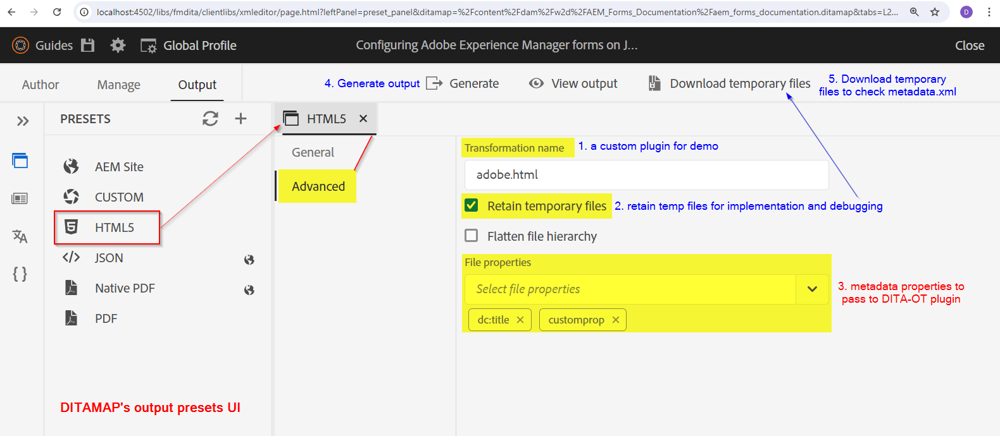
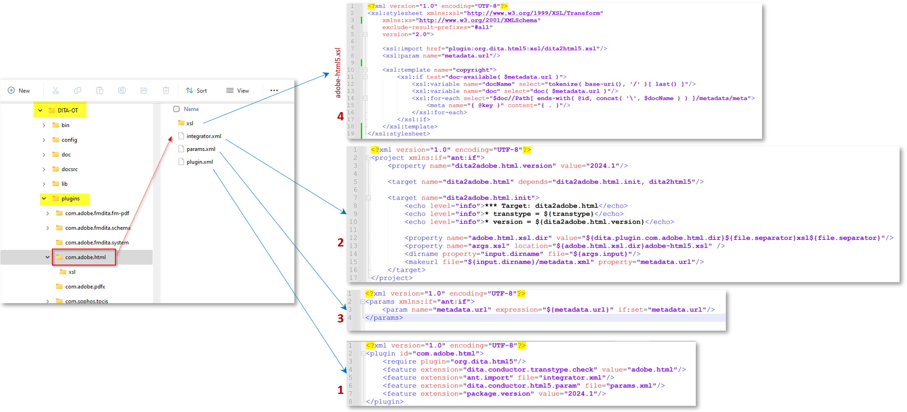

# AEM Assets メタデータをDITA-OT プラグインで生成された出力に反映

この記事では、DITA-OT プラグインに変更を実装してmetadata.xml _（一時ファイルで使用可能）_&#x200B;を読み取り、AEM Guides パブリッシングワークフローによって渡されたプロパティをDITA-OT プラグインで利用し、生成された出力に設定する方法について説明します。

大まかに言うと、この記事で学習する手順は次のとおりです。
- AEM Guidesでditamapの出力プリセットにメタデータを設定する
- 出力生成時に、DITA-OT temp ディレクトリ内のこのmetadata.xmlにアクセスします
- この&#x200B;_metadata.xml_&#x200B;を読み取り、生成された出力で使用可能なプロパティを使用するためのDITA-OT プラグインの実装
- 生成された出力を確認して、伝播されたメタデータを確認する

## 背景

AEM Guidesでは、DITA-OT プラグインを使用して、設定されたプラグインを使用して任意の出力フォーマットに公開できます。
AEM DAMで管理されているアセットのメタデータをDITA-OT プロセスに渡して、生成された出力で使用することもできます。[出力プリセットにメタデータを渡すようにditamap/topicsを設定する方法](https://experienceleague.adobe.com/en/docs/experience-manager-guides/using/user-guide/output-gen/pass-metadata-dita-ot)に関するドキュメントを参照してください。


## 前提

AEM Guides版4.4.0/2024.6以降のAEM設定が必要です
DITA-OTの仕組みとディレクトリ構造について事前に知っておく必要があります


## 手順の説明

### アセットのメタデータの設定

AEM Assets メタデータスキーマを使用すると、AEMでAssetsのカスタムプロパティフィールドを作成でき、ユーザーはアセットにメタデータを割り当てることができます。 _customprop_&#x200B;という名前のメタデータを例として設定できる&#x200B;_topic_ アセットの例を示します。以下のスクリーンショットを参照してください。


### DITA-OTに渡すditamap出力プリセットのメタデータの設定

メタデータを書き出してDITA-OTに渡すために、マップ上で任意の出力プリセットを設定します
DITA-OT プラグインを使用してHTML5出力を生成しているとします（_adobe.html_）。
DITA-OT プラグインにメタデータを渡すマップの出力プリセットを設定する方法については、以下のスクリーンショットを参照してください。
1. マップを開き、このマップの「_Output_」タブを参照してHTML5 プリセットを開き、「_Advanced_」タブをクリックします。この場合、変換名を&#x200B;_adobe.html_&#x200B;に設定します（このプラグインは、この例で使用します。カスタムプラグインも定義できます）
2. 一時ファイルをダウンロードし、metadata.xmlの形式を確認するには、_一時ファイルを保持_&#x200B;を設定します。これを開発に使用できます
3. metadata.xmlを介してDITA-OTに渡すメタデータプロパティを選択します。 この例では、_dc:title_&#x200B;と&#x200B;_customprop_を渡します
4. プリセットを保存し、出力を生成します
5. プリセットに表示されているボタンを使用して一時ファイルをダウンロードします

上記の手順については、以下のスクリーンショットを参照してください。



### DITA-OT プラグインの実装

#### 一時ディレクトリ内のmetadata.xmlへのアクセス

ダウンロードした一時ファイルパッケージにmetadata.xml ファイルがあり、プロパティと値の構造を確認できます（以下のスクリーンショットを参照）


##### metadata.xmlについて

- このファイルには、公開されるすべてのアセットのリストが含まれます。各アセットには次のものが含まれます。
   - path エレメント ]のDITA ディレクトリ [id属性のファイルのパス
   - _メタデータ_&#x200B;要素]の下のメタデータプロパティ値ペア [のリスト

```
        <Path id="topics\about-this-document.dita">
            <sourceProps>
                ...
            </sourceProps>
            <metadata>
                <meta isArray="false" key="dc:title">About This Document</meta>
                <meta isArray="false" key="customprop">customval</meta>
            </metadata>
        </Path>
```

#### DITA-OT プラグインの各アセットのメタデータへのアクセス

DITA-OT プラグインで&#x200B;_metadata.xml_&#x200B;とその中で使用可能なプロパティを読み取るには、次の操作を行う必要があります。
- _plugins.xml_&#x200B;でカスタムプラグイン設定を定義します。ここでは、プラグインの開始に関するパラメーターとインテグレータを定義します。サンプルプラグインファイルは次のようになります。

```
<?xml version="1.0" encoding="UTF-8"?>
<plugin id="com.adobe.html">
    <require plugin="org.dita.html5"/>
    <feature extension="dita.conductor.transtype.check" value="adobe.html"/>
    <feature extension="ant.import" file="integrator.xml"/>
    <feature extension="dita.conductor.html5.param" file="params.xml"/>
    <feature extension="package.version" value="2024.1"/>
</plugin>
```

- プラグインの開始時：
   - metadata.xml ファイルを指すように変数を設定します。例えば、_integrator.xml_&#x200B;のプラグインの下に、メタデータファイルのパスを定義するプロパティを設定し、
   - カスタム xsl変換ルールを実行するファイル（例：_args.xsl_）を定義します。この場合は、_xsl/adobe-html5.xsl_というファイルを指します。
以下のコードを参照してください。

```
    <property name="adobe.html.xsl.dir" value="${dita.plugin.com.adobe.html.dir}${file.separator}xsl${file.separator}"/>
    <property name="args.xsl" location="${adobe.html.xsl.dir}adobe-html5.xsl" />
    <dirname property="input.dirname" file="${args.input}"/>
    <makeurl file="${input.dirname}/metadata.xml" property="metadata.url"/>
```

- 変数&#x200B;_metadata.url_&#x200B;の値をカスタム XSLに渡して、必要に応じて利用します。つまり、既存または作成された&#x200B;_param.xml_&#x200B;でプラグインにパラメーターを渡す場合は、サンプル params.xml ファイルの以下を参照してください。

```
    <?xml version="1.0" encoding="UTF-8"?>
    <params xmlns:if="ant:if">
        <param name="metadata.url" expression="${metadata.url}" if:set="metadata.url"/>
    </params>
```

- カスタム XSL変換ファイル _xsl/adobe-html5.xsl_&#x200B;では、メタデータファイルからメタデータ値を読み取り、必要に応じて出力に設定できます。 この例では、メタデータ値をhtml head/meta タグに追加します。 以下のコードを参照してください。

```
<xsl:import href="plugin:org.dita.html5:xsl/dita2html5.xsl"/>
    <xsl:param name="metadata.url"/>
    <xsl:template name="copyright">
        <xsl:if test="doc-available( $metadata.url )">
            <xsl:variable name="docName" select="tokenize( base-uri(), '/' )[ last() ]"/>
            <xsl:variable name="doc" select="doc( $metadata.url )"/>
            <xsl:for-each select="$doc//Path[ ends-with( @id, concat( '\', $docName ) ) ]/metadata/meta">
                <meta name="{ @key }" content="{ . }"/>
            </xsl:for-each>
        </xsl:if>
    </xsl:template>
```

上記の手順を強調して、以下のスクリーンショットを参照してください



### プラグイン実装のテスト

次のコマンドを実行してプラグインをテストし、AEMからダウンロードした一時ファイル（マップコンテンツとそのmetadata.xmlを含む）でプラグインをテストできます

```
./dita --input=docsrc/samples/HTML5/aem_forms_documentation.ditamap --format=adobe.html
```

ダウンロードした一時ファイルを「DITA-OT/docsrc/samples/HTML5」ディレクトリにコピーしたとします。
また、以下のリソースセクションに記載されているサンプルをダウンロードすることもできます。

上記のコマンドを実行すると、「DITA-OT/bin/out」ディレクトリの出力を確認できます。ここで、_head_&#x200B;要素にカスタムメタデータが含まれるトピック「about-this-document.dita」に対して生成されたhtml ファイルを確認できます

```
<head>
    <meta http-equiv="Content-Type" content="text/html; charset=UTF-8">
    <meta charset="UTF-8">
    <meta name="copyright" content="(C) Copyright 2024">
    <meta name="DC.format" content="HTML5">
    <meta name="DC.identifier" content="GUID-f193ea85-989d-4d80-99e2-2f5dea3d5310">
    <meta name="DC.language" content="en-US">
    <meta name="dc:title" content="About This Document">
    <meta name="customprop" content="customval">
    <title>About This Document</title>
</head>
```

### デプロイメント

DITA-OT プラグインを開発したら、_dita —install_ コマンドを使用してDITA-OTに統合し、AEM サーバーにデプロイします。詳細については、この記事を参照してください](https://experienceleaguecommunities.adobe.com/t5/experience-manager-guides/steps-to-setup-a-custom-dita-ot/td-p/407659)[


## リソース

1. サンプル ditamapからダウンロードした一時ファイルのサンプル – このリンクを使用した[ ダウンロード ](../../assets/publishing/sample-temp-html5-adobe.html-content.zip)
2. 上記で説明した実装を備えたDITA-OT プラグイン [このリンクを使用したダウンロード ](../../assets/publishing/sample-custom-plugin-com.adobe.html.zip)
