# Experience Manager GuidesとEdge Delivery Services

Adobe Experience Manager Guidesでは、専用のGitHub ベースのパブリッシュプロファイルを使用して、DITA コンテンツをEdge Delivery Services（EDS）に直接公開できます。 この機能により、Experience Manager GuidesのDITA ベースのオーサリングワークフローを維持しながら、高性能でレスポンシブなドキュメント体験を提供することができます。

Adobe Experience ManagerでのEDSの使用について詳しくは、[Edge Delivery Servicesの概要](https://experienceleague.adobe.com/ja/docs/experience-manager-cloud-service/content/edge-delivery/overview)を参照してください。

Experience Manager GuidesからEDSへの公開を有効にするには、GitHubとExperience Manager Guidesの一連の設定手順を完了する必要があります。 以下のセクションでは、各ステップを順番に説明し、公開ワークフロー全体でどのように連携するかを説明します。

1. [EDS用にGitHubをセットアップして設定する](#set-up-and-configure-github-for-eds)
2. [Experience Manager GuidesでのEDS用のパブリッシュプロファイルの作成と設定](#create-and-configure-a-publish-profile-for-eds-in-experience-manager)
3. [EDS ブロックを使用した出力のカスタマイズ](#customize-output-using-eds-blocks)

簡単なビデオのチュートリアルについては、[AEM Guidesでの公開](https://experienceleague.adobe.com/en/docs/experience-manager-guides/using/knowledge-base/expert-session/publishing-in-aem-guides-aug25)をご覧ください。

## EDS用にGitHubをセットアップして設定する

この節では、EDSで使用するためのGitHubの設定と設定方法について説明します。 Adobeのボイラープレートを使用したリポジトリの作成、AEM Code Syncを介したGitHubとAdobe Experience Managerの接続、必要なGitHubおよびOAuth アプリケーションの設定、コンテンツの公開に使用するリポジトリのマウントポイントの定義について説明します。

### EDS用のGitHub リポジトリの作成

EDSには、事前定義された構造を持つGitHub リポジトリが必要です。 Adobeでは、Experience Manager Guides ユーザー向けに設計された公式の定型リポジトリを提供しています。

リポジトリを作成するには、次の手順を実行します。

1. Experience Manager Guides ボイラープレートテンプレートリポジトリ [aem-guides-boilerplate](https://github.com/adobe/aem-guides-boilerplate)を開きます。
   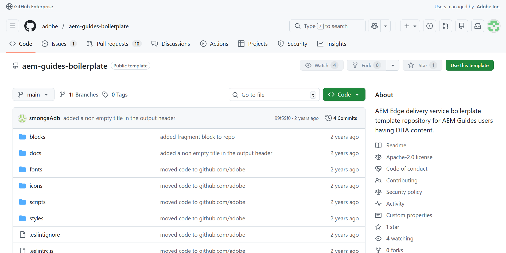

2. このテンプレートを使用して新しいリポジトリを作成します。 テンプレート ](https://docs.github.com/en/repositories/creating-and-managing-repositories/creating-a-repository-from-a-template)からリポジトリを作成する[について説明します。 リポジトリの表示が&#x200B;*パブリック*&#x200B;に設定されていることを確認し、EDSがアクセスできるようにします。

   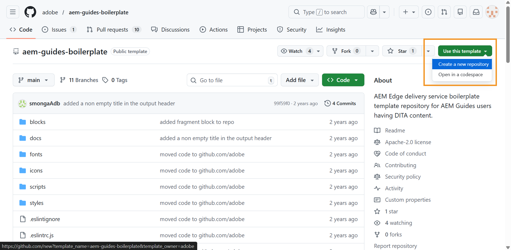

リポジトリが作成され、ボイラープレートのテンプレート構造と整合します。

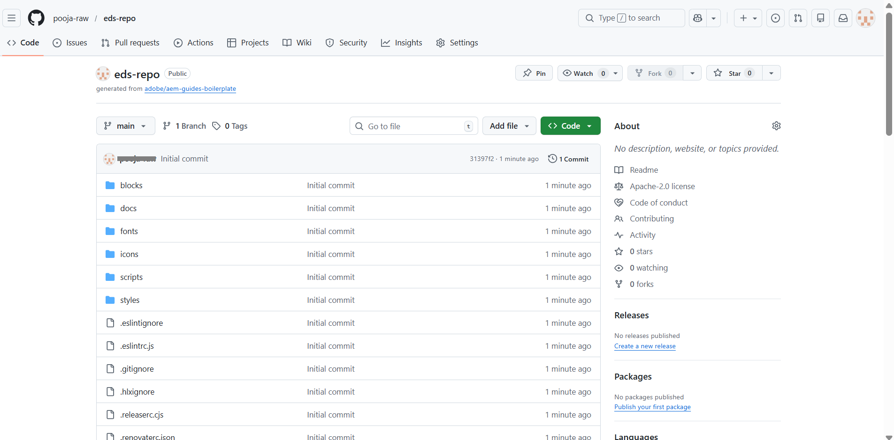

### AEM Code Syncを介してGitHubをAdobeに接続する

Adobe Experience Managerは、**AEM Code Sync**&#x200B;というGitHub アプリケーションを使用して、Experience Manager GuidesからGitHubにコンテンツをプッシュします。

次の手順を実行して、*AEM Code Sync* アプリケーションをインストールおよび設定します。

1. [AEM Code Sync](https://github.com/apps/aem-code-sync) ページに移動し、**インストール**&#x200B;を選択します。
2. *AEM Code Sync*&#x200B;は、リポジトリの変更を監視し、更新がGitHubに正しくプッシュされるようにします。

   >[!NOTE]
   >
   >アプリケーションのインストール中は、リポジトリを所有する同じGitHub アカウントを使用していることを確認してください。

   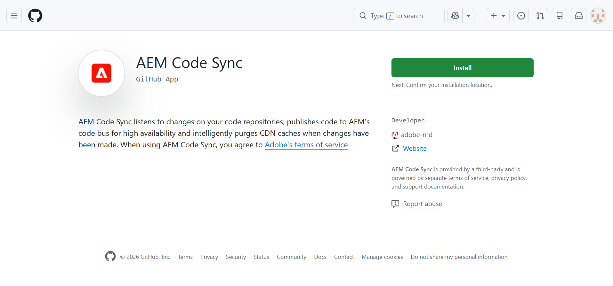

3. 次のページで、作成したリポジトリへのアクセス権を付与します。 これを行うには、「**リポジトリのみを選択**」オプションを選択し、ドロップダウンからリポジトリを選択します。

   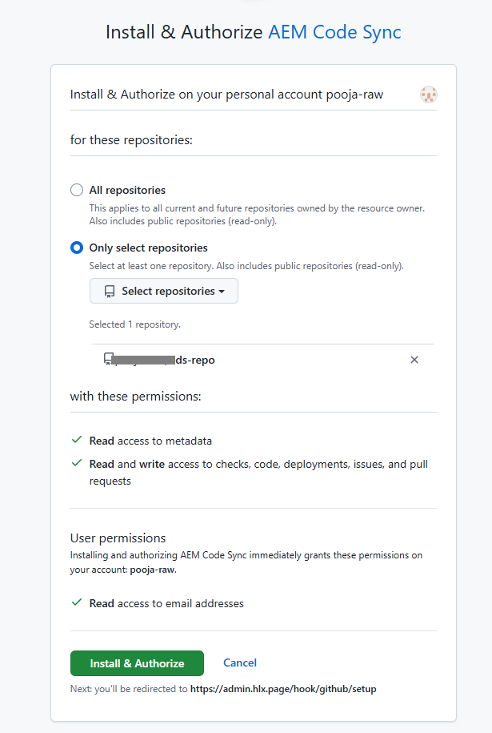{width="350"}

4. 「**インストールして承認**」を選択します。

GitHub設定ページにリダイレクトされ、*AEM Code Sync* アプリケーションの正常な登録が確認されます。 このページから、web サイトのプレビューとライブ URLを保存することもできます。

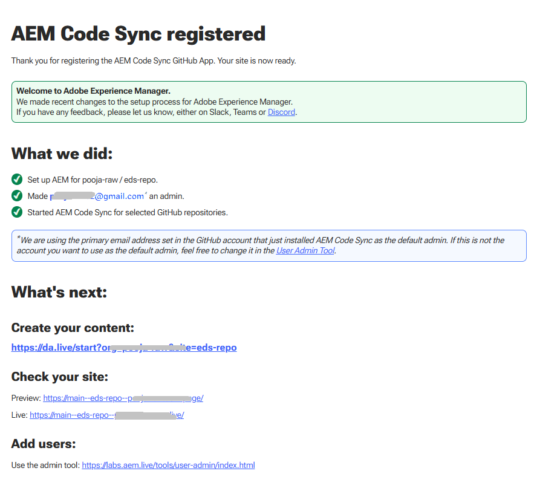

### 新しいGitHub アプリの作成

1. GitHubで、左側のサイドバーに移動し、**開発者設定**&#x200B;を選択します。
2. 左側のサイドバーで、**GitHub Apps**&#x200B;を選択します。
3. **新しいGitHub アプリ**&#x200B;を選択します。

   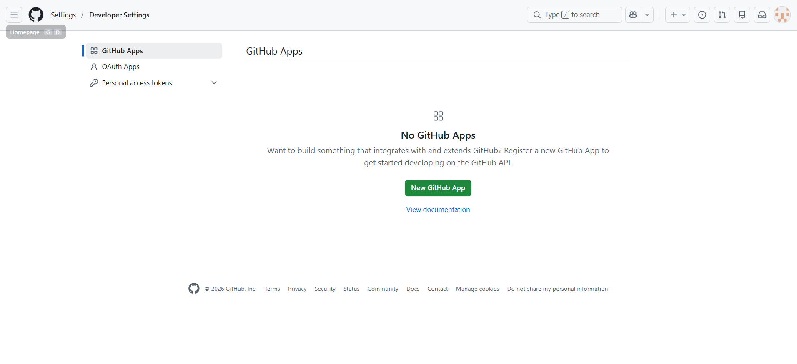{width="650"}

4. **新しいGitHub アプリを登録** ページで、次の詳細を入力します。

   - **GitHub アプリ名**：アプリの名前を入力します。 例えば、`USERNAME-eds-app`はUSERNAMEがGitHubのユーザー名です。
   - **ホームページ URL**: Experience Manager Guides インスタンスのURLを入力します。

     サンプル URL （形式）: `https://<aem-author-url>/libs/fmdita/clientlibs/xmleditor/page.html`

     サンプル URL: `https://author-p16602-e335172-cmstg.adobeaemcloud.com/libs/fmdita/clientlibs/xmleditor/page.html`

   - **コールバック URL**: ホームページ URLと同じです。
   - **Webhook URL**：このオプションを無効にします。
   - **リポジトリ権限**: *アクション、管理、および認証*&#x200B;に対する&#x200B;**読み取りおよび書き込み**&#x200B;権限を設定します。

5. 「**GitHub アプリを作成**」を選択します。

これでアプリの準備ができました。 GitHub アプリの&#x200B;**Settings** ページにリダイレクトされます。

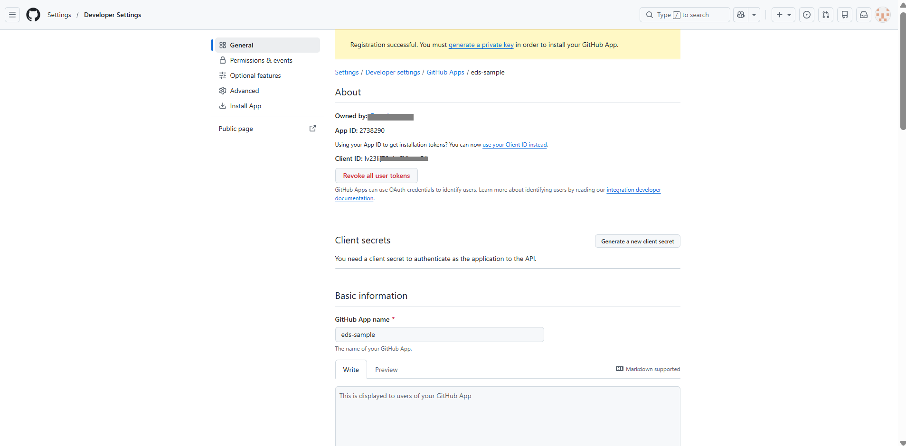

### 新しいOAuth アプリの作成

Experience Manager GuidesでEDS公開プロファイルを作成する際にユーザーを認証するには、OAuth アプリが必要です。 *クライアント ID*&#x200B;と&#x200B;*クライアントシークレット*&#x200B;を使用して、セキュアなログインフローを有効にします。

新しいOAuth アプリを作成するには、次の手順を実行します。

1. GitHubで、左側のサイドバーに移動し、**開発者設定**&#x200B;を選択します。
2. 左側のサイドバーで、**OAuth Apps**&#x200B;を選択します。
3. **新規OAuth アプリ**&#x200B;を選択します。

   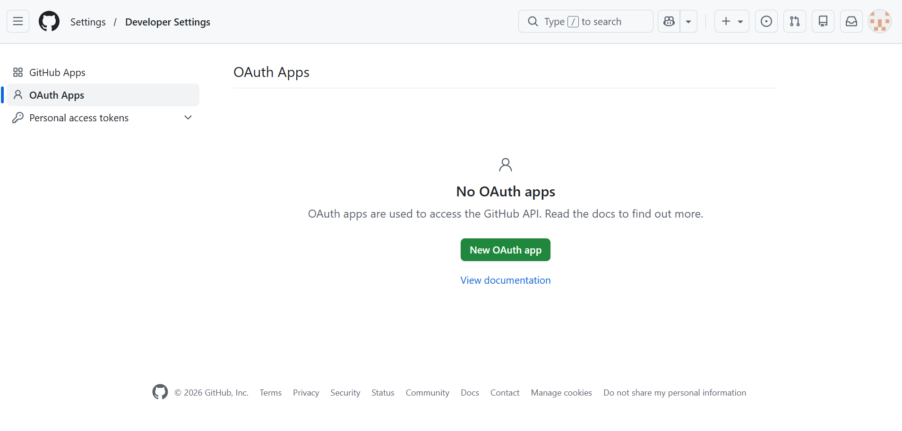{width="650"}

4. 次の必須の詳細を指定して、アプリケーションを登録します。

   - **アプリケーション名**: EDS リポジトリの名前を入力します
   - **ホームページ URL**: Experience Manager Guides インスタンスのURLを入力します。 （URL形式のサンプルについては、[新しいGitHub アプリの作成](#create-a-new-github-app) セクションの手順4を参照してください）。
   - **認証コールバック URL**: ホームページ URLと同じ

5. 「**デバイスフローを有効にする**」オプションを選択し、「**アプリケーションを登録**」を選択して登録を完了します。

   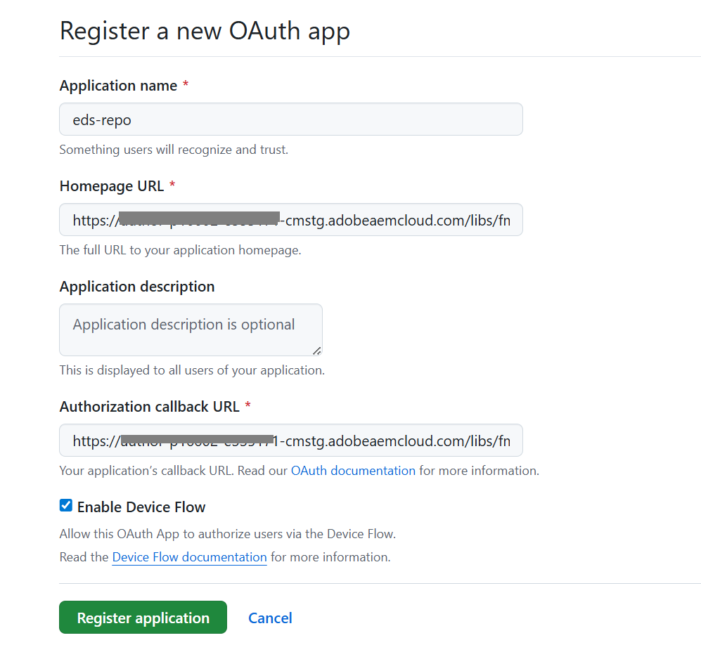{width="650"}

これでアプリの準備ができました。 *クライアント ID*&#x200B;をメモします。 Experience Manager Guidesで公開プロファイルを設定する際に、最大5つの&#x200B;*クライアントシークレット*&#x200B;を生成できます。

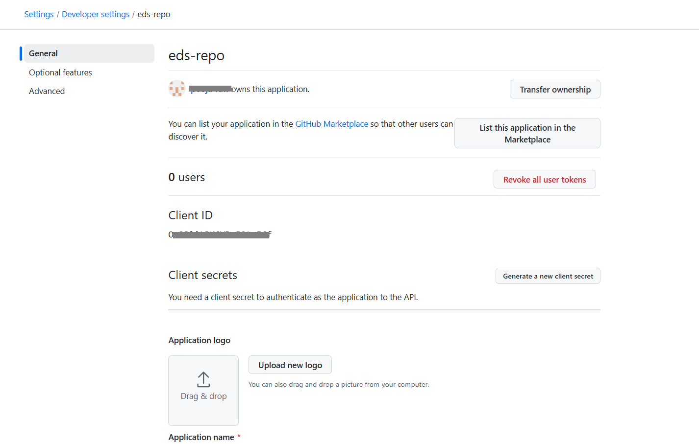

### EDS リポジトリでのマウントポイント URLの設定

EDSは、`fstab.yaml` ファイルの&#x200B;*mountpoint* URLとして定義されたGitHub リポジトリパスからコンテンツを読み取ります。

`fstab.yaml` ファイルでマウントポイント URLを設定するには：

1. リポジトリで`fstab.yaml` ファイルを開き、次の内容を更新します。

   - `your-user-name`
   - `your-repo-name`

   >[!NOTE]
   >
   > マウントポイント URLで、`main`はコンテンツを公開するブランチを示し、`docs`は作業中のEDS リポジトリのルートフォルダーを示します。 GitHubでブランチ名を変更する場合は、*mountpoint* URL （`fstab.yaml` ファイル）と対応するEDS パブリッシュプロファイルの同じブランチ名をExperience Manager Guidesで更新する必要があります。

   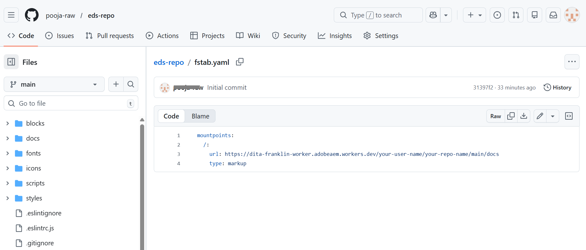{width="650"}

2. 「**変更をコミット**」を選択し、コミットの詳細を入力して確認します。
3. [開発者設定](https://github.com/settings/apps)に戻り、アプリを見つけて、**編集**&#x200B;を選択します。

   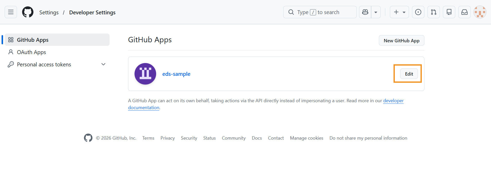{width="650"}

4. **アプリのインストール** ページに移動し、**インストール**&#x200B;を選択します。

   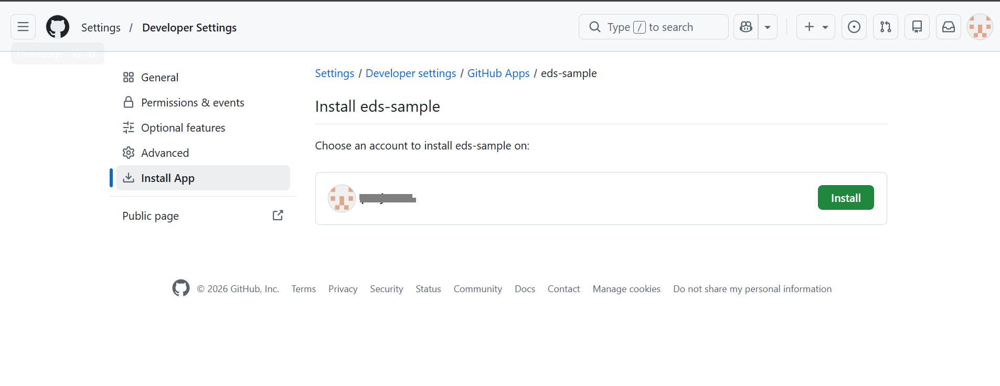{width="650"}

5. リポジトリを認証するには、「[AEM Code Sync](#connect-github-to-adobe-via-aem-code-sync)経由でGitHubをAdobeに接続」セクションの手順2と3を繰り返します。

## Experience ManagerでのEDS用のパブリッシュプロファイルの作成と設定

以下の節では、各ステップを順番に説明し、EDS パブリッシュプロファイルの設定、出力プリセットの設定、およびExperience Manager GuidesでのEDSを使用した出力の生成方法について説明します。

### EDS公開プロファイルの作成

1. **[Workspace settings](/help/product-guide/cs-install-guide/workspace-settings.md)** **>** **プロファイルの公開**&#x200B;に移動します。
2. **+** アイコンを選択して、新しい公開プロファイルを作成し、次の詳細を指定します。

   - **サーバーの種類**: ドロップダウンから&#x200B;**GitHub Edge Delivery Services**&#x200B;を選択します。
   - **名前**：このプロファイルの名前を入力します。
   - **リポジトリ名**：ボイラープレートから作成されたGitHub リポジトリ名を使用します。
   - **ユーザー名**: GitHub ユーザー名を入力します。
   - **分岐メイン**: メイン （デフォルト）に設定します。
   - **ルートフォルダー**: ドキュメントに設定（デフォルト）。
   - **クライアント IDとクライアントシークレット**：これらはGitHub アプリから取得します（詳細については、[新しいOAuth アプリの作成](#create-a-new-oauth-app) セクションを参照）。

3. 認証するには、**ログイン**&#x200B;を選択します。

   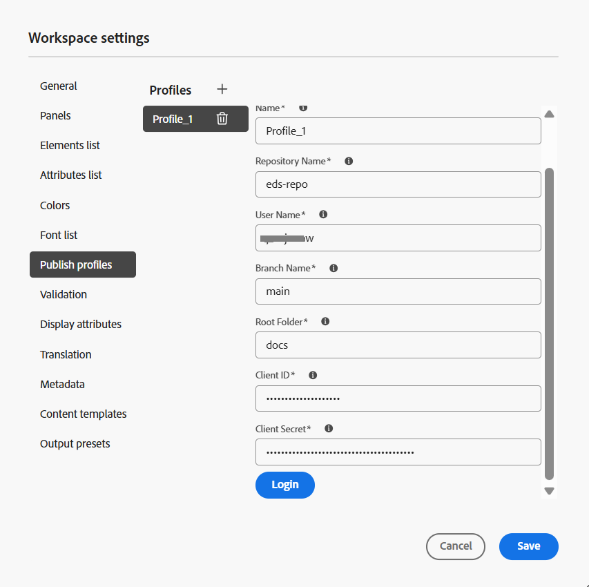{width="650"}

4. 認証が成功したら、**保存**&#x200B;を選択します。

これで、EDS公開プロファイルが設定されました。

### EDS用の出力プリセットの作成と出力の生成

1. マップコンソールでマップを開きます。
2. **出力プリセット** タブで、**+**&#x200B;を選択して、新しい出力プリセットを作成します。
3. **新しい出力プリセット** ダイアログで、次の詳細を入力します。
   - **種類**: **Edge Delivery サービス**&#x200B;を選択
   - **名前**：このプリセットの名前を指定します
4. 「**追加**」を選択します。

   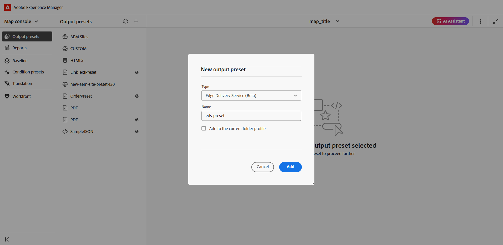{width="650"}
5. 新しく作成したEDS出力プリセットを開き、**Config** タブに移動します。
   - 前の手順で作成した公開プロファイルを選択します。
   - **ライブへのプッシュを有効にする**。

   **ライブへのプッシュ**&#x200B;が有効になっている場合、生成された出力はGitHubにコミットされ、対応する更新はすぐにライブ web サイトに反映されます。

   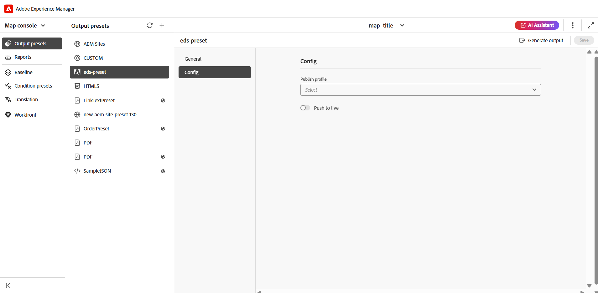{width="650"}

6. 「**保存**」を選択し、「**出力を生成**」を選択します。

>[!NOTE]
>
>生成された出力は、EDS リポジトリの&#x200B;**docs** フォルダーに保存されます。

これで、EDS出力が生成されました。 コンテンツはレスポンシブでクリーンなレイアウトで表示されます。 ページタイトル、パンくずリスト、本文、トピックで使用されるすべてのブロックなどの通常の要素が含まれます。 左側の目次（マップから生成）は、トピック間を移動するのに役立ちます。右側のミニ目次は、現在のページ内のセクションをハイライト表示します。 出力全体が完全にレスポンシブになり、デバイス間で最適化された一貫性のある読み取りエクスペリエンスを実現します。

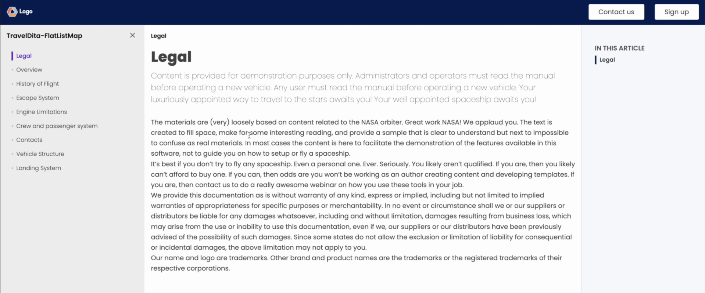

## EDS ブロックを使用した出力のカスタマイズ

EDSは`blocks`を使用して、コンテンツのさまざまな部分のスタイル設定と表示方法を制御します。 既存のブロックを変更したり、独自のブロックを作成したりできます。

以下の例では、既存のブロックをカスタマイズし、新しいブロックを作成して、Experience Manager Guidesで最終的なEDS出力のスタイルを設定する方法を説明します。

### パンくずブロックをカスタマイズしてテキストカラーを更新する

パンくずリストは、ユーザーがドキュメント内の場所を理解するのに役立つように、ページ間で使用されます。 このブロックはweb サイト全体で一貫して表示されるため、スタイルを更新すると、統一されたデザイン更新が可能になります。

パンくずブロックをカスタマイズしてテキストの色を更新するには、次の手順を実行します。

1. GitHub リポジトリに移動し、`blocks` フォルダーを開きます。
2. **パンくずリスト** ブロックを選択します。

   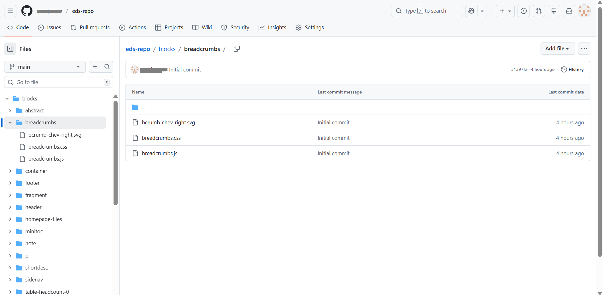{width="650"}
3. `css` ファイルを開き、テキストの色を更新します。
4. 変更をGitHubにコミットします。
5. ライブ web サイトを更新して、更新を表示します。

### 公開された出力にカスタム要素を作成するようにEDS スクリプトを更新する

場合によっては、コンテンツの特定の部分のみにスタイルを適用することもできます。 カスタムブロックを使用してこれを実現するには、次の手順を実行します。

1. トピックファイルを開き、タグ要素内のテキストを選択します。

   次のスクリーンショットでは、`example` タグ内のコンテンツが選択されています。
   {width="650"}
2. `example` タグ内のテキストを設定するには：
   - **コンテンツのプロパティ**&#x200B;に移動します。
   - `outputclass`属性を追加します。
   - 値を`example eds-force-block`に設定します。
   - 「**追加**」を選択します。
     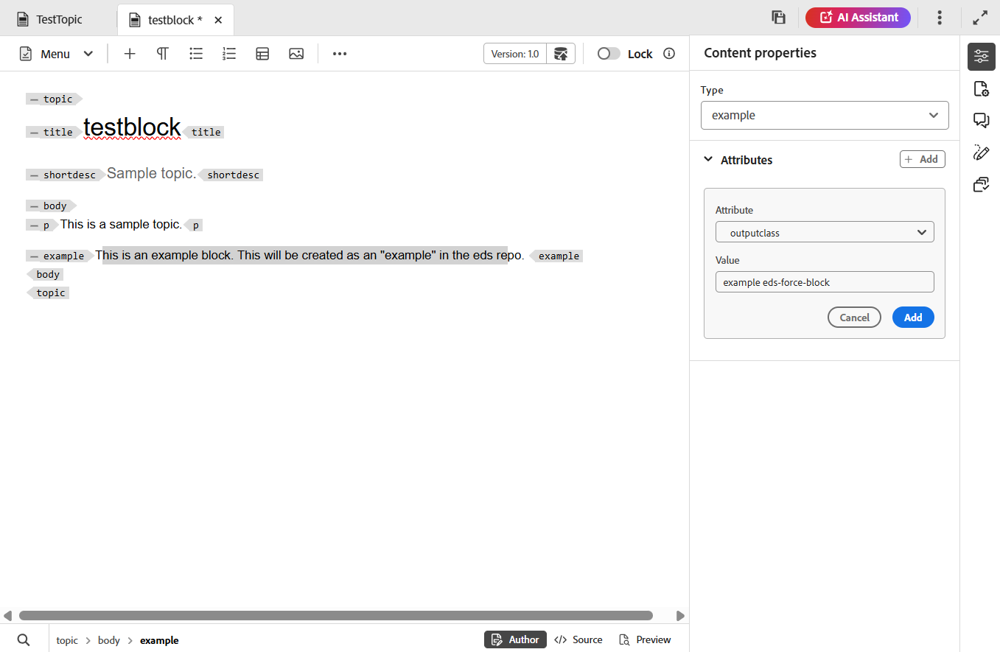{width="650"}
3. 出力を保存して再生成します。
4. `blocks` ディレクトリ内に`outputclass`と同じ名前の新しいフォルダーを作成します。 [ リポジトリへのファイルの追加](https://docs.github.com/en/repositories/working-with-files/managing-files/adding-a-file-to-a-repository#adding-a-file-to-a-repository-using-the-command-line)について説明します。

   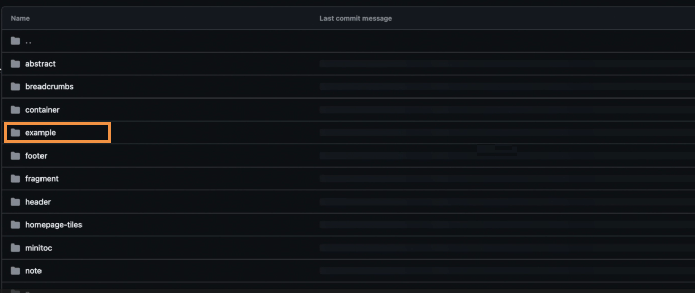{width="650"}

5. 必要な`css`とオプションの`js` ファイルを追加します。

   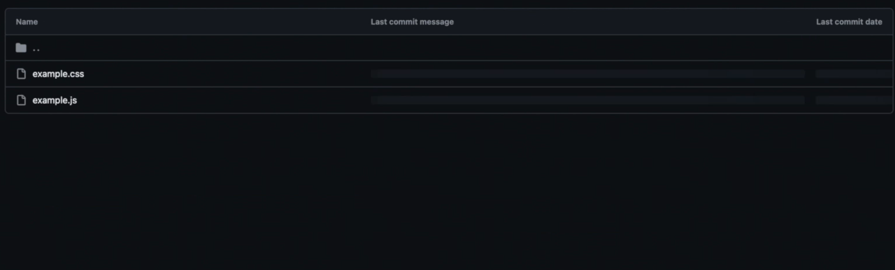{width="650"}

6. 変更をコミットして出力を再生成します。

選択したコンテンツに、ブロックで定義されたカスタムスタイルが表示されるようになりました。

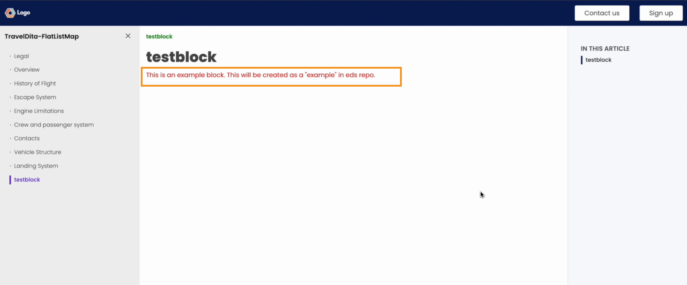{width="650"}
