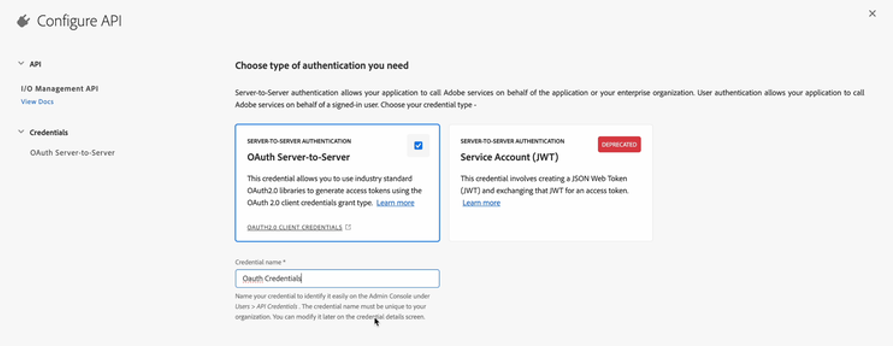

# OAuth認証によるマイクロサービスベースの公開を設定します

パブリッシングマイクロサービスを使用すると、Experience Manager Guides as a Cloud Service上で同時に大規模なパブリッシングワークロードを実行し、業界をリードするAdobe I/O Runtime サーバーレスプラットフォームを活用できます。

Experience Manager Guides as a Cloud Serviceでは、公開リクエストごとに個別のコンテナを実行し、ユーザーリクエストに応じて水平方向にスケーリングします。 これにより、複数の公開リクエストを実行し、大規模なオンプレミス Adobe Experience Manager サーバーよりも優れたパフォーマンスを得ることができます。

>[!NOTE]
>
> Experience Manager Guidesのマイクロサービスベースのパブリッシングでは、PDF（ネイティブベースとDITA-OT ベースの両方）、HTML5、JSON、およびカスタムタイプの出力プリセットをサポートしています。

クラウドパブリッシングサービスはAdobe IMS OAuth ベースの認証によって保護されるので、次の手順を実行して、環境をAdobeのセキュアトークンベースの認証ワークフローと統合し、クラウドベースのスケーラブルなパブリッシングソリューションの使用を開始します。


## Adobe Developer ConsoleでのIMS設定の作成

**設定の作成に必要な役割**: システム管理者

**Adobe Developer Console**&#x200B;でIMS設定を作成するには、次の手順を実行します。

>[!NOTE]
>
>オーサリング用にAIを活用したスマート提案を設定するOAuth プロジェクトを既に作成している場合は、次の手順をスキップしてプロジェクトを作成できます。

1. **Developer Console**&#x200B;を開きます：`https://developer.adobe.com/console`。

1. 上部から「**プロジェクト**」タブに切り替えます。

   

   *Adobe Developer Console&#x200B;***&#x200B;の「**&#x200B;プロジェクト&#x200B;**」タブを選択します&#x200B;**

1. 新しい空のプロジェクトを作成するには、「**新しいプロジェクトを作成**」ドロップダウンから「**空のプロジェクト**」を選択します。

   

   *新しい空のプロジェクトを作成します。*

1. 「**プロジェクトに追加**」ドロップダウンから「**API**」を選択して、IO管理APIをプロジェクトに追加します。

   

   *ドロップダウンからAPI プロジェクトを選択します。*

   

   *I/O Management APIをプロジェクトに追加します。*

1. 新しいOAuth資格情報を作成して保存します。

   

   *APIにOAuth資格情報を設定します。*


1. **プロジェクト** タブに戻り、左側の&#x200B;**プロジェクト概要**&#x200B;を選択します。

   

   *新しいプロジェクトを開始します。*

1. 上部の「**ダウンロード**」ボタンをクリックして、サービス JSONをダウンロードします。

   

   *JSON サービスの詳細をダウンロードします。*

OAuth認証の詳細を設定し、JSON サービスの詳細をダウンロードしました。 次のセクションで必要となるので、このファイルを便利に使用できます。


## 環境へのIMS設定の追加

>[!NOTE]
>
>スマート提案のOAuth プロジェクトを既に作成している場合は、同じプロジェクトをマイクロサービスに再利用し、次の手順をスキップしてIMS設定を環境に追加できます。

### 既存の設定を更新する（JWTからOAuth シフトへ）

JWT （非推奨）を使用した公開にマイクロサービスを既に使用している場合は、次の手順を実行して設定を更新します。


1. **Experience Manager**&#x200B;を開き、設定する環境を含むプログラムを選択します。
1. 「**環境**」タブに切り替えます。
1. 設定する環境の名前を選択します。 これにより、**環境情報** ページに移動します。
1. 「**設定**」タブに切り替えます。

1. ダウンロードした新しいOAuth JSON ファイルでSERVICE_ACCOUNT_DETAILS JSON フィールドを更新します。
1. PRIVATE_KEY フィールドを削除します。


   

   *既存のJWT環境設定を更新します。*

### 初回設定

公開マイクロサービスを初めて使用するには、次の手順に従って設定を更新します。
1. **Experience Manager**&#x200B;を開き、設定する環境を含むプログラムを選択します。
1. 「**環境**」タブに切り替えます。
1. 設定する環境の名前を選択します。 これにより、**環境情報** ページに移動します。
1. 「**設定**」タブに切り替えます。

1. SERVICE_ACCOUNT_DETAILSという名前の新しい設定を作成します。 値として、開発者コンソールからダウンロードしたOAuth JSON ファイルのコンテンツを追加します。


*環境を初めて構成します。*


### マイクロサービスベースのパブリッシングのイネーブルメントに関する初めてのコード変更

>[!NOTE]
>
> 既にマイクロサービスベースのパブリッシングを使用している場合は、次の手順をスキップします。

IMS設定を環境に追加したら、次の手順を実行して、これらのプロパティをOSGiを使用してExperience Manager Guidesにリンクします。

1. Cloud ManagerのGit プロジェクトコードで、次の2つのファイルを`/apps/fmditaCustom/config`に追加します（ファイルの内容については、[付録](#appendix)を参照）。

   * `com.adobe.aem.guides.eventing.ImsConfiguratorService.cfg.json`
   * `com.adobe.fmdita.publishworkflow.PublishWorkflowConfigurationService.xml`
1. 新しく追加されたファイルが`filter.xml`でカバーされていることを確認します。
1. Gitの変更をコミットしてプッシュします。
1. パイプラインを実行して、環境に変更を適用します。

これが完了したら、マイクロサービスベースのクラウドパブリッシングを使用できます。

## FAQ


1. マイクロサービスを使用するOSGi設定が有効になっている場合、公開プロセスは同じコードベースを持つローカル Experience Manager サーバーで機能しますか？
   * いいえ。フラグ `dxml.use.publish.microservice`が`true`に設定されている場合、常にマイクロサービス設定を探します。 パブリッシングがローカルサーバーで機能するように、`dxml.use.publish.microservice`を`false`に設定します。
1. マイクロサービスベースのパブリッシングを使用する場合、DITA プロセスに割り当てられるメモリの量はどれくらいですか？ 「これはDITA プロファイルとパラメーターによって駆動されますか？」
   * マイクロサービスベースの公開では、メモリ割り当てはDITA プロファイルとパラメーターを通じて実行されません。 サービスコンテナで使用可能な合計メモリは8 GBで、そのうち6 GBがDITA-OT プロセスに割り当てられます。


## 付録 {#appendix}

**ファイル**:
`com.adobe.aem.guides.eventing.ImsConfiguratorService.cfg.json`

**コンテンツ**:

```
{
"service.account.details": "$[secret:SERVICE_ACCOUNT_DETAILS]",
}
```

**ファイル**: `com.adobe.fmdita.publishworkflow.PublishWorkflowConfigurationService.xml`

**コンテンツ**:
* `dxml.use.publish.microservice`: DITA-OTを使用してマイクロサービスベースの公開を有効に切り替えます
* `dxml.use.publish.microservice.native.pdf`: マイクロサービスベースのネイティブ PDF パブリッシングを有効にする切り替え

```
<?xml version="1.0" encoding="UTF-8"?>
<jcr:root xmlns:jcr="http://www.jcp.org/jcr/1.0" xmlns:sling="http://sling.apache.org/jcr/sling/1.0"
          jcr:primaryType="sling:OsgiConfig"
          dxml.publish.microservice.url="https://adobeioruntime.net/api/v1/web/543112-guidespublisher/default/publishercaller.json"
          dxml.use.publish.microservice="{Boolean}true"
          dxml.use.publish.microservice.native.pdf="{Boolean}true"
/>
```
