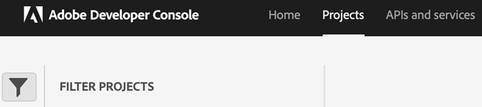

# OAuth 認証を使用したマイクロサービスベースの公開の設定

パブリッシングマイクロサービスを使用すると、Experience Manager Guidesas a Cloud Serviceで大規模なパブリッシングワークロードを同時に実行し、業界をリードするAdobe I/O Runtime サーバーレスプラットフォームを活用できます。

公開リクエストごとに、Experience Manager Guidesas a Cloud Serviceは、ユーザーリクエストに応じて水平方向に拡大・縮小される個別のコンテナを実行します。 これにより、複数の公開リクエストを実行し、大規模なオンプレミス Adobe Experience Manager サーバーよりも高いパフォーマンスを得ることができます。

>[!NOTE]
>
> Experience Manager Guidesのマイクロサービスベースの公開では、PDF（ネイティブと DITA-OT ベースの両方）、HTML 5、JSON、カスタムの各種類の出力プリセットがサポートされています。

Cloud Publishing Service はAdobe IMSの OAuth ベースの認証で保護されているので、次の手順を実行して環境をAdobeのセキュアトークンベースの認証ワークフローと統合し、クラウドベースのスケーラブルな公開ソリューションの使用を開始します。


## Adobe Developer Consoleでの IMS 設定の作成

**設定の作成に必要な役割**: システム管理者

で IMS 設定を作成するには、次の手順を実行します **Adobe Developer Console**:

>[!NOTE]
>
>AI を利用したスマート提案をオーサリング用に設定する OAuth プロジェクトを既に作成している場合は、次の手順をスキップしてプロジェクトを作成できます。

1. 開く **Developer Console**: `https://developer.adobe.com/console`.

1. に切り替え **プロジェクト** 上部から Tab キーを押します。

   

   *「」を選択します&#x200B;**プロジェクト**タブ&#x200B;**Adobe Developer Console***

1. 新しい空のプロジェクトを作成するには、を選択します。 **空のプロジェクト** から **新規プロジェクトを作成** ドロップダウン。

   

   *新しい空のプロジェクトを作成します。*

1. を選択 **API** から **プロジェクトに追加** ドロップダウンで、IO 管理 API をプロジェクトに追加します。

   

   *ドロップダウンから API プロジェクトを選択します。*

   

   *I/O Management API をプロジェクトに追加します。*

1. 新しい OAuth 認証情報を作成し、保存します。

   

   *API に OAuth 認証情報を設定します。*


1. に戻る **プロジェクト** tab キーを押して選択 **プロジェクトの概要** 左側。

   

   *新しいプロジェクトの基本を学びます。*

1. 「」をクリックします **Download** 上部のボタンをクリックして、サービス JSON をダウンロードします。

   

   *JSON サービスの詳細をダウンロードします。*

OAuth 認証の詳細を設定し、JSON サービスの詳細をダウンロードしました。 次の節で必要になるので、このファイルは手元に置いておいてください。


## 環境への IMS 設定の追加

>[!NOTE]
>
>スマート提案用の OAuth プロジェクトを既に作成している場合は、同じプロジェクトをマイクロサービスに再利用し、以下の手順をスキップして IMS 設定を環境に追加できます。

### 既存の設定を更新する（JWT から OAuth へのシフト）

JWT （非推奨）を使用して公開するために、既にマイクロサービスを使用している場合は、次の手順を実行して設定を更新します。


1. 開く **Experience Manager** 設定する環境が含まれているプログラムを選択します。
1. に切り替え **環境** タブ。
1. 設定する環境の名前を選択します。 これで、 **環境情報** ページ。
1. に切り替え **設定** タブ。

1. SERVICE_ACCOUNT_DETAILS JSON フィールドを、ダウンロードした新しい OAuth JSON ファイルで更新します。
1. PRIVATE_KEY フィールドを削除します。


   

   *既存の JWT 環境設定を更新します。*

### 初回設定

パブリッシングマイクロサービスを初めて使用するには、次の手順に従って設定を更新します。
1. 開く **Experience Manager** 設定する環境が含まれているプログラムを選択します。
1. に切り替え **環境** タブ。
1. 設定する環境の名前を選択します。 これで、 **環境情報** ページ。
1. に切り替え **設定** タブ。

1. SERVICE_ACCOUNT_DETAILS という名前の新しい設定を作成します。 値に、開発者コンソールからダウンロードした OAuth JSON ファイルのコンテンツを追加します。


*環境を初めて設定します。*


### マイクロサービスベースのパブリッシングを有効化するための初回コード変更

>[!NOTE]
>
> マイクロサービスベースの公開を既に使用している場合は、次の手順をスキップしてください。

IMS 設定を環境に追加したら、次の手順を実行して、OSGi を使用してこれらのプロパティをExperience Manager Guidesにリンクします。

1. Cloud Manager Git プロジェクトコードで、次の 2 つのファイルをに追加します。 `/apps/fmditaCustom/config` （ファイルの内容については、 [付録](#appendix)）に設定します。

   * `com.adobe.aem.guides.eventing.ImsConfiguratorService.cfg.json`
   * `com.adobe.fmdita.publishworkflow.PublishWorkflowConfigurationService.xml`
1. 新しく追加したファイルがによってカバーされていることを確認します。 `filter.xml`.
1. Git の変更をコミットし、プッシュします。
1. パイプラインを実行して、変更を環境に適用します。

この操作が完了したら、microservice ベースのクラウドパブリッシングを使用できます。

## FAQ


1. マイクロサービスを使用する OSGi 設定が有効になっている場合、公開プロセスは同じコードベースのローカルExperience Managerサーバーで動作しますか？
   * いいえ（フラグの場合） `dxml.use.publish.microservice` はに設定されています。 `true`は、常にマイクロサービス設定を探します。 を設定 `dxml.use.publish.microservice` 対象： `false` 公開をローカルサーバーで機能させるために
1. マイクロサービスベースのパブリッシングを使用する場合、DITA プロセスに割り当てられるメモリの量 これは DITA プロファイルとパラメータによって駆動されますか？
   * マイクロサービスベースのパブリッシングでは、メモリ割り当ては DITA プロファイルとパラメーターによって実行されません。 サービスコンテナで使用可能なメモリの合計は 8 GB で、そのうち 6 GB が DITA-OT プロセスに割り当てられます。


## 付録 {#appendix}

**ファイル**:
`com.adobe.aem.guides.eventing.ImsConfiguratorService.cfg.json`

**コンテンツ**:

```
{
"service.account.details": "$[secret:SERVICE_ACCOUNT_DETAILS]",
}
```

**ファイル**: `com.adobe.fmdita.publishworkflow.PublishWorkflowConfigurationService.xml`

**コンテンツ**:
* `dxml.use.publish.microservice`:DITA-OT を使用したマイクロサービスベースの公開を有効にするように切り替えます
* `dxml.use.publish.microservice.native.pdf`：マイクロサービスベースのネイティブPDF公開を有効にするように切り替えます

```
<?xml version="1.0" encoding="UTF-8"?>
<jcr:root xmlns:jcr="http://www.jcp.org/jcr/1.0" xmlns:sling="http://sling.apache.org/jcr/sling/1.0"
          jcr:primaryType="sling:OsgiConfig"
          dxml.publish.microservice.url="https://adobeioruntime.net/api/v1/web/543112-guidespublisher/default/publishercaller.json"
          dxml.use.publish.microservice="{Boolean}true"
          dxml.use.publish.microservice.native.pdf="{Boolean}true"
/>
```
