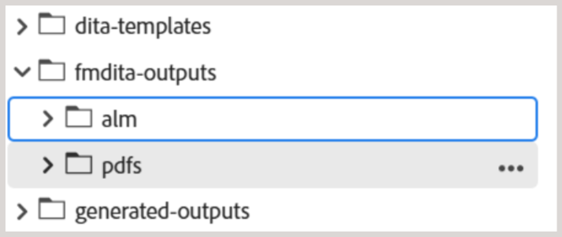

# フォルダー構造を設定する際のベストプラクティス

この記事では、管理者がAdobe Experience Manager Guidesでフォルダー構造を設定するための基本的な手順とベストプラクティスについて説明します。 よく整理されたフォルダー階層は、学習およびトレーニングコンテンツのオーサリング、公開、翻訳ワークフローをスムーズに行うのに役立ちます。

## フォルダー構造の設定

Experience Manager Guidesの様々なオーサリング、公開、および翻訳機能へのアクセスを許可するには、以下に説明するように、適切な階層にフォルダーを設定してください。

**ルートレベルのフォルダーを作成**

まず、組織のルートフォルダーを作成します。 これは、すべての部門レベルのフォルダーと一般的な共有アセットのベースとして機能します。

例：`/content/dam/ABC-Corp/`

このルートフォルダー内に、複数の部門で使用されるアセットを管理するための専用フォルダーを作成します。 例えば、**Common** フォルダーを作成して、画像、ビデオなどの共有リソースを含めます。

**部門レベルのフォルダーを作成**

人事、財務、法務など、各部門ごとに個別のフォルダーを作成し、独自のコンテンツを管理できるようにします。

*キャプション：ルートフォルダー内のHR部門用に作成された個別のフォルダー構造*

**部署レベルのフォルダーを設定するためのベストプラクティス**

- 部門レベルの共通アセット用に、各部門の下に専用の&#x200B;**Common** > **assets** フォルダーを作成します（必要に応じて）。
- 翻訳用にコンテンツを共有する場合は、言語固有のフォルダー（en、de、frなど）を作成します。 作成者は、ソース言語フォルダー以外のコンテンツは翻訳ワークフローに含まれないため、ソース言語フォルダー（enなど）でのみコンテンツを作成または更新する必要があります。 他の言語フォルダーは、プレースホルダーとして空のままにできます。 [&#x200B; コンテンツ翻訳](../user-guide/translation.md)の詳細をご覧ください。
- 権限は、特定の部門またはユーザーのアクセスを、新しく作成されたフォルダー構造に制限するために利用できます。 例えば、人事部門のユーザーのみが、指定されたフォルダー内でコンテンツを作成または変更できるようにするために、権限を割り当てます。

財務、法務など、他の部門についても同じ構造を繰り返します。

## 出力フォルダー構造の設定

`fm-ditaoutputs` フォルダーは、学習およびトレーニングコンテンツから生成された出力のデフォルトの保存場所として機能します。 これらの出力には、通常、**alm** フォルダーのSCORM パッケージ（ZIP ファイル）と&#x200B;**pdf** フォルダーのPDFが含まれます。このデフォルトの出力パスは、必要に応じて&#x200B;**マップコンソール**&#x200B;からプリセットレベルで変更できます。

複数の部門で作業する場合は、特定の部門内のユーザーが関連する出力フォルダーにアクセスできるように、`fm-ditaoutputs` フォルダー構造内に部門固有のフォルダーを作成することを検討してください。

## ユーザーを作成し、適切なグループに割り当てる

フォルダー階層が確立されたら、ユーザーの作成を開始してグループに追加し、Experience Manager Guidesの関連機能にアクセスできるようにします。 Experience Manager Guidesには、作成者、レビュー担当者、パブリッシャーという3つのグループが用意されています。 ユーザーが関連付けられているグループに応じて、特定のタスクを実行できます。 例えば、パブリッシングタスクはパブリッシャーのみが実行でき、作成者は実行できません。

新しいユーザーを作成してグループに追加するには、**ツール** > **セキュリティ** > **ユーザー**&#x200B;に移動します。

ユーザー管理ページで、**作成**&#x200B;を選択して新しいユーザーを作成します。 ユーザーの詳細を追加し、グループに割り当てます。

詳細については、[&#x200B; ユーザー管理とセキュリティ &#x200B;](../cs-install-guide/user-admin-sec.md)を参照してください

## 各ユーザーグループに権限を割り当てる

ユーザーを適切なグループに追加したら、グループレベルで権限を設定して、リポジトリ内の適切なオーサリングフォルダーと出力フォルダーにアクセスできるようにします。

権限を割り当てるには、**ツール**/**セキュリティ**/**権限**&#x200B;に移動します。

これらの権限は、ユーザーが指定されたフォルダー内でのみコンテンツを作成または変更できることを確認するのに役立ちます。

詳しくは、[AEMの権限](https://experienceleague.adobe.com/ja/docs/experience-manager-65/content/security/security#permissions-in-aem)を参照してください。
