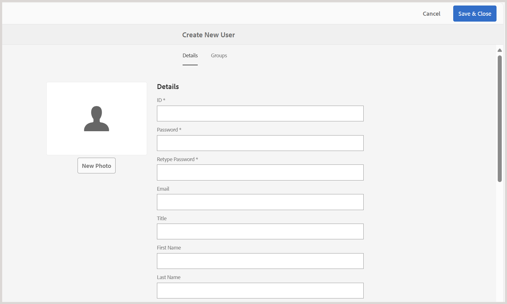

# フォルダー構造の設定のベストプラクティス

この記事では、管理者がAdobe Experience Manager Guidesでフォルダー構造を設定するための基本的な手順とベストプラクティスを説明します。 整理されたフォルダー階層により、学習コンテンツとトレーニングコンテンツのオーサリング、公開、翻訳ワークフローがスムーズになります。

## フォルダー構造の設定

Experience Manager Guidesの様々なオーサリング、公開および翻訳機能にアクセスできるようにするには、以下に説明するように適切な階層でフォルダーを設定してください。

**ルートレベルのフォルダーの作成**

まず、組織のルートフォルダーを作成します。 これは、部門レベルのすべてのフォルダーと一般的に共有されるアセットのベースとして機能します。

例：`/content/dam/ABC-Corp/`

このルートフォルダー内に、複数の部門で使用するアセットを管理する専用のフォルダーを作成します。 例えば、画像、ビデオなどの共有リソースを含む **共通** フォルダーを作成します。

**部門レベルのフォルダーの作成**

人事、財務、法務など、部門ごとに個別のフォルダーを作成して、独自のコンテンツを管理できるようにします。

*キャプション：ルートフォルダー内に人事部門用に個別のフォルダー構造を作成*

**部門レベルのフォルダー設定のベストプラクティス**

- 部門レベルの共通アセット用に、各部門の下に専用の **Common**/**assets** フォルダーを作成します（必要な場合）。
- 翻訳用にコンテンツを共有する場合は、言語固有のフォルダー（en、de、fr など）を作成します。 ソース言語フォルダー外のコンテンツは翻訳ワークフローに含まれないので、作成者はソース言語フォルダー内（en など）のコンテンツのみを作成または更新する必要があります。 その他の言語フォルダーは、プレースホルダーとして空の状態を維持できます。 詳細情報：[ コンテンツ翻訳 ](../user-guide/translation.md)。
- 権限を利用すると、新しく作成したフォルダー構造に対する特定の部門やユーザーのアクセスを制限できます。 例えば、権限を割り当てて、人事部門のユーザーのみが指定されたフォルダー内のコンテンツを作成または変更できるようにします。

財務、法務などの他の部門に対して同じ構造を繰り返します。

## 出力フォルダー構造の設定

`fm-ditaoutputs` フォルダーは、学習およびトレーニングコンテンツから生成された出力のデフォルトのストレージ場所として機能します。 これらの出力には通常、（alm **フォルダー内の SCORM パッケージ（ZIP ファイル）と** pdf **フォルダー内の** pdf が含まれます。必要に応じて、**Map コンソール** からプリセットレベルでこのデフォルトの出力パスを変更できます。

複数の部門で作業する場合は、特定の部門内のユーザーが関連する出力フォルダーに確実にアクセスできるように、`fm-ditaoutputs` フォルダー構造内に部門固有のフォルダーを作成することを検討してください。

## ユーザーを作成して適切なグループに割り当てる

フォルダー階層が確立されたら、ユーザーの作成を開始し、グループに追加して、ユーザーがExperience Manager Guidesの関連する機能にアクセスできるようにします。 Experience Manager Guidesには、作成者、レビュー担当者、公開者という 3 つの標準グループが用意されています。 ユーザーが関連付けられているグループに応じて、特定のタスクを実行できます。 例えば、公開タスクを実行できるのは公開者のみであり、作成者は実行できません。

新しいユーザーを作成してグループに追加するには、**ツール**/**セキュリティ**/**ユーザー** に移動します。

User Management ページで「**作成**」を選択して、新しいユーザーを作成します。 ユーザーの詳細を追加し、グループに割り当てます。

詳しくは、「ユーザー管理とセキュリティ [ を参照してください ](../cs-install-guide/user-admin-sec.md)

## 各ユーザーグループへの権限の割り当て

ユーザーを適切なグループに追加したら、リポジトリ内の正しいオーサリングおよび出力フォルダーにユーザーがアクセスできるように、グループレベルで権限を設定します。

権限を割り当てるには、**ツール**/**セキュリティ**/**権限** に移動します。

これらの権限により、ユーザーが指定されたフォルダー内でのみコンテンツを作成または変更できるようになります。

詳しくは、[AEMの権限 ](https://experienceleague.adobe.com/en/docs/experience-manager-65/content/security/security#permissions-in-aem) を参照してください。

