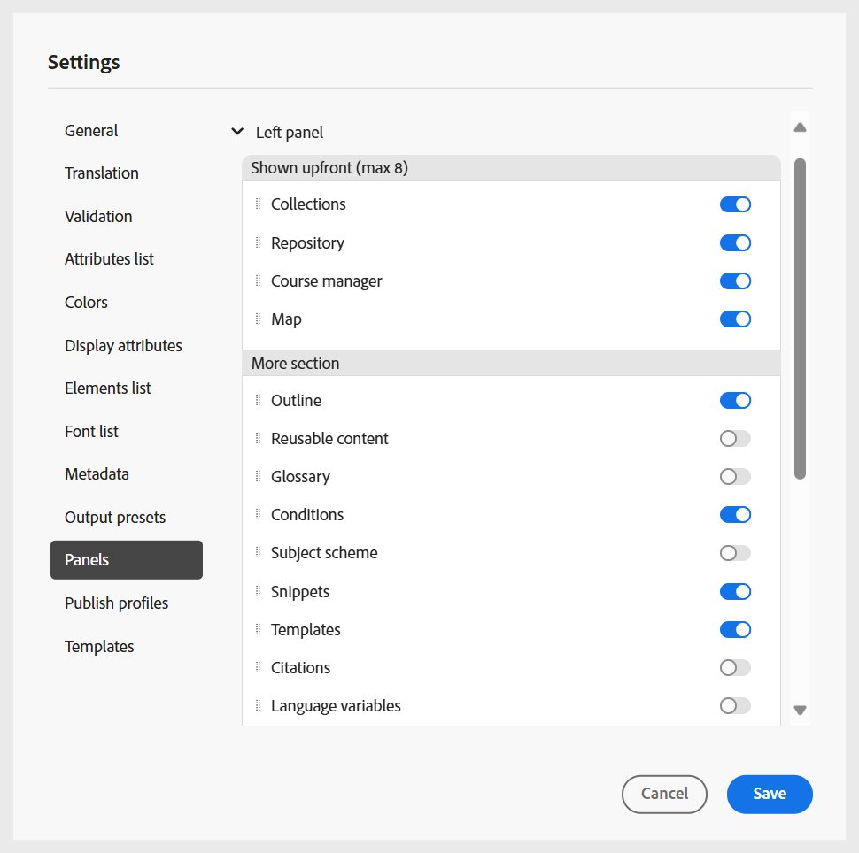
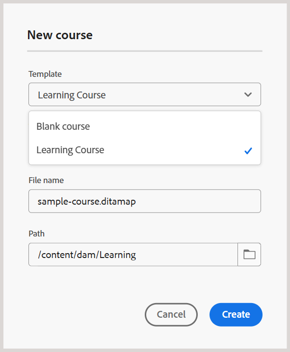
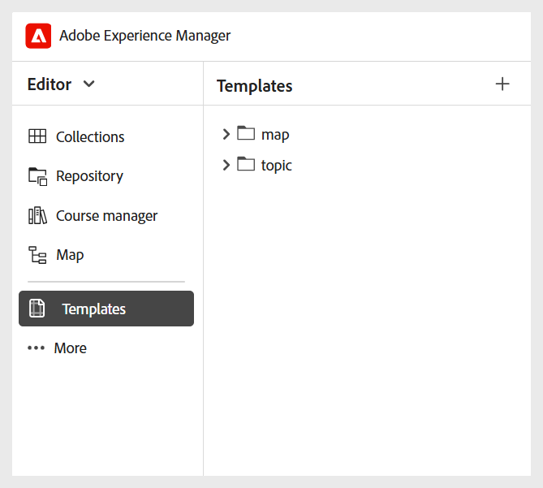

# フォルダープロファイルの設定

企業内の様々な部門や製品の設定を分離するには、フォルダープロファイルが必要です。 学習コンテンツとトレーニングコンテンツの場合、フォルダーレベルのプロファイルを作成および設定して、オーサリングテンプレート、出力テンプレート、出力プリセットおよびその他のフォルダーレベルの設定を管理できます。

学習およびトレーニングコンテンツのフォルダープロファイル設定を開始するには、次が必要です。

1. [ フォルダープロファイルの作成 ](../cs-install-guide/conf-folder-level.md#create-and-configure-a-folder-level-profile)。
2. **設定するフォルダープロファイルを選択する**：フォルダープロファイルを作成したら、[ ユーザー環境設定 ](../user-guide/intro-home-page.md#user-preferences) ページでフォルダープロファイルを選択して、作成者と公開者が正しいテンプレートにアクセスできるようにする必要があります。

   {width="650" align="left"}

3. **フォルダープロファイル設定の指定**：学習コンテンツとトレーニングコンテンツの場合、次の設定をフォルダーレベルで設定できます。
   - [パネル](#configure-panels)
   - [テンプレート](#configure-templates)
   - [出力プリセット](#configure-output-presets)
   - [HTML エディター ](#html-editor-settings)
   - [ プロファイルの公開 ](#manage-publish-profiles)

これらの設定にアクセスするには、エディタービューに切り替えて、以下に示すように、**オプション** メニューから **設定** を選択します。

## パネルの設定

この設定は、Experience Manager Guidesの **エディター** および **マップコンソール** の左右のパネルに表示されるパネルを制御します。 ボタンを切り替えて、目的のパネルの表示と非表示を切り替えることができます。

学習コンテンツとトレーニングコンテンツの場合は、エディターとマップ コンソールで次の機能のみが有効になっていることを確認します。

{width="350" align="left"}

### エディター

**左パネル**

- **コレクション**：頻繁に使用するファイルを整理して保存したり、共有ファイルにすばやくアクセスしたりできます。
- **リポジトリ**：コンテンツリポジトリに保存されているすべてのマップ、トピック、画像、その他のアセットを表示してアクセスできます。
- **コースマネージャー**：コースを作成および管理するための専用のワークスペースが用意されています。
- **スニペット**：学習コースの様々なトピックをまたいで小さなコンテンツフラグメントを作成して再利用できます。
- **条件**：グローバルおよびフォルダーレベルで条件属性を設定できます。
- **変数**：学習コンテンツで使用する変数を作成および管理できます。
- **言語変数**：テンプレート内の公開済み出力または静的テキストのローカライズされた文字列を定義できます。
- **テンプレート**：作成者が使用するテンプレートを作成および管理できます。
- **出力テンプレート**：出力テンプレートを作成および管理して、様々な形式の出力を生成できます。
- **検索と置換**：リポジトリー内のマップまたはフォルダー内のファイル全体でテキストを検索および置換するオプションを提供します。 

**右側のパネル**

- **コンテンツのプロパティ**：エディターで現在選択されている要素のタイプと属性に関する情報が含まれます。
- **ファイルのプロパティ**：選択したファイルのプロパティを表示および管理できます。
- **スタイル**：学習コンテンツで使用するグローバルクラスベースのスタイルオプションを表示します。
- **フィルター**：トピックのプレビューモードで適用された条件に基づいてコンテンツをフィルタリングできます。

### マップコンソール

**左パネル**

- **プリセット**：学習コースを公開するための出力プリセットを設定できます。
- **翻訳**: コンテンツを複数の言語に翻訳するオプションを提供します。
- **レポート**: レポートを生成および管理して、コース内のコンテンツの全体的なヘルスに関する有用なinsightを取得できます。
- **条件プリセット**：様々なオーディエンスや部門などに対して条件ベースの出力プリセットを設定するためのオプションが用意されています。

**右側のパネル**

- **フィルター**：レポートと翻訳を操作する際にフィルターを使用できます。

## テンプレートの設定

この設定を使用すると、[ エディターの左側のパネル ](../user-guide/web-editor-left-panel.md) にあるオーサリングおよび公開テンプレートを管理できます。 オーサリングおよび出力テンプレートを追加、削除または並べ替えて、作成者や公開者からアクセスできるようにします。

{width="350" align="left"}

オーサリングテンプレートは、学習コース、学習コンテンツ、クイズ、質問バンクの 4 つのカテゴリで使用できます。 インスタンスに事前定義済みのテンプレートがある場合は、デフォルトで表示されます。

{width="350" align="left"}

### テンプレートを追加

新しいテンプレートを追加するには、次の手順を実行します。

1. テンプレートを追加するテンプレートカテゴリに移動して、「**追加**」を選択します。
2. パスを選択ダイアログで、目的のテンプレートを選択します。
3. **選択** を選択します。

   {width="350" align="left"}

テンプレートは、設定パネルの各カテゴリに追加されます。

同様に、他のオーサリングテンプレートや出力テンプレートを追加することもできます。 これらのテンプレートを追加すると、作成者や公開者は、それぞれのコースダイアログでこれらのテンプレートを使用できるようになります。 例えば、管理者が追加した学習コーステンプレートは、作成者が新しいコースを作成する際に利用できます。

{width="350" align="left"}

### 新しいオーサリングおよび出力テンプレートの使用

**パスを選択** ダイアログに表示されるテンプレートとは異なるテンプレートを使用するには、カスタムオーサリングまたは出力テンプレートを作成します。

**新しいオーサリングテンプレートの作成**

別のマップまたはトピックのテンプレートを使用するには、エディターのテンプレート パネルから新しいオーサリングテンプレートを作成します。 マップテンプレートを使用すると、学習コンテンツ、クイズ、または学習サマリー用の学習コースおよびトピックテンプレートを作成できます。

詳しくは、[ エディターからカスタマイズされたテンプレートを作成する ](../user-guide/create-maps-customized-templates.md) を参照してください。

{width="350" align="left"}

**新しい出力テンプレートの作成**

学習およびトレーニングコンテンツ用の新しい出力テンプレートを作成するには、次の手順を実行します。

1. エディターの左側のパネルから、**その他**/**出力テンプレート** を選択します。

   出力テンプレートパネルが表示されます。

   {width="350" height="" align="left"}
2. 出力テンプレート パネルで、「+」を選択して新しい出力テンプレートを作成します。

   {width="350" align="left"}
3. ドロップダウンメニューから出力テンプレートを選択します。

   {width="650" align="left"}
4. 選択した出力テンプレートタイプに基づいて、ダイアログが表示され、使用可能なテンプレートに基づいて新しいテンプレートを作成できます。

   {width="350" align="left"}

5. 「**作成**」を選択します。

   新しい出力テンプレートが作成されます。

6. 公開者向けの出力テンプレートにアクセスして追加するには、**設定**/**テンプレート**/**出力テンプレート** に移動し、**追加** を選択します。

   {width="350" align="left"}

   出力テンプレートがパスを選択ダイアログに表示されます。
7. テンプレートを選択し、「**確認**」を選択します。

   {width="350" align="left"}

   選択した出力テンプレートが設定パネルに追加されます。

   {width="350" align="left"}

### テンプレートの削除または並べ替え

追加したテンプレートは、設定パネルから削除したり、並べ替えたりすることができます。

テンプレートを削除するには、横にある **削除** アイコンを選択します。

{width="350" align="left"}

カテゴリ内に存在するテンプレートの表示順序を定義することもできます。 テンプレートの表示順序を変更するには、点線バーを選択し、テンプレートを目的の位置にドラッグします。

{width="350" align="left"}

## 出力プリセットの設定

「出力プリセット」タブでは、コースの公開に使用できる出力形式を定義できます。 2 つのセクションがあります。**許可される出力プリセットのタイプ** および **共通の出力プリセット** です。

{width="350" align="left"}

- **許可されている出力プリセットの種類**：この節では、Experience Manager Guides インスタンスでサポートされているすべての出力プリセットを一覧表示します。 コースのパブリッシュには、**SCORM** および **PDF** 形式のみを適用できます。 1 つまたは両方のオプションを選択できます。 コース出力の生成時に、選択したプリセットが公開者に対して使用可能になります。

  {width="350" align="left"}

- **共通の出力プリセット**：このセクションには、パブリッシャーが共通に作成して特定のフォルダープロファイルに追加した出力プリセットが表示されます。 また、不要になったプリセットを削除することもできます。

  {width="350" align="left"}

## HTML エディターの設定

この設定を使用すると、HTML ベースのオーサリング用にエディターを設定できます。 この設定に含まれる主要な設定オプションは次のとおりです。

{width="350" align="left"}

- **インラインスタイル設定を非表示にする**：作成者がコースコンテンツにインライン書式を適用できないようにするには、このオプションを有効にします。 有効にすると、エディターの右側のパネルに表示されるフォント、境界線、レイアウト、背景、列などのインラインスタイル設定オプションがすべて作成者に対して非表示になります。 ただし、作成者は **スタイル** パネルで使用できるグローバルクラスベースのスタイルオプションを引き続き使用できます。 これにより、組織のスタイルガイドラインとの一貫性を維持できます。
- **作成者に対してSource ビューを非表示にする**:HTML ソースコードへのアクセスを制限するには、このオプションを有効にします。 これは、編集エクスペリエンスを簡素化する場合や、基になるコードが誤って変更されるのを避ける場合に便利です。

## 公開プロファイルの管理

このセクションでは、コースを SCORM Cloud に公開するために使用する公開プロファイルを表示、作成および管理できます。 各プロファイルでは、特定の SCORM クラウド環境に学習コースを公開するために必要な接続設定と構成の詳細を定義します。

異なる SCORM Cloud アカウントに公開する必要がある場合は、複数のプロファイルを作成して、公開プロセスの柔軟性と制御を確保できます。

SCORM クラウド用のパブリッシュ・プロファイルを構成するには、関連する SCORM クラウド・アプリケーションのクライアント ID とクライアント・シークレットとともに、サーバの詳細を指定します。

{width="350" align="left"}