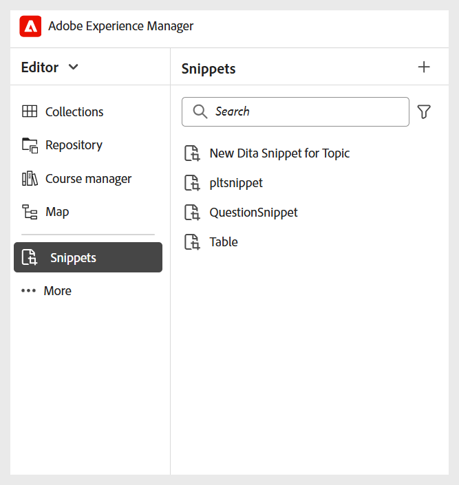

# その他の設定

管理者は、学習コースの作成者と公開者に対して、次の設定を行うこともできます。

- **スニペット**：作成者が正しいスニペットにアクセスできるように、スニペットをフォルダーレベルで設定できます。 Experience Manager Guidesでスニペットを作成できるのは管理者のみです。このスニペットは、作成者がエディターで使用できます。

  エディターの左パネルからスニペットにアクセスできます。

  {width="350" align="left"}
- **条件**：管理者は、標準の DITA サポートの条件属性をグローバルレベルまたはフォルダレベルで設定できます。 オーサーは、必要な条件をコンテンツにドラッグ&amp;ドロップするだけで、設定済みの条件を使用できます。

  条件には、エディターの左パネルからアクセスできます。

  {width="350" align="left"}
- **変数**：変数を定義することで、コンテンツの移植性、一貫性、更新のしやすさを向上させることができます。 出力生成時に、変数は選択した変数セットの値に置き換えられるので、カスタマイズされた出力を効率的に生成できます。

  詳しくは、[&#x200B; 新しい変数の作成 &#x200B;](../native-pdf/native-pdf-variables.md#create-a-new-variable) を参照してください

- **エディターツールバー**：組織のニーズに応じて、エディターツールバーをカスタマイズできます。 例えば、ツールバーボタンの名前や位置などを変更することができます。

  詳しくは、[XML エディターの設定とカスタマイズ &#x200B;](../cs-install-guide/conf-folder-level.md#configure-and-customize-the-xml-editor-id2065g300o5z) を参照してください。
