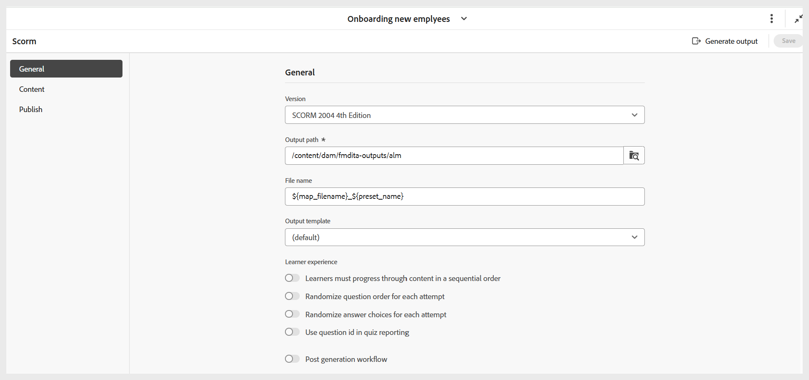

# SCORM 出力プリセットの構成

プリセットを作成したら、SCORM プリセット設定を指定します。 プリセット設定オプションは、「一般」、「コンテンツ」および「公開」タブに整理されています。

- **一般：** サポートされているバージョン、出力パス、ZIP ファイル名、出力テンプレートなど、基本的な出力設定を指定するために使用します。

  {width="650" align="left"}

- **コンテンツ：** 使用可能な条件付きフィルタリング（DITAVAL または一部の条件プリセットを使用）と変数セットの指定に使用します。

  {width="650" align="left"}

- **公開：** この設定は、出力を SCORM Cloud に公開して直接アクセスする場合にのみ使用します。

  {width="650" align="left"}

すべての変更を設定したら、SCORM プリセット・ページのツールバーの右隅にある **保存** を使用して、SCORM プリセットの変更を保存します。
