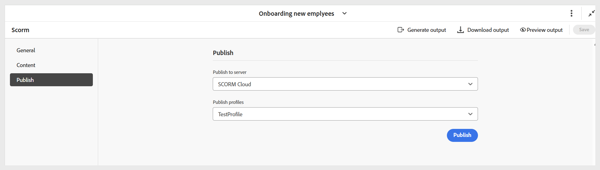

# SCORM出力プリセットの設定

プリセットを作成したら、SCORM プリセット設定を行います。 プリセット設定オプションは、「一般」、「コンテンツ」、「公開」の各タブに整理されています。

- **一般：** サポートされているバージョン、出力パス、ZIP ファイル名、出力テンプレート、学習者の経験に関連するその他のオプションなど、基本的な出力設定を指定するために使用します。

  {width="650"}

  **学習者の経験**

   - **学習者はコンテンツを順番に進める必要があります**：学習者がクイズを決まった順序で進み、スキップしたり質問の間を飛び越えたりできないようにします。
   - **学習者は、すべての質問を試して続行する必要があります**：学習者がクイズを送信する前にすべての質問を試すことを求め、不完全な送信を防ぎます。
   - **各試行に対して質問順序をランダム化**：各試行に対して異なる順序でクイズの質問を表示し、予測可能性を減らします。
   - **各回の回答選択肢をランダム化**：回答毎に回答選択肢を切り替え、位置に基づいて推測する可能性を減らします。
   - **クイズレポートで質問IDを使用**: クイズレポートに一意の質問IDを含めることで、特定の質問に対する追跡、分析、結果のマッピングが容易になります。
   - **生成後ワークフロー**：このオプションを選択すると、設定されたすべてのワークフローを含む新しい「生成後ワークフロー」ドロップダウンリストが表示されます。

- **コンテンツ：**&#x200B;使用可能な条件付きフィルタリング（DITAVALを使用するか、一部の条件プリセットを使用）と変数セットを指定するために使用します。

  {width="650"}

- **公開：**&#x200B;この設定は、出力を直接アクセス用にSCORM Cloudに公開する場合にのみ使用します。

  {width="650"}

すべての変更を設定したら、SCORM プリセットページのツールバーの右隅にある&#x200B;**Save**&#x200B;を使用して、SCORM プリセットの変更を保存します。
