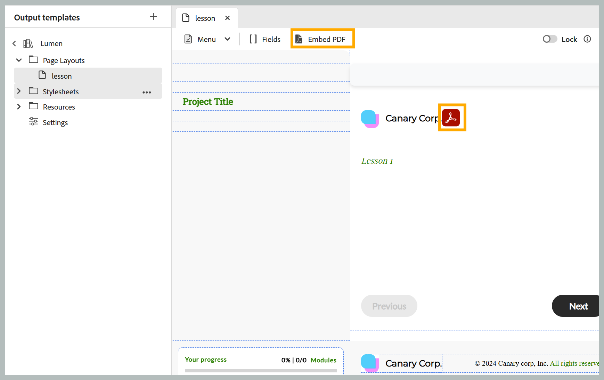

# SCORM出力プリセットの設定

プリセットを作成したら、SCORM プリセット設定を行います。 プリセット設定オプションは、「一般」、「コンテンツ」、「学習者エクスペリエンス」、「公開」タブに整理されています。

- **一般：**&#x200B;すべてのワークフローが設定された新しい生成後ワークフローのドロップダウンリストで、サポートされているバージョン、出力パス、SCORM ファイル名（zip）、出力テンプレート、生成後ワークフローなどの基本的な出力設定を指定するために使用します。

  {width="650"}

- **コンテンツ：**&#x200B;使用可能な条件付きフィルタリング（DITAVALを使用するか、一部の条件プリセットを使用）と変数セットを指定するために使用します。

  {width="650"}

- **学習者エクスペリエンス：** 「**学習者エクスペリエンス**」タブでは、学習者がSCORM出力を操作および操作する方法を設定できます。 設定は、**一般**、**ナビゲーション**、**クイズ**&#x200B;の下で整理され、コンテンツのアクセシビリティ、ナビゲーションフロー、クイズ動作を制御して、カスタマイズされた学習体験を実現できます。

  {width="650"}

  - **一般：**&#x200B;学習者に対するPDF ダウンロードの有効化など、出力レベルのオプションを設定します。

    - **学習者がコース PDFをダウンロードできるようにします**：有効にすると、SCORM出力にPDF アイコンが追加されます。 このアイコンをクリックすると、学習者は公開された出力から直接PDF バージョンのコースコンテンツをダウンロードできます。

      **前提条件：**&#x200B;このオプションを有効にする前に、次の点を確認してください。

      - **出力テンプレート**&#x200B;は、**PDF**&#x200B;を埋め込むアイコンを目的の場所に設定する必要があり、SCORM プリセットの設定中に&#x200B;**一般** タブの&#x200B;**出力テンプレート** オプションで同じテンプレートを選択する必要があります。

        {width="650"}

      - 関連付けられた&#x200B;**ネイティブPDF プリセット**&#x200B;は、少なくとも1回生成されている必要があります。 未生成のPDF プリセットを選択すると、プリセットの公開を求めるエラーが発生します。

    SCORM出力が上記の設定で生成されると、結果の出力には、次に示すようにPDFアイコンが含まれ、学習者はコースPDFをダウンロードできます。

    {width="650"}

  - **ナビゲーション：**&#x200B;受講者がコースを進む方法を定義します。これには、順次進行、必須の完了条件、**次** ボタンのロックを解除するためのルールが含まれます。

    - **学習者は、コンテンツを順番に進める必要があります**：学習者が固定された順序でコースを進み、コースのコンポーネント間をスキップまたはジャンプできないようにします。
    - **学習者がクイズに失敗した場合、「次へ」ボタンを無効にする**：学習者がクイズに合格するまで、次のセクションまたはページに移動するのをブロックします。
    - **学習者は、すべての質問を試して続行する必要があります**：学習者がクイズを送信する前にすべての質問を試すことを求め、不完全な送信を防ぎます。
    - **完了するまで進行状況をロック**：その下に設定されているすべてのサブ条件が満たされるまで、コース内の&#x200B;**次** ボタンを無効にするまで、コース内でのナビゲーションを禁止します。
      - **すべてのインタラクティブ要素が開きました**：学習者は、ページ上のすべてのインタラクティブ要素を開く必要があります。
      - **すべてのメディアを視聴**：学習者は、ページ上のすべてのビデオ/オーディオメディアを視聴する必要があります。
      - **すべての知識チェックが試行されました**：学習者は、ページ上のすべての知識チェックの質問を試みる必要があります。
      - **ページに費やした最小時間**：学習者は、次のボタンを有効にするには、少なくとも指定された期間ページに滞在する必要があります。 有効にすると、以下のように必要な時間を入力する必要があります。
        - **所要時間（秒）**：この条件を満たすために、学習者がページに残る必要がある最小秒数（例：`30`）。

  - **クイズ：**&#x200B;質問の順序と回答の選択肢をランダム化するなど、クイズに関連する動作を設定して、試行間の予測可能性を減らします。

    - **各試行に対して質問順序をランダム化**：各試行に対して異なる順序でクイズの質問を表示し、予測可能性を減らします。
    - **各試行に対する回答オプションをランダム化**：各試行に対する各質問の回答オプションを切り替えて、推測の可能性を減らします。

- **LMSへの公開：**&#x200B;この設定を使用して、コンテンツをAdobe Learning Manager（ALM）に直接公開します。 **Publish server** ドロップダウンから、**Adobe Learning Manager**&#x200B;を選択し、以前にWorkspace設定で設定した必要な&#x200B;**Publish profile**&#x200B;を選択します。 選択したプロファイルを使用して接続を確立し、生成されたコンテンツをALMにアップロードします。

  >[!NOTE]
  >
  > コンテンツをALMに公開する前に、Adobe Learning Manager公開プロファイルを設定する必要があります。 詳しくは、[&#x200B; プロファイルの公開](../lc-config-guide/lc-folder-profile.md)を参照してください。

  {width="650"}

すべての変更を設定したら、SCORM プリセットページのツールバーの右隅にある&#x200B;**Save**&#x200B;を使用して、SCORM プリセットの変更を保存します。
