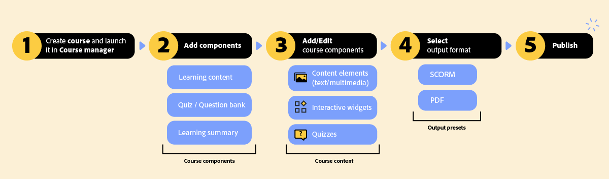

# コース概要

コースは、製品トレーニングおよび顧客教育のためにインタラクティブなトレーニングエクスペリエンスを提供するように設計された学習ユニットです。  各コースは、学習コンテンツ、評価用のクイズ、重要な留意点を強調するための学習の概要で構成されています。

## 仕組み

作成者は、利用可能なコーステンプレートを使用してコースを作成します。 その後、学習コンテンツ（コースの章と同様）、クイズ、学習の概要、学習グループなどの主要コンポーネントを追加して、コースを作成します。 これらのコンポーネントは、直感的なオーサリングインターフェイスを通じて統合および強化され、テキスト、マルチメディア、インタラクティブウィジェット、評価を使用してコンテンツが強化され、魅力的な学習体験が作成されます。

コースコンテンツが完成すると、コースを公開するように出力プリセットが設定されます。

次の図は、コースワークフローの概要を示しています。

