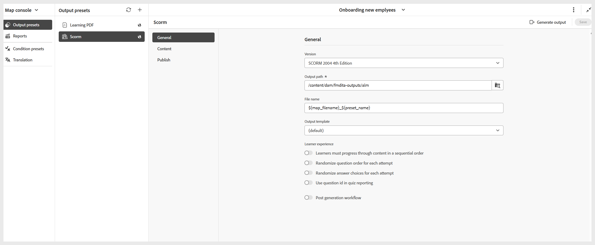

# SCORM 出力プリセットの作成

SCORM 出力プリセットを作成するには、次の手順を実行します。

1. **マップ コンソール** でコースを開きます。

   {width="350" align="left"}

1. **出力プリセット** パネルで、「+」アイコンを選択して出力プリセットを作成します。
1. **新規出力プリセット** ダイアログの **タイプ** ドロップダウンから **SCORM** を選択します。

   {width="350" align="left"}

1. 「**名前**」フィールドに、このプリセットの名前を入力します。
1. 「**現在のフォルダープロファイルに追加**」オプションを選択して、現在のフォルダープロファイル内に出力プリセットを作成します。
1. 「**追加**」を選択します。

SCORM プリセットが作成されます。 SCORM プリセット・ページが開き、必要な設定を行うことができます。

{width="800" align="left"}