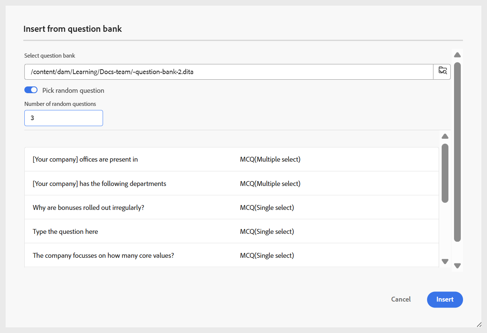

# 質問バンクから質問を挿入

次の手順を実行して、クイズに質問バンクの質問を挿入します。

1. 以下に示すように、ツールバーの **質問** ドロップダウンメニューから **質問バンクから挿入** オプションを選択します。

   {width="350" align="left"}

   **HTML Question Bank から挿入** ダイアログが表示されます。

1. 次に示すように、リポジトリに格納されている質問バンクへのパスを指定し、クイズに挿入する質問を選択します。 また、**すべてを選択** を使用して、質問バンクのすべての質問を選択できます。

   {width="650" align="left"}

1. 選択した質問は、編集不可であることを示す青いハイライトでクイズに挿入されます。 ただし、パブリッシュされた出力には通常どおり表示されます。

   {width="650" align="left"}

1. さらに、切替スイッチを使用して「**ランダムな質問を選択**」オプションを有効にすることができます。 有効にすると、ランダムに選択する質問の数を定義できます。 2 番目のスクリーンショットに示すように、クイズには、ランダムな質問が挿入されたことを示すプレースホルダーが表示されます。 公開中、システムは質問バンクから指定された数のランダムな質問を自動的に選択して挿入します。

   {width="650" align="left"}

   以下に示すように、ランダムな質問がクイズに追加されます。

   {width="650" align="left"}

ビデオの概要を簡単に確認するには、 を参照してください。