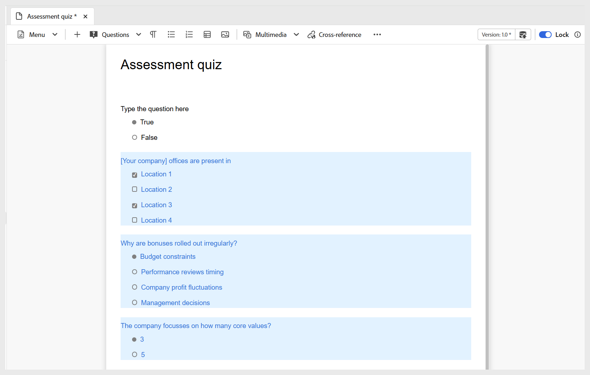
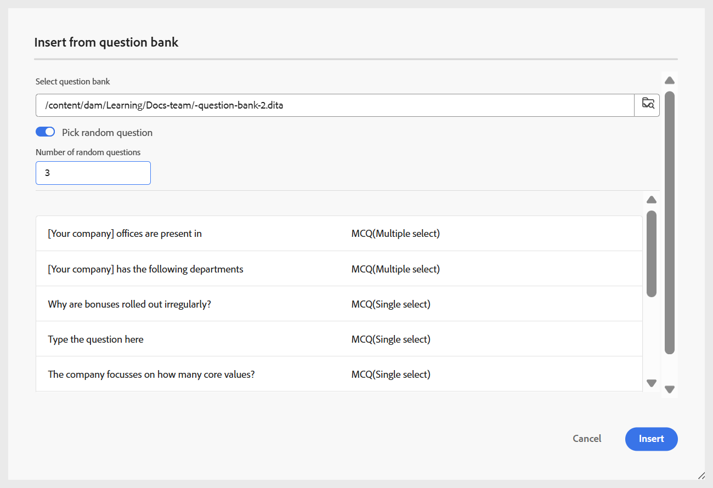

# 質問バンクからの質問の挿入

次の手順を実行して、クイズで質問バンクから質問を挿入します。

1. 以下に示すように、ツールバーの&#x200B;**質問** ドロップダウンメニューから「**質問バンクから挿入**」オプションを選択します。

   {width="350"}

   HTMLの質問バンク **から挿入ダイアログが表示されます。**

1. リポジトリに保存されている質問バンクへのパスを指定し、次に示すように、クイズに挿入する質問を選択します。 **すべてを選択**&#x200B;を使用して、質問バンクのすべての質問を選択することもできます。

   {width="650"}

1. 選択した質問が青いハイライトでクイズに挿入され、編集できないことを示します。 ただし、パブリッシュされた出力では通常どおりに表示されます。

   {width="650"}

1. さらに、切り替えスイッチを使用して、**ランダムな質問を選択** オプションを有効にできます。 有効にすると、ランダムに選択する質問の数を定義できます。 次に、2番目のスクリーンショットに示すように、クイズには、ランダムな質問が挿入されたことを示すプレースホルダーが表示されます。 公開中、システムは指定された数のランダムな質問を質問バンクから自動的に選択して挿入します。

   {width="650"}

   以下に示すように、クイズにランダムな質問が追加されます。

   {width="650"}

簡単なビデオの概要については、[質問バンクからの質問の挿入](https://video.tv.adobe.com/v/3475212/learning-content-aem-guides) を参照してください。
