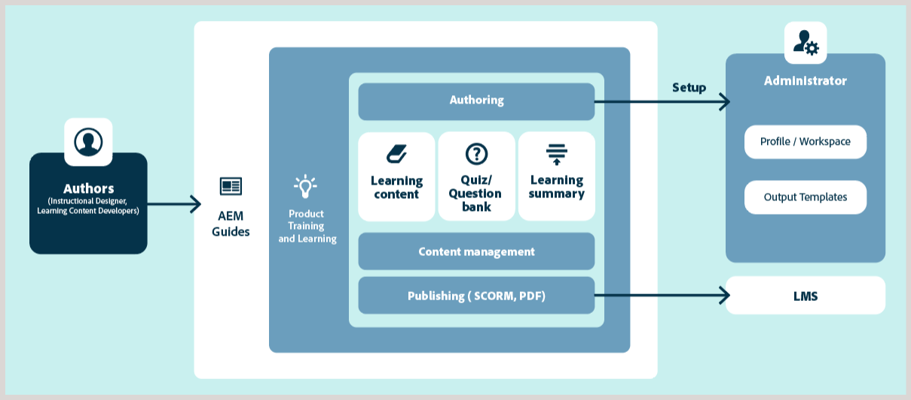

# 製品トレーニングおよび学習コンテンツの概要

製品トレーニングおよび学習コンテンツのサポートにより、エンタープライズ環境でのインタラクティブな e ラーニングコンテンツの作成と管理が容易になります。 テンプレートを使用してコースを作成したり、インタラクティブな要素（アコーディオン、カルーセル、マルチメディアなど）を追加したり、様々な質問タイプまたは質問バンクを使用してクイズを追加したり、サポートされている出力形式でコースを公開したりできます。

## コア機能の概要

主な機能は次のとおりです。

- 一元的な学習コンテンツ管理
- テンプレート駆動型オーサリング
- コンテンツの再利用
- クイズの作成と管理
- 業界をリードする翻訳管理
- 標準搭載の SCORM およびPDF出力フォーマットを使用したマルチチャネルパブリッシング
