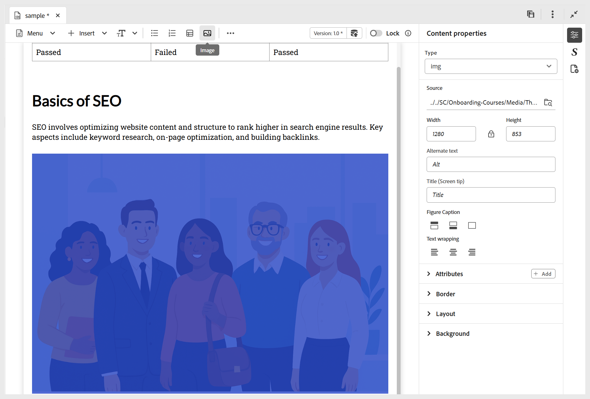

# トピックへの基本的な構成要素の追加

学習トピックの作成方法をより明確に理解し、基本的な構成要素を追加するために、次のビデオでは、使用可能な機能の概要を説明します。

>[!VIDEO](https://video.tv.adobe.com/v/3469535/learning-content-aem-guides)

次に示すように、エディターツールバーで使用できる基本的な編集機能を使用できます。

- **挿入オプション**：アコーディオン、カルーセル、ホットスポット、タブ、フリップカード、クリックして表示などといった [&#x200B; インタラクティブウィジェットを追加 &#x200B;](./lc-widgets.md) するオプションと、Iframe、ブロック引用、コードブロックなどの [&#x200B; 構造要素 &#x200B;](./lc-other-insert-options.md) を提供します。 このメニューを使用して、学習コンテンツに機能と多様性を追加し、魅力的で適切に構成します。

  {width="650" align="left"}

- **テキストコンポーネント**：コンテンツに見出し/タイトル、段落、インライン引用符、上付き文字、下付き文字、引用文を追加します。

  {width="650" align="left"}

- **順序なしリスト**：コンテンツ内に順序なしリストを追加します。

  {width="650" align="left"}

- **番号付きリスト**：コンテンツに番号付きリストを挿入します。

  {width="650" align="left"}

- **テーブル**：必要なディメンションのテーブルをコンテンツに挿入します。 次に示すように、**コンテンツのプロパティ** パネルを使用して、様々なテーブルプロパティをさらに管理できます。

  {width="650" align="left"}

- **画像**：代替テキストおよび画面ヒントと共に画像をコンテンツに挿入します。 画像は、リポジトリから、または外部 URL を使用して追加できます。 また、画像のプロパティは **コンテンツのプロパティ** パネルを使用して変更できます。

  {width="650" align="left"}

- **マルチメディア**：コンテンツにビデオとオーディオを追加します。 **コンテンツのプロパティ** パネルを使用して、プロパティをカスタマイズできます。

  {width="650" align="left"}

- **再利用可能なコンテンツ**：アセットやリポジトリから既存のコンテンツを組み込んで、再利用性を確保できます。 次の手順を実行して、再利用可能なコンテンツを挿入します。

   1. ツールバーの **再利用可能なコンテンツ** を選択します。
**コンテンツを再利用** ダイアログが開きます。
   2. 目的のトピックに移動して選択し、そのコンテンツを現在のコースに含めます。
   3. 追加するコンテンツの ID を選択します。参照用にプレビューが横に表示されます。

      {width="650" align="left"}

   4. **選択** を選択します。

  コンテンツが挿入されます。 例えば、車両構造に関するセクションは、再利用され、コースのトピックに追加されるコンテンツピースです。 タイプは **参照** として表示され、その **ID** が **コンテンツのプロパティ** パネルに反映されます。

  {width="650" align="left"}

- **シンボル**：以下に示すように、リストからコンテンツに選択したシンボルを追加します。

  {width="350" align="left"}

- **ハイパーリンク**：コンテンツ内の必要な場所にハイパーリンクを追加します。 ファイル参照、web URL、メールリンクのいずれかを指定できます（下図を参照）。

  {width="650" align="left"}

また、「**メニュー**」ドロップダウンから、編集アクション（切り取り、コピー、削除）、検索と置換、バージョンラベルにアクセスできます。
