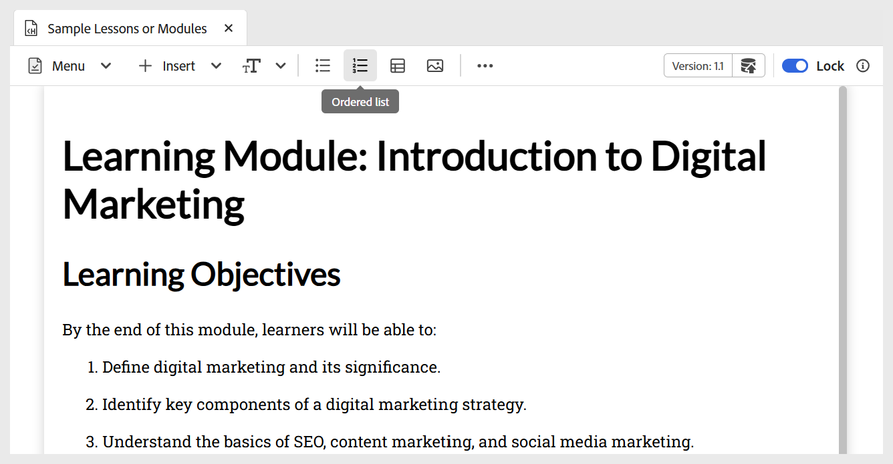
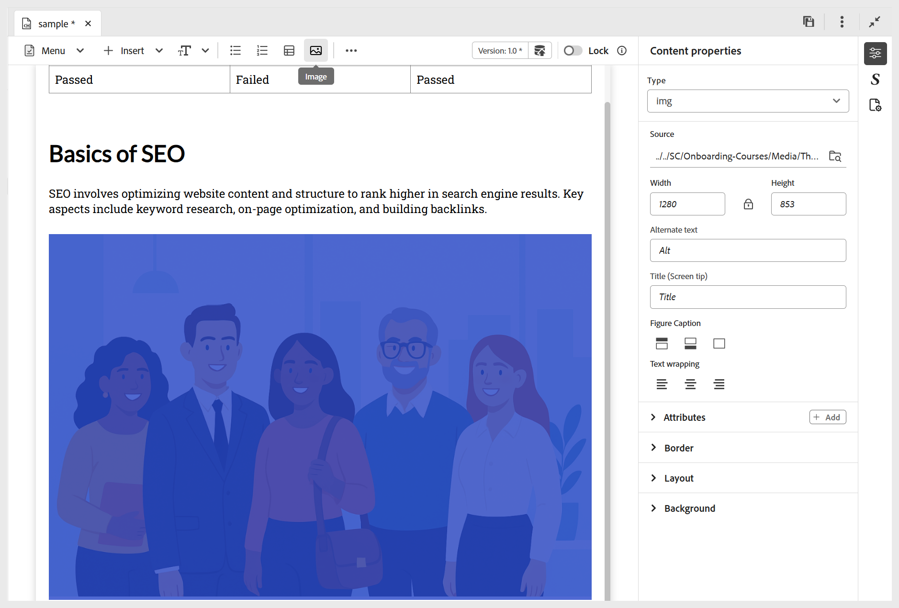
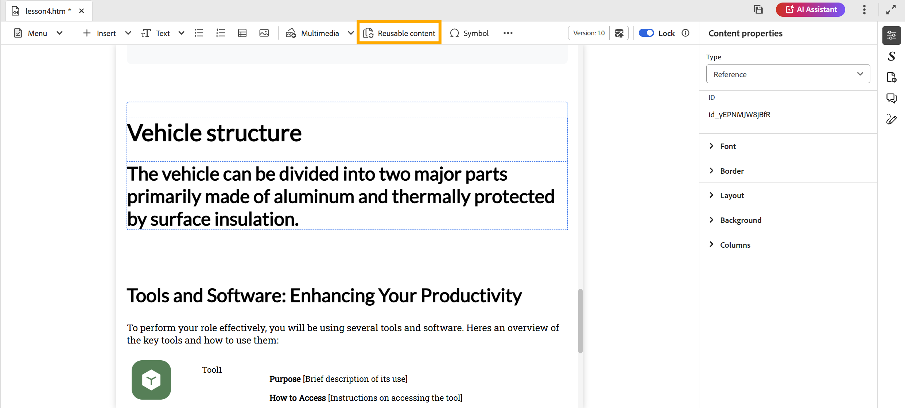
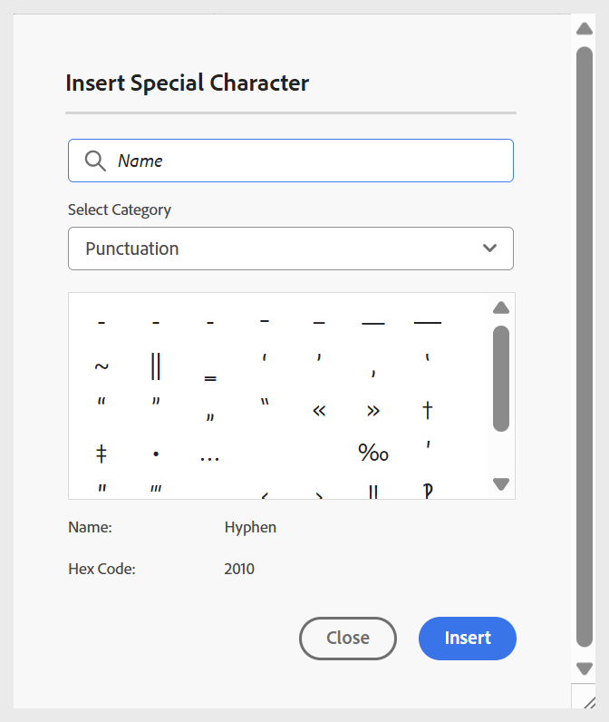
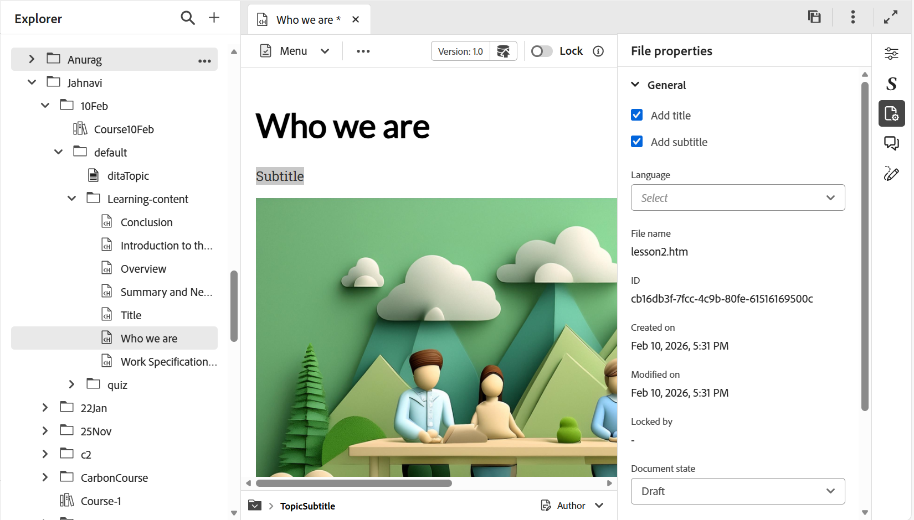

# トピックに基本的な構成要素を追加する

学習トピックを作成し、基本的な構成要素を追加する方法をより明確に理解するために、次のビデオでは、利用可能な機能の概要を説明します。

>[!VIDEO](https://video.tv.adobe.com/v/3469535/learning-content-aem-guides)

エディターツールバーで使用できる基本的な編集機能を使用できます（以下を参照）。

- **挿入オプション**: アコーディオン、カルーセル、HotSpot、タブ、フリップカード、クリックして表示するなど[&#x200B; インタラクティブウィジェット &#x200B;](./lc-widgets.md)を追加するオプションと、Iframe、ブロック引用、コードブロックなど[構造要素](./lc-other-insert-options.md)を提供します。 このメニューを使用して、学習コンテンツに機能と多様性を追加し、魅力的で構造化されたコンテンツにします。

  {width="650"}

- **テキストコンポーネント**：見出し、段落、インライン引用符、上付き文字、下付き文字、引用をコンテンツに追加します。

  >[!NOTE]
  >
  > また、学習コンテンツにタイトルとサブタイトルを含めることもできます。 コンテンツに追加する方法について詳しくは、[学習コンテンツにタイトルとサブタイトルを追加](#add-title-and-subtitle-to-learning-content)を参照してください。

  {width="650"}

- **順序なしリスト**：コンテンツ内に順序なしリストを追加します。

  {width="650"}

- **順序付きリスト**: コンテンツ内に番号付きリストを挿入します。

  {width="650"}

- **テーブル**：必要なディメンションのテーブルをコンテンツに挿入します。 以下に示すように、**コンテンツのプロパティ** パネルを使用して、様々なテーブルプロパティをさらに管理できます。

  {width="650"}

- **画像**：代替テキストおよび画面のヒントと共に、画像をコンテンツに挿入します。 画像は、リポジトリまたは外部URLから追加できます。 さらに、画像のプロパティは、**コンテンツのプロパティ** パネルを使用して変更できます。

  {width="650"}

- **マルチメディア**: コンテンツにビデオとオーディオを追加します。 **コンテンツのプロパティ** パネルを使用して、プロパティをカスタマイズできます。

  {width="650"}

- **再利用可能なコンテンツ**: アセットまたはリポジトリーの既存のコンテンツを再利用性のために組み込むことができます。 再利用可能なコンテンツを挿入するには、次の手順を実行します。

   1. ツールバーから「**再利用可能なコンテンツ**」を選択します。
**コンテンツを再利用** ダイアログが開きます。
   2. 目的のトピックに移動して選択し、現在のコースにコンテンツを含めます。
   3. 追加するコンテンツのIDを選択します。参照のためにプレビューが横に表示されます。

      {width="650"}

   4. **Select**&#x200B;を選択します。

  コンテンツが挿入されます。 例えば、車両の構造に関するセクションは、コースのトピックに再利用および追加されるコンテンツ要素です。 タイプは&#x200B;**参照**&#x200B;として表示され、その&#x200B;**ID**&#x200B;は&#x200B;**コンテンツのプロパティ** パネルに反映されます。

  {width="650"}

- **シンボル**：次に示すように、リストから選択したシンボルをコンテンツに追加します。

  {width="350"}

- **ハイパーリンク**: コンテンツの必要な場所にハイパーリンクを追加します。 次に示すように、ファイル参照、web URL、または電子メールリンクを指定できます。

  {width="650"}

さらに、**メニュー** ドロップダウンでは、編集アクション（カット、コピー、削除）、検索と置換、およびバージョン ラベルにアクセスできます。

## 学習コンテンツにタイトルとサブタイトルを追加

学習コンテンツにタイトルとサブタイトルを含めるには、次の手順を実行します。

1. マップコンソールで学習コースを開きます。
1. タイトルまたはサブタイトルを追加するトピック、クイズ、またはその他のコースコンポーネントを開きます。
1. ファイルのプロパティパネルに移動し、**タイトルを追加**&#x200B;を選択します。

   
1. プロンプトが表示されたら、既存の見出しをタイトルとして使用するかどうかを選択します。

   >[!NOTE]
   >
   > 既存の見出しをタイトルとして使用しない場合は、まずエディターツールバーのテキストコンポーネントを使用して見出しを挿入し、「**タイトルを追加**」を選択します。 これにより、サンプル **タイトル**&#x200B;がコンテンツに追加され、必要に応じて編集できます。

1. ファイルのプロパティで、**字幕を追加**&#x200B;を選択します。
サンプル **字幕**&#x200B;がコンテンツに追加されます。

   

タイトルを削除するには、ファイルプロパティで「**タイトルを追加**」オプションをオフにします。 タイトルを削除すると、関連するサブタイトルが自動的に削除されます。

