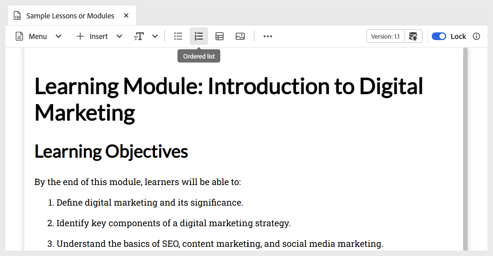

# 学習コンテンツへの基本的な構成要素の追加

以下に説明するように、「学習コンテンツ」ツールバーで使用できる基本的な編集機能を使用できます。

- **ウィジェット**：以下に示すように、**挿入** メニューを使用して、アコーディオン、カルーセル、ホットスポットなどのウィジェットを学習コンテンツに追加します。 インタラクティブウィジェットについて詳しくは、[ インタラクティブウィジェットの使用 ](./lc-widgets.md) を参照してください。

  {width="650" align="left"}

- **テキストコンポーネント**：コンテンツに見出し/タイトル、段落、インライン引用符、上付き文字、下付き文字、引用文を追加します。

  {width="650" align="left"}

- **順序なしリスト**：コンテンツ内に順序なしリストを追加します。

  {width="650" align="left"}

- **番号付きリスト**：コンテンツに番号付きリストを挿入します。

  {width="650" align="left"}

- **テーブル**：必要なディメンションのテーブルをコンテンツに挿入します。 次に示すように、**コンテンツのプロパティ** パネルを使用して、様々なテーブルプロパティをさらに管理できます。

  {width="650" align="left"}

- **画像**：代替テキストおよび画面ヒントと共に画像をコンテンツに挿入します。 画像は、リポジトリから、または外部 URL を使用して追加できます。 また、画像のプロパティは **コンテンツのプロパティ** パネルを使用して変更できます。

  {width="650" align="left"}

- **マルチメディア**：ツールバーの **詳細** メニューからコンテンツにビデオとオーディオを追加します。 **コンテンツのプロパティ** パネルを使用して、プロパティをカスタマイズできます。

  {width="650" align="left"}

- **シンボル**：以下に示すように、リストからコンテンツに選択したシンボルを追加します。 ツールバーの **詳細** メニューから使用できます。

  {width="350" align="left"}

- **ハイパーリンク**：コンテンツ内の必要な場所にハイパーリンクを追加します。 ツールバーの **詳細** メニューから使用できます。 ファイル参照、web URL、メールリンクのいずれかを指定できます（下図を参照）。

  {width="650" align="left"}

