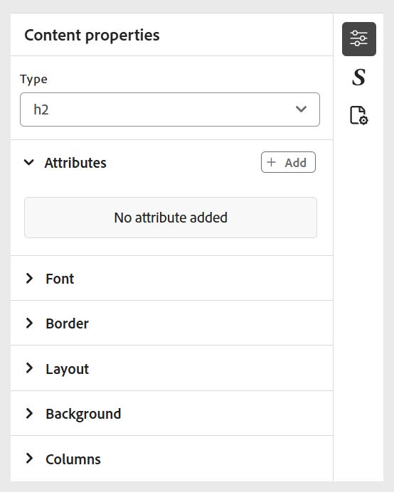

# インラインスタイルの使用

インラインスタイルを適用して、コースコンテンツ内での特定のテキストの外観を直接カスタマイズします。 これにより、フォントサイズ、色、配置など、フォーマットの調整をすばやく行うことができます。 **コンテンツのプロパティ** パネルを使用して、選択したテキストのインラインスタイルを変更できます。

>[!NOTE]
>
> これらのスタイルオプションは、管理者が有効にした場合にのみ表示されます。

{width="350" align="left"}

以下のオプションが利用できます。

- **フォント：** フォントファミリー、フォントの太さ、テキストの装飾、フォントサイズなど、様々なオプションを使用して、テキストの外観をカスタマイズできます。 これらの設定は、次の例に示すように、コンテンツのスタイル設定に役立ちます。

  {width="350" align="left"}

- **境界線**：境界線の辺、幅、スタイル（実線、破線、点線など）、色などのオプションを使用して、要素の境界線を定義およびカスタマイズできます。 これらの設定は、コンテンツの特定のセクションを視覚的に区別したり、ハイライト表示したりするのに役立ちます。

  {width="350" align="left"}

- **レイアウト**：コンテンツ内の要素の位置と間隔を制御するのに役立ちます。 余白、パディング、整列、表示タイプなどのプロパティを調整できます。 を使用してコンテンツ構造を効果的に整理します。

  {width="350" align="left"}

- **背景**：背景色、画像、位置、繰り返しスタイルなどのオプションを設定して、要素の背景をカスタマイズできます。 これらの設定は、コンテンツの視覚的な魅力と明確さを高めるのに役立ちます。

  {width="350" align="left"}

- **列**：コンテンツを複数の列に整理できます。 列の数、列間の間隔、列の幅などを調整できます。 コンテンツ内の読みやすさとレイアウト構造を改善する。

  {width="350" align="left"}